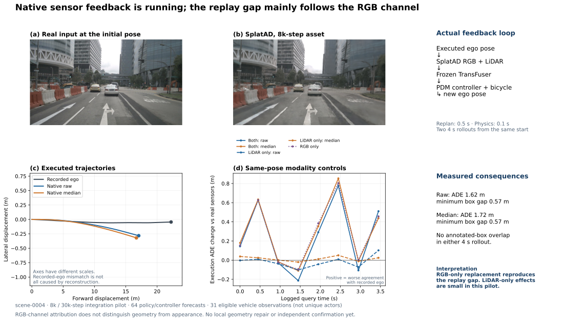

# 原生 RGB＋LiDAR 闭环试跑：差距主要经 RGB 通道传递，几何因果仍未确认

> 历史报告 / 计划：保留当时观察与结论；当前状态见 [RESEARCH_STATUS](../../../RESEARCH_STATUS.md)，归档导航见 [README](README.md)。

**SplatAD、冻结 TransFuser 和官方 PDM 控制器/自行车模型已实际串联运行。** `scene-0004` 的 raw、median 两种原生点云各完成一次 4 秒闭环；每执行 0.5 秒，就按车辆的新位姿重新生成三路相机和 LiDAR。另完成 8 个日志时刻、6 种模态组合的同位姿比较。本轮共 64 次策略前向、64 次 PDM 轨迹执行预测、2 次实际传感器反馈闭环。

这是固定第 **8,000 步** checkpoint 的接入试跑，完整 30,001 步拟合仍在运行。输入包含整段 RGB、LiDAR、标定和演员轨迹，属于额外信息的仿真参照；不是前馈模型的同预算排名，也不是经过完整训练预算验证的 SOTA 失效结论。

## 仿真是否真的使用了新位姿

策略使用官方 `latent=False` checkpoint，当前环境在完全相同输入下复现之前的轨迹，最大数值差为 0。三路相机的标定矩阵与官方解析器的最大元素差低于 `8e-5`。

在单独的接口检查中，将 ego 横移 0.25 m 后，相机像素平均绝对变化为 11.19／255，raw 距离平均绝对变化为 0.568 m；把扫描输入中的距离占位值从 1 改成 7，输出距离完全不变。这确认位姿会影响输出，闭环扫描没有读取未来真实距离。这个人为横移只作接口检查，不计入自然 badcase。

LiDAR 使用由初始真实扫描校准的 **30,487 个固定方向和时间**，包含官方补充的未返回方向及 ego 排除区域。它不是理想均匀厂家扫描。相机和 LiDAR 在闭环查询时同步渲染，运动补偿使用实际车辆速度；保留 raw 与 median 两条官方点云路径及相同 ray-drop。车辆物理步长 0.1 s，重规划间隔 0.5 s；其他演员按日志运动，没有反应式交通参与者。

## 同位姿对照：先区分传感器通道

每个日志时刻分别使用真实传感器、仅替换 RGB、仅替换 LiDAR、同时替换 RGB 和 LiDAR。策略状态保持相同。下表是 8 个时刻的均值和最大值，正的 ADE 差值表示相对真实行驶轨迹的误差增加。

| 输入变化 | 平均执行 ADE 增量（m） | 最大执行终点变化（m） |
|---|---:|---:|
| 仅 LiDAR，raw | −0.017 | 0.336 |
| 仅 LiDAR，median | +0.015 | 0.203 |
| 仅 RGB | +0.288 | 2.556 |
| RGB＋LiDAR，raw | +0.250 | 2.479 |
| RGB＋LiDAR，median | +0.290 | 2.728 |

**仅替换 RGB 已能重现主要的平均退化，LiDAR 单独替换的影响较小。** 神经策略是非线性的，不能把这些数值相减后当成可加的“贡献比例”。这一步只定位到 RGB 通道，尚未区分视觉几何、外观拟合、采样时刻或其他图像差异。当前同步渲染与真实传感器束的异步时刻尚未单独剥离；完整拟合后的比较将进一步匹配日志各传感器的采样时刻。

后续日志时序接口已通过单帧核验：左右相机相对前相机分别为 −7.630／+7.865 ms，LiDAR 为 +35.999 ms；相机位姿矩阵最大差小于 `6e-7`，LiDAR 原点变换差为 0，输出有限。它只验证接口，不改变上表已完成的同步试跑结果，也不增加研究条件计数。

车辆检测使用了策略自身的真实预测头，固定存在概率阈值 0.5，并同时报告 IoU 0.25／0.5。前方 32 m、左右 16 m、至少 5 个真实 LiDAR 点支持的车辆共有 **31 次观测**，不是 31 个独立演员。真实输入的匹配数仅为 11／31 和 5／31，表明当前 nuScenes 适配下的检测基线较弱。raw 仅 LiDAR 替换为 9／31、4／31；median 为 11／31、5／31。不能用这一小批次的少量翻转支持普遍感知失效。语义预测差异也已保存，但没有完整道路/可行驶地图真值，不称为占用准确率。

## 实际闭环结果与含义

| 闭环读出 | 对真实行驶轨迹的 ADE（m） | 终点误差（m） | 最小标注框间距（m） | 标注框交叠 |
|---|---:|---:|---:|---|
| Raw | 1.623 | 5.167 | +0.566 | 无 |
| Median | 1.722 | 5.542 | +0.572 | 无 |

两次闭环的 41 个状态样本均完成间距检查；ego 框每边膨胀 0.1 m 后，最小间距仍为 +0.466／+0.471 m。真实行驶轨迹在同一车辆框约定下的最小间距为 +0.457 m。这里评价的是标注对象的二维框间距，不是完整静态几何碰撞、at-fault 或 PDM 总分。

**不能把 5 米终点误差直接归为重建造成的危害。** 初始真实传感器输入下，策略与车辆执行预测本身已有 3.067 m 终点误差；真实路测没有车辆偏离后位置上的传感器观测，因此不存在可直接对照的“真实传感器闭环”。同位姿模态对照和实际反馈闭环必须分别解释。

## 研究决定

当前不晋级几何 Hero case。新增证据说明完整反馈链路已接通，也说明单纯的轨迹差距不能替代几何因果证明。保留 LiDAR 影响小的结果，并等待既定拟合预算完成；之后复核模态对照，再对仍有实际影响的具体区域做局部几何恢复。不会把 RGB 通道的差距直接改名为外观问题，也不会把未收敛资产的误差当作官方 SOTA 普遍失败。

总体目标保持 active，人工 verdict 为 null，新增失败边界为 `V74-H2-F18`。旧 Pi3X 路面子命题继续关闭。累计：18 次 HUGSIM/LTF 闭环、2 次本轮 SplatAD 反馈闭环、72 次四官方几何模型前向、738 次策略/PDM 执行预测。

## 复现与证据

- 任务：`WS-SIM-NATIVE-CLOSEDLOOP-01`；运行：`scene0004-step008000-pilot2`；种子：`20260915`。
- [官方 SplatAD/NeuRAD Studio](https://github.com/georghess/neurad-studio)，`8ba9b5116b8a2822a80c64f63a4ae64c5871aa68`。
- [官方 SplatAD CUDA](https://github.com/carlinds/splatad)，`6e31ad766d39e0c33f9034a2ed772d51364b2343`。
- [官方 NAVSIM](https://github.com/autonomousvision/navsim)，`ca0ca7e4368646d8f7b86fb1fdaa1862c946176f`；原生组件之外的连接代码和 nuScenes 约定均单列。
- 远端根目录：`/root/autodl-tmp/runs/worldsim_simimpact/WS-SIM-NATIVE-LIDAR-01/20260915-r1/closed_loop/scene0004-step008000-pilot2`。包含逐帧传感器、策略头、执行状态、完整统计和实际运行脚本副本。
- 首次初始化因官方解析器已释放全库对象而结束，没有策略或闭环结果；修复为当前日志的轻量元数据索引后，第二次运行完成。它属于接口修复，不计为方法失败。

[PNG 图](../../../autoresearch/worldsim_simimpact/milestone5/figures/F13_Native_RGB_LiDAR_Loop.svg) · [PDF 图](../../../autoresearch/worldsim_simimpact/milestone5/figures/F13_Native_RGB_LiDAR_Loop.svg) · [可编辑 SVG](../../../autoresearch/worldsim_simimpact/milestone5/figures/F13_Native_RGB_LiDAR_Loop.svg)
