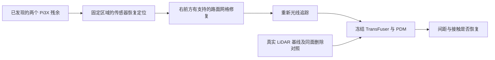

# Pi3X 残余的有限因果审计

> 历史报告 / 计划：保留当时观察与结论；当前状态见 [RESEARCH_STATUS](../../../RESEARCH_STATUS.md)，归档导航见 [README](README.md)。

**本轮没有产生可以晋级主方法动机的稳定局部几何案例。** 新增 23 项空间恢复定位、7 项真实网格修改及删除对照；共 30 次官方 TransFuser 推理与 30 次官方 PDM 车辆执行。所有缺失恢复均明示额外真实 LiDAR 信息，仍是已曝光场景的发现诊断。

## 实际结果

以下为执行过程中最小标注框间距。负数是平面矩形交叠深度，不能解释成真实刚体穿透或严重事故；真实基线只有约 1.6 cm 的名义余量。

| 条件 | 六视图（m） | 十二视图（m） |
|---|---:|---:|
| 真实 LiDAR 基线 | +0.0162 | +0.0162 |
| Pi3X，全部原始缺失已恢复 | −0.1025 | −0.1954 |
| 传感器 oracle：恢复右前区域 | +0.0268 | −0.0982 |
| 传感器 oracle：仅保留右前区域误差 | −0.2157 | −0.1638 |
| **真实网格：普通局部路面平面修复** | **−0.0970** | **−0.1872** |
| 真实网格：删除相同面片 | −0.1185 | −0.1787 |
| 传感器 oracle：恢复区域外的大范围部分 | +0.0805 | +0.0069 |

六视图的右前区域传感器替换有恢复信号，十二视图同样替换仍接触；只保留右前区域误差时两者都接触，说明策略对全局输入的组合有非线性响应。不能把一次传感器恢复直接写成“唯一局部几何原因已经确认”。CPU 与原 GPU 的三条基线策略输出最大绝对差异均小于 4.2×10⁻⁶，数值后端变化不能解释该结果。

## 几何干预具体改了什么

在先前固定的右前区域 `0<x≤25 m，−12≤y<−3 m`，使用额外真实 LiDAR 的 2,734 个路面支持点拟合普通平面，支持点垂直 RMSE 为 0.0120 m。仅修改距平面 0.5 m 内、距实测支持点水平 0.35 m 内的网格顶点，并排除标注演员框内顶点；其他顶点和三角形连接保持。

六视图修改 48,207 个顶点，十二视图修改 47,379 个；重新光线追踪后分别改变 776 和 709 条原有效射线距离。不是直接替换最终 LiDAR 数值。原本缺失的射线在各条件中按相同规则恢复；新产生的 3 / 4 条缺失保留并计数。相同面片删除对照产生 689 / 629 条新缺失，也没有恢复接触。

这是**有实测支持的普通局部路面控制**，不等于完整右前区域的完美 GT 几何 oracle：它没有修复该区域的车辆、路缘全部细节和其他非平面结构。因此结果关闭的是“这个受支持的路面偏差足以解释并恢复残余”的当前子命题，不能证明所有右前几何均无影响。

当前不再围绕这两个近边界残余继续细切区域或扫参数，不据此启动重建训练。数值与资产保留，等待更有实质行为偏差的新案例提供独立证据。

## 从下游重新看完整分母

对既有六日志、四模型、六/十二视图、普通 BUILD 定尺度后的 48 个完整重建扫描，按下游事件重新整理，未读取 Early 或深度误差用于排序：

| 下游事件 | 条件数 | 日志数 | 解释 |
|---|---:|---:|---|
| 新增名义演员接触 | 7 | 1 | 全在 scene-0061；已知覆盖和近边界问题 |
| 执行终点变化超过 1 m | 2 | 2 | 一个 ADE 改善；另一个真实基线本身已接触 |
| 相对基线新增制动超过 2 m/s² | 0 | 0 | 本批未发现 |
| 新停止：最终速度低于 0.5 m/s，真实基线高于 2 m/s | 0 | 0 | 本批未发现 |

[完整 48 条事件记录](../../../autoresearch/worldsim_simimpact/milestone4/DOWNSTREAM_EVENT_RANKING.json)保留了变化方向和相对真实行驶轨迹的误差。终点差异、接触翻转都只是发现入口，不能代替仿真价值下降与局部修复恢复。

下一阶段遵循 [下游优先协议](WORLDSIM_SIMULATION_DOWNSTREAM_FIRST.md)，由正在拟合的 [原生 RGB＋LiDAR 场景](WORLDSIM_SIMULATION_NATIVE_SENSOR_STAGE.md)补齐实际新位姿传感器环路。目标是寻找可重复的重建引起的仿真退化；不预设 first-return，也不为了凑够 3–5 个案例降低因果要求。

任务：`WS-SIM-PI3X-LOCAL-01`、`WS-SIM-PI3X-GEOMETRY-01`、`WS-SIM-DOWNSTREAM-MINING-01`；运行 `20260915-r1`。远端证据分别位于 `WS-SIM-INTERACTION-01/20260915-r1/lidar_policy/pi3x_localization` 与 `pi3x_geometry_oracle`。累计 18 次 HUGSIM 闭环、72 次四模型几何前向、674 组策略与 PDM 执行；后者不能混称完整传感器闭环。人工 verdict=null；整体目标 active。
