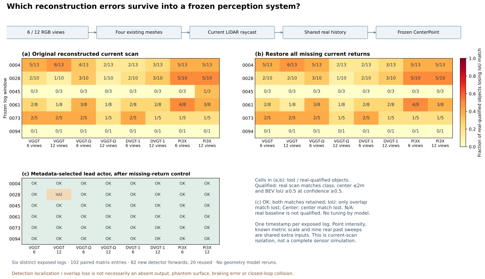
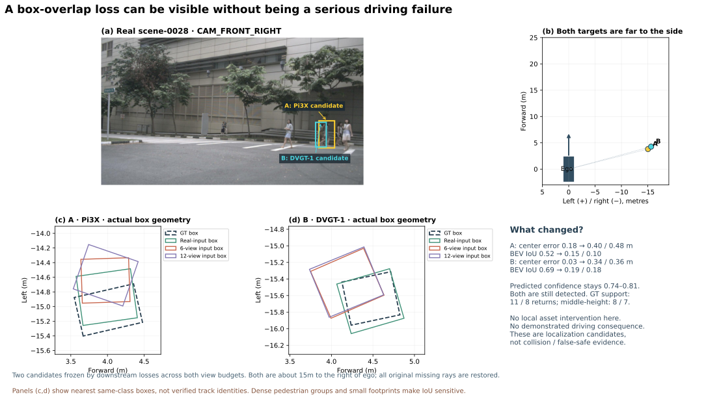

# 六日志扩大复核：框精度退化可见，前车严重丢失未重复

> 历史报告 / 计划：保留当时观察与结论；当前状态见 [RESEARCH_STATUS](../../../RESEARCH_STATUS.md)，归档导航见 [README](README.md)。

**四个官方前馈模型的跨日志感知矩阵已补齐。本轮看到了框定位、重叠精度下降，也保留了改善和良好案例；没有新增能够支持“普遍 phantom 导致严重驾驶仿真问题”的案例。**

新增 **82 次 CenterPoint 推理**，复用 20 次已有结果，组成六日志 × 17 条件的 102 项矩阵。累计 CenterPoint 222 次；几何模型前向仍为 72 次，策略/PDM 仍为 802 次，实际反馈闭环仍为 18 次 HUGSIM＋4 次 SplatAD。没有新增训练、几何推理或闭环执行。

## 数据和信息范围

任务 `WS-SIM-FF-COHORT-PERCEPTION-01 / 20260915-r1`。沿用事先按真实交通状态冻结的六个不同日志：0004、0028、0045、0061、0073、0094，每个日志一个时刻。后四个未完成检测评价的日志是 0028、0045、0073、0094；这些日志已有模型和策略结果，**本轮不是独立封存集验证**。

四模型为官方 VGGT、VGGT-Ω 原始 512 checkpoint、DVGT-1、Pi3X。Ω 使用用户指定的公开镜像原始 512 权重，不是 416 reproduction。复用已有六图/十二图预测，仅共同前六张输出构建网格。十二图包含下一关键帧 RGB，是额外的离线重建观测，不能称作在线当前帧输入。

本轮以同一套已知标定、BUILD LiDAR 全局尺度和相同网格读出为控制。替换的是**当前重建扫描**；九帧真实历史、当前射线的真实强度均保持相同。“补回缺失”还将原来未返回的当前射线恢复为真实回波。这些都是额外度量/传感器信息，不是纯视觉同预算排名，也不是完整传感器模拟器。36 个缺少的历史文件已从挂载数据包提取；六日志现有射线与原始扫描逐点对齐通过。

冻结检测器为 MMDetection3D v1.4.0 的 CenterPoint voxel0.1 / circle-NMS 官方 checkpoint，权重键和形状全部匹配。保留原生范围过滤、体素化和后处理。固定 confidence 0.3/0.5、同类中心距离 ≤2m、BEV IoU ≥0.5；目标范围为前方 0–32m、横向 ±16m、标注当前 LiDAR 点数 ≥5。指标是目标观测计数，不是 AP/NDS。

## 完整分母与结果

六日志分别有 19/12/4/10/6/1 个可评价目标，共 **52** 个。真实输入在两个固定置信度下均有 52 个中心匹配、40 个 IoU 匹配；这 40 个同时通过中心与 IoU 匹配的目标构成可靠基线子集。其余 12 个继续保留在完整分母，不能把它们原有的 IoU 失配归为重建新增错误。

下表均为 confidence ≥0.5、补回全部原缺失回波后的结果。损失和新增匹配分别报告，因此“总匹配接近真实”不等于每个对象都恢复。

| 输入 | 中心匹配 /52 | IoU 匹配 /52 | 原可靠 40 目标中丢失 IoU | 相对真实新增 IoU 匹配 |
|---|---:|---:|---:|---:|
| 真实扫描 | 52 | 40 | 0 | 0 |
| VGGT 六图 | 48 | 32 | 11 | 3 |
| VGGT 十二图 | 48 | 31 | 11 | 2 |
| Ω 六图 | 46 | 29 | 13 | 2 |
| Ω 十二图 | 51 | 38 | 5 | 3 |
| DVGT-1 六图 | 51 | 37 | 8 | 5 |
| DVGT-1 十二图 | 51 | 35 | 9 | 4 |
| Pi3X 六图 | 47 | 28 | 15 | 3 |
| Pi3X 十二图 | 48 | 27 | 14 | 1 |

- **预选前车是重要正例。** 六个元数据预选前车 × 四模型 × 两预算，在补回缺失后的 48 项中全部保留中心匹配，47 项也保留 IoU 匹配；唯一 IoU 失配为 0028 的 VGGT 十二图，没有在六图重复。
- **额外观测的效果不一致。** Ω 十二图明显改善；DVGT-1 和 Pi3X 的汇总 IoU 未随十二图改善。不能主张更多观测必然让这些模型更差或更好。
- **补回缺失并不清除全部框误差，但也不保证总是改善。** 例如 Ω 六图的 IoU 匹配从完整扫描的 30 变成 29。它是固定额外信息对照，不能先验当作成功 oracle。
- 在 confidence 0.3 和 0.5、六图和十二图的补回缺失条件下，**没有一个原可靠目标同时持续丢失中心匹配**。持续 IoU 失配则有 24 个“模型－目标”组合，分布在四个日志；不是 24 个独立坏例，更不是 24 次危险驾驶事件。

## 两个预注册新候选为什么不晋级

先按下游冻结规则筛选，再查看几何：优先元数据前车，其次两预算均持续中心失配，再其次持续 IoU 失配，同级按场景/目标顺序，最多两个新目标。最终得到 0028 的两个行人，分别对应 Pi3X 和 DVGT-1。未继续越过这两个目标挑更大的几何误差。

| 候选 | 真实 / 六图 / 十二图最近同类框中心误差 | 真实 / 六图 / 十二图 IoU | 当前真实框内回波 |
|---|---|---|---:|
| Pi3X 行人 A | 0.177 / 0.405 / 0.475m | 0.516 / 0.155 / 0.097 | 11，其中中部高度 8 |
| DVGT-1 行人 B | 0.033 / 0.341 / 0.357m | 0.689 / 0.187 / 0.176 | 8，其中中部高度 7 |

两人的重建条件检测置信度仍为 0.74–0.81，中心匹配仍在。最近同类框并不等于已核实的轨迹身份，拥挤行人之间还可能涉及对应关系；不能把这些数值称为行人完全消失。Pi3X 的目标回波有约 0.42/0.73m 的中位提前，DVGT-1 有约 0.16/0.27m，但这些只提供机制候选。

两人均位于车身右侧约 15m，前向约 4m。当前没有证据表明这些框误差造成驾驶决策退化；原日志 0028 的既有策略基线本身也已有名义交叠，不能把任何接触自动算为新增重建危害。本轮不做这两个行人的局部网格扫参或训练，保留为感知定位候选，不晋级 Hero。

## 对主张的影响与后续边界

此前 Ω 车辆局部网格修改后定位恢复的有限因果结果仍成立，同面删除也有效；此次新增矩阵没有提供独立重复或生成式修复必要性。[局部资产因果审计](WORLDSIM_SIMULATION_LOCAL_ASSET_CAUSAL_AUDIT.md)

现在可以说：**在本适配器与六个已曝光日志上，重建输入确实能改变冻结检测器的框精度，损失与改善并存；严重前车漏检没有按冻结定义重复。** 不能说所有 SOTA 都有相同 phantom 问题，不能把 Early、IoU 失配或检测差异直接等同于仿真危害。

当前 TransFuser 不消费 CenterPoint 输出。WorldEngine 的 PDM 接口虽然读取目标观测，但已安装实现还依赖 nuPlan 地图/路线；官方 [BridgeSim](https://github.com/VAIL-UCLA/BridgeSim) 是可继续核查的闭环入口，作者 [PKL](https://github.com/nv-tlabs/planning-centric-metrics) 可作为检测到规划分布的诊断参照。本轮未运行这两个新入口，PKL 也不能替代实际车辆执行。[接口复核](WORLDSIM_SIMULATION_PLANNER_INTERFACE_REVIEW.md)

六日志这轮有限筛查收口，不重复当前案例、增加阈值或用更极端合成条件追求失败。总体研究目标仍 active：新的有意义推进必须补充独立日志/时间与真实传感器范围，并实际接通下游恢复；当前尚未获得可支撑主方法的严重几何因果坏例。人工 verdict 保持 null。

原始运行根目录：`/root/autodl-tmp/runs/worldsim_simimpact/WS-SIM-FF-COHORT-PERCEPTION-01/20260915-r1`。代码和三本总账同步当前研究分支；failure ledger 为 `V74-H2-F21`。

[完整数值](../../../autoresearch/worldsim_simimpact/milestone8/evidence/report_evidence.json) · [矩阵 SVG](../../../autoresearch/worldsim_simimpact/milestone8/figures/F19_Six_Log_Perception_Matrix.svg) · [候选图 SVG](../../../autoresearch/worldsim_simimpact/milestone8/figures/F20_Candidate_Context_And_Limits.svg)
