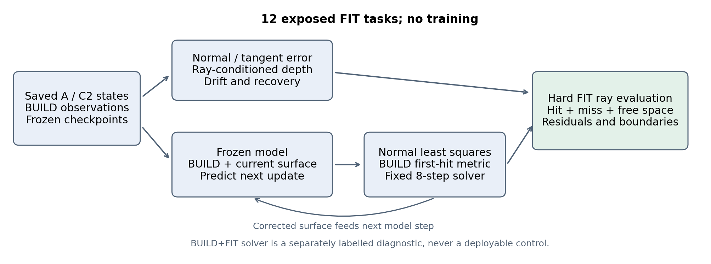
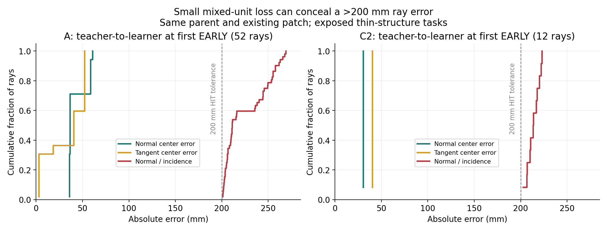
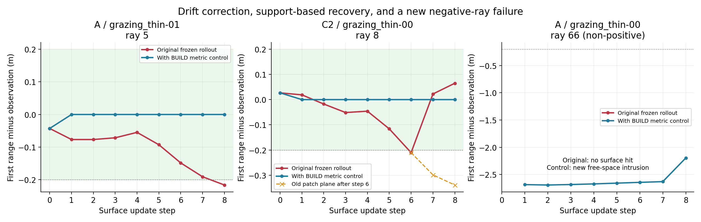
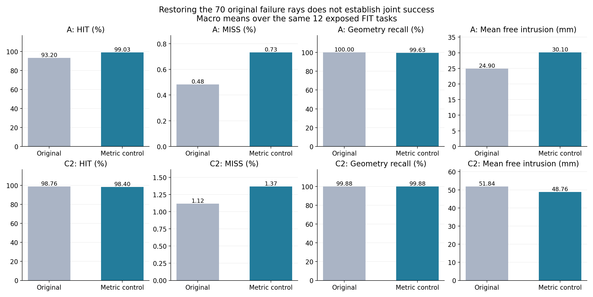

# V74-H2 P1.6：普通度量解释旧漂移，有限支撑问题仍开放

> 历史报告 / 计划：保留当时观察与结论；当前状态见 [RESEARCH_STATUS](../../../RESEARCH_STATUS.md)，归档导航见 [README](README.md)。

2026-09-13；`WS-V74-H2-P16-01 / 20260913__physical-metric-r2`。**诊断完成，结论为 PARTIAL_EXPLANATION_NOT_JOINT_SUCCESS。** 普通 BUILD 物理度量控制使原70条失败射线在对应闭环步骤全部 HIT，但没有同时解决全任务的自由空间、缺失和有限支撑问题。本轮没有训练模型，也没有新方法进展；人工评分沿用用户此前约 **3/6 Weak Reject**。

**关闭范围**：不能再把这批薄结构正例的法向漂移作为“需要全新 first-hit dynamics 机制”的证据。**整体关闭条件没有满足**；剩余问题也没有证明新机制必要。当前 ordered 实现继续关闭，不立项 ownership-stable、B/C 或真实数据训练。



## 1. 实验范围与可追溯输入

复用 GPU-P1-01 的 `20260912__A-dagger12-r1` / `C2-dagger12-r1`、`fit-teacher-r3/fit` 前3个各类任务、`dagger12-w32-r1` 冻结 checkpoint；继承 [P1.5](WORLDSIM_V7_4_H2_P15_FORENSICS_REPORT.md) 失败转移。分析前已提交[协议](WORLDSIM_V7_4_H2_P16_DIAGNOSTIC_PLAN.md)，没有根据结果改参数/阈值。

12个已训练 FIT 任务、每模型808正例射线、0–8步；薄结构为3任务196正例。分析全部 **12,928 个正例相邻状态转移、192个原始同父教师参考**；普通控制包括384个局部后状态（192 BUILD、192 BUILD+FIT诊断）和48次冻结模型八步闭环（24 BUILD、24监督诊断）。另外在24个 closed-BUILD 最终状态做同父的原算法全监督诊断，以免把不同闭环轨迹当纯信息对照。

BUILD 控制只读取构建观测。FIT监督仅用于教师/明确标记的诊断控制及评价，不能称独立测试或部署效果。每个任务80条FIT评价射线，正例沿用 `positive_actor & ~ambiguous_owner`；free-space 同原评价器作用于全部射线。负例上没有对象交点是合理结果，不能与正例 MISS 混为一谈。HIT容差固定0.2m。

## 2. Normal/tangent 与 ray-conditioned error

中心位移在参考法向下分解为：

$$\Delta c_\perp=(n^\top\Delta c)n,\qquad \Delta c_\parallel=\Delta c-\Delta c_\perp.$$

同一片、同一姿态且交点保持有效时：

$$\Delta t=\frac{n^\top\Delta c}{n^\top d},\qquad J_r=\frac{1}{n^\top d}.$$

切向位移不改变无限平面根，却可以改变有限片是否覆盖交点。因此“切向根导数为零”不等于“切向对实际求交无影响”。当法向改变时，脚本保留精确余项：

$$t_1-t_0=\frac{n_1^\top\Delta c_\perp}{n_1^\top d}+\frac{n_1^\top\Delta c_\parallel}{n_1^\top d}+\frac{(n_1-n_0)^\top(c_0-o-t_0d)}{n_1^\top d}.$$

所有无限平面量单列有效性与有限片交点，换面不套同首面解释。全10,977次同首面有限转移中，解析根差与原硬三角形查询最大误差4.44e-15m。

| 实际退化动作的几何替换 | A薄结构：52条 | C2薄结构：12条 | 多层：A1+C2 5条 |
|---|---:|---:|---:|
| 仅法向中心位移，其他保持父状态 | 52 EARLY | 12 EARLY | 0 EARLY |
| 仅切向中心位移，其他保持父状态 | 0 EARLY | 0 EARLY | 6 EARLY |

薄结构最后退化步由法向通道解释；多层6条属于有限支撑入场换首面的另一通道，不能统一写成法向漂移。

同父状态原有限候选教师→学习器的**实际中心误差**如下，比较的是已有共同片，没有按编号强行匹配不同出生来源的新片：

| 薄结构失败射线上的量 | A：最小 / 中位 / 最大 | C2：最小 / 中位 / 最大 |
|---|---|---|
| 法向中心误差绝对值 | 35.83 / 36.54 / 60.79mm | 30.28 / 30.28 / 30.28mm |
| 切向中心误差 | 2.98 / 40.49 / 52.17mm | 40.31 / 40.31 / 40.31mm |
| 射线放大倍数 1/abs(n dot d) | 3.33 / 5.88 / 7.36 | 6.69 / 7.05 / 7.36 |
| 法向误差对应的射线根误差 | 200.59 / 211.11 / 268.84mm | 202.54 / 213.50 / 222.80mm |

这些参考上的旋转差全部为零，切向深度分量仅浮点舍入量级。几十毫米中心误差对应超过200mm的物理射线误差；原14维米/弧度/log-radius混合MSE不能作为“单步几何已经足够准确”的证据。这里的教师差与P1.5的**单次实际动作法向位移2.18–20.48mm**是两个量，不得混用。



192个原始父状态全部重算同池参考，稳定转移也保存。薄结构可比较教师片相交样本中，A的射线条件误差与首距误差秩相关为1.0，欧氏中心误差为0.795；C2分别0.975/0.635。这主要反映几何恒等关系与当前样本构成，只是诊断，不是独立预测性能或必要性证据；相关性样本数1491/1510，射线并非独立任务。

## 3. 累计漂移与恢复并不是同一件事

从每次失败之前连续HIT段起点计算累计深度，保留之前的换面贡献；不把整段轨迹错误地视为固定片。

| 量 | A薄结构52条 | C2薄结构12条 |
|---|---|---|
| 连续HIT段到首次EARLY | 4–8步 | 6步 |
| 失败前最后一步之前，已有累计提前 | 128.37–212.20mm | 137.47–151.22mm |
| 最后一步占净深度漂移中位 | 27.36% | 39.79% |
| 在观测到的8步内恢复HIT | 3/52 | 12/12 |
| 未观察到恢复、右删失 | 49/52 | 0/12 |

A并非每条都由“小最后一步”主导：21/52最后一步略超过净漂移的一半，最大50.70%；均有此前显著累计。A的3条恢复发生于第8步，法向回退单独可重现3/3，无换面。不能将49个右删失病例说成永远无法恢复。

C2的12条在第6步退化、1–2步后恢复。**12/12恢复时旧片退出有限支撑并更换首面，旧片的无限平面根仍然EARLY。** 半径单独替换可重现8/12恢复，切向单独1/12，切向+半径9/12；法向位移单独也能通过改变有限片交点位置重现3/12。它们是不同反事实、允许重叠，不能相加成贡献比例。C2的最终正确读出不能全部归因于更准确的法向回归。



左图为A thin-01失败射线中编号最小者；中图为C2 thin-00恢复射线8，虚线继续跟踪原责任片无限平面；右图为A控制引入的首条薄结构非正例侵入射线。缺少原始曲线表示无交点，完整选择ID保存在figure_selection.json。示例用于解释，统计使用全部资产。

## 4. 普通物理 metric control 的定义和结果

每片一个法向标量位移，不改旋转、半径、活动片和网络参数。对当前真实首面重算导数，使用正例距离与全部射线自由段的普通平方度量：

$$E(S)=\frac1{N_+}\sum_{r\in B^+}\ell(Q(S,r)-y_r)+\frac1{|B|}\sum_{r\in B}[y_r-0.2-Q(S,r)]_+^2.$$

有限正例的ell为距离平方；正例MISS沿用原2m代价尺度、平方为4，自由段MISS残差为零。正规方程按片为对角形式；无观测梯度片不动，法向标量步截至±0.75m；每轮使用固定最多8个二分步长和1e-4 Armijo系数，共8轮。线搜索只检查同一整体目标，没有逐射线保护门槛。这个控制有额外计算，也保留了原冻结模型的出生/范围能力；不是从零独立重建算法，更不是新论文方法。

局部事后控制中，BUILD恢复A53/53、C2 15/17原失败，C2剩2条为多层；同算法读取BUILD+FIT可局部恢复70/70。然而全部原始后状态里，BUILD局部校正又把A13/C2 9个原HIT射线状态变为非HIT，不能只报修复率。

**真实闭环**每一步在修正后表面重新运行冻结模型，隐藏状态照常传播。BUILD控制在全部原70个case/ray/step上都是HIT，并消除薄结构新增HIT→EARLY。主要最终指标如下；HIT/EARLY/MISS/recall按任务宏平均，free_m是所有评价射线平均侵入深度：

| 队列 / 模型 / 版本 | HIT % | EARLY % | MISS % | 几何recall % | free_m (mm) |
|---|---:|---:|---:|---:|---:|
| 薄结构 / A / 原始 | 74.25 | 25.256 | 0.498 | 100.00 | 18.80 |
| 薄结构 / A / BUILD控制 | 99.50 | 0.000 | 0.498 | 99.50 | 42.32 |
| 薄结构 / C2 / 原始 | 99.50 | 0.000 | 0.498 | 100.00 | 0.00 |
| 薄结构 / C2 / BUILD控制 | 100.00 | 0.000 | 0.000 | 100.00 | 0.00 |
| 全12任务 / A / 原始 | 93.20 | 6.314 | 0.483 | 100.00 | 24.90 |
| 全12任务 / A / BUILD控制 | 99.03 | 0.000 | 0.732 | 99.63 | 30.10 |
| 全12任务 / C2 / 原始 | 98.76 | 0.123 | 1.118 | 99.88 | 51.84 |
| 全12任务 / C2 / BUILD控制 | 98.40 | 0.235 | 1.367 | 99.88 | 48.76 |

A全任务最终正例HIT计数755→800/808，C2为798→795/808。A薄结构146→195/196，C2为195→196/196；计数汇总与宏平均分母不同。A正例EARLY被消除，却出现更严重的非正例自由段侵入。C2薄结构指标改善，但其他构型出现新错误。



## 5. 残差审计：为什么不能宣布全部问题已被解释

1. **A新自由空间侵入**：最终全任务11条非正例侵入，总深度28.90m；薄结构4条是原本无交点、控制闭环产生的新侵入，单条1.38–3.59m。A责任片对应的11条中，有8条在BUILD没有该片自身首面提前违规，有4条该片没有BUILD正例首面责任；部分片只作为被遮挡后继仍有正例相交。当前局部目标未充分约束它们，不能推导为全局不可辨识定理。
2. **C2新共享支撑失败**：`shared_support-00`的ray73/74在第5步、ray51在第7步出现新的HIT→EARLY，均由已有片2替换片1成为首面。它们不在原17条失败清单内。最终正例有2 EARLY+11 MISS；全任务17条非正例侵入中15条责任片在BUILD无自身首面提前违规。
3. **同父信息诊断也未解决全部残差**：从closed-BUILD的同一最终表面，用原算法额外读取BUILD+FIT后，A free_m从0.03010降至0.00970m，C2从0.04876降至0.04424m；A原8个坏正例、C2原13个坏正例仍未恢复。说明观测覆盖能解释部分残差，但法向一维控制/局部求解也有限制。不能把全监督参考称作全局oracle或容量下界。
4. **从头反馈路径会改变错误类型**：完整BUILD+FIT诊断闭环也不是保证更强：A薄结构出现21次新HIT→EARLY瞬态，最终EARLY为0但MISS增至1.01%；C2全任务MISS为2.73%。这不是部署结果或新的调参方向，结果原样保留。

纯法向控制不更新切向位置、支撑边界或出生，而这些会改变有限片成员关系；MISS的当前首面梯度也不存在。观察到这些局限，不等于证明所有普通完整自由度优化都不够。已有完整C1在另外80个mechanism任务上近乎解决问题，仍禁止将那个非配对结果冒充这12个FIT任务的同状态对照。

## 6. 对下一层抽象的决定

**不把“normal drift → 新 ownership-stable operator”立为下一主方法。** 这条动机已被普通射线物理度量和几何分解解释，修一个metric、加投影或换损失没有主方法新颖性。

保留的下一层问题分解是：**射线能够约束的表面放置，与决定有限支撑/遮挡关系的生成自由度，分别如何演化并共同满足观测？** 这不是宣称新representation，也不是把P1.6未通过的控制拼成新框架。剩余证据不足以判定witness机制必要或不必要。

若继续这一级研究，最先需要的是在相同剩余状态上给予普通方法完整既有几何自由度，区分“构建观测能约束但普通局部控制未做到”与“观测未覆盖的支撑扩张”；这是后续必要性辨别问题，不自动授权新训练/新方法。本轮按用户要求收口，不扩网络、epoch、DAgger、loss grid或真实数据。

一句新知识：**射线条件法向误差足以解释旧薄结构正例漂移，普通校正可消除它；但正确首面深度、有限支撑范围与闭环自由空间质量不是同一个成功条件。**


### 推理批次对照修正与保留边界

初次r1使用12个任务一起网络前向，而原推理为8+4；首次未校正输出中心最大差6.59e-6m。考虑硬求交反馈可能放大路径差异，r2仅将网络前向恢复为原8+4，模型/控制参数/数据不变；第一步中心差降为0，片数量一致。主要正例结论与关闭边界未变，但A控制的全任务free_m由r1的0.04006m变为r2的0.03010m，仍高于原始0.02490m；因此不能将微小批次误差当成可忽略的闭环影响。全文主结果已更新为r2。r1完整资产及提交132500fa保留，当前不是挑选两个run中更好者，而是使用与原推理设置匹配的r2。详见batch_correction.json。此为对照工程修正，不是新机制证据或扩训练。

## 7. 前序、资产与复现

法向残差/Jacobian沿用成熟几何优化思路，参见 [Open3D point-to-plane ICP](https://www.open3d.org/docs/release/tutorial/pipelines/icp_registration.html#point-to-plane-icp)；Gauss–Newton与线搜索参考 [Ceres 官方文档](https://ceres-solver.readthedocs.io/latest/nnls_solving.html#line-search-methods)。切向滑动不能由平面几何残差唯一约束已有明确前序，见 [Park et al., ICCV2017 官方 Colored ICP 教程](https://www.open3d.org/docs/release/tutorial/pipelines/colored_pointcloud_registration.html)。本项目只迁移诊断与普通求解思想，没有引入颜色、视觉大模型或宣布这些性质原创。

主审计完成23.43秒，PyTorch峰值分配0.0581GiB；额外同父残差/恢复分析和图生成分别运行，未计入这23.43秒。环境RTX3090、cgroup 14 CPU/90GiB，无OOM、资源阻塞或模型训练。一次必要的科学实现核对覆盖同首面解析公式与硬求交；没有大量smoke/回归测试。图按资产生成并视觉检查。

完整资产：`/root/autodl-tmp/runs/worldsim_v74_h2/WS-V74-H2-P16-01/20260913__physical-metric-r2/`，含raw/teacher/local/closed/proposal/same-parent状态、全射线查询、求解日志、输入和冻结checkpoint。轻量入口为[结果索引](../../../autoresearch/worldsim_v74_h2/p16/README.md)，[F10短卡](../../../research_failures/entries/V74-H2-F10.md)。大逐射线数组保留在runs，不默认读入context。

```bash
python scripts/query_research_failures.py --id V74-H2-F10 --detail --limit 1 --max-lines 30
python scripts/audit_worldsim_v74_h2_p16.py \
  --source /root/autodl-tmp/runs/worldsim_v74_h2/WS-V74-H2-GPU-P1-01 \
  --p15 /root/autodl-tmp/runs/worldsim_v74_h2/WS-V74-H2-P15-01/20260913__switching-margin-r1 \
  --output /root/autodl-tmp/runs/worldsim_v74_h2/WS-V74-H2-P16-01/NEW_RUN_DIRECTORY
```

随后按结果目录运行`summarize_worldsim_v74_h2_p16.py`、`residual_worldsim_v74_h2_p16.py`、`recovery_detail_worldsim_v74_h2_p16.py`；图由`render_worldsim_v74_h2_p16.py`生成。核心协议提交cab0179e；实测数据/代码里程碑8d273d0f。failure_ledger_delta=F10，F08/F09历史保留。报告、图、三本总账和分支push完成、无活动任务后按既有授权关机。
