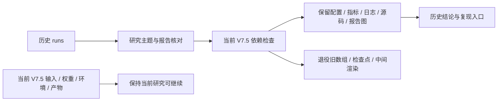

# 历史 runs 退役与研究脉络

日期：2026-09-22。任务：`WS-STORAGE-OLD-RUNS-RETIRE-01 / 20260922-r1`。用户明确授权：早期 runs 若已有报告记录，或对当前 V7 研究帮助不大，可以清理。此次授权更新了旧报告中要求常驻所有 checkpoint/固定表面的历史保留策略。

执行前代码：`8b5eafee`，分支 `research/worldsim-v7.4-h2-generative-surface`。`model_calls=0`，`failure_ledger_delta=none`，`human_verdict=null`。科学结论、正反例和已消费的数据角色不因删除文件而改变。

**实际新增可用空间 166.821 GiB；当前已用约 343.7 GiB，可用约 356.3 GiB。** 删除 169,845 个普通文件，保留并核验 53,685 个历史文件；当前 V7.5 的 4,038 个文件/链接核验通过，未改动或丢失。

## 170.5 GiB 主要研究了什么

下表为删除前同一次全盘扫描对目录的物理空间归属，含共享硬链接时不能解释成独立删除收益。完整逐目录实测结果见 `result.json` 和 `plan_summary.json`。

| 路线 | 旧占用 GiB | 研究问题与已有结论 | 保留的报告入口 |
|---|---:|---|---|
| V4 / EviDelta-GS | 21.3 | 在 StreetGS / AD-GS 重建上做对象编辑、风险修复与时序修正。M1 独立验证失败；M2 外观改善但洞内几何变差；M3 支持有限短片时序改善。不是闭环能力证明。 | [V4 终局归档](../../archive/2026-08/worldsim-v4-final/README.md) |
| V5 / V5.1 / V5.2 | 9.7 | 结构化对象归属、几何优先修复、多视图语义证据。V5.1 的主要边界是有效观测缺失，图传播、聚合与 identity 路线未产生可晋级候选。 | [V5.1 收口](../../archive/2026-08/worldsim-v51-m1-closeout/README.md)、[历史导航](../../archive/README.md) |
| V6–V6.3 | 25.4 | 可验证世界编译、选择性复用、占据/表面风险约束。部分冻结接口和效率结果成立；V6.3 表面架构在保持覆盖时仍增加 hidden-FREE 风险，已关闭。 | [V6 selector](../worldsim_v6/SELECTOR_RESEARCH_FAMILY_CLOSEOUT.md)、[V6.1](../worldsim_v61/V61_MINIMUM_EXPERIMENT_CLOSEOUT.md)、[V6.2](../worldsim_v62/README.md)、[V6.3](../worldsim_v63/P6_SURFACE_FAMILY_CLOSEOUT.md) |
| V6.4–V6.7 | 34.4 | 从体素不确定性转向“轨迹访问的状态是否可靠”、对象存在与局部几何分离、Actor 误差分布与轨迹边界因子化。保留有限校准/排序正结果，也保留碰撞判据、动作收益及自然表面修复的失败边界；这些不是 OmniDreams 生成闭环实验。 | [V6.4](../worldsim_v64/V64_RESEARCH_FAMILY_CLOSEOUT.md)、[V6.5](../worldsim_v65/V65_RESEARCH_CLOSEOUT.md)、[V6.6](../worldsim_v66/V66_RESEARCH_CLOSEOUT.md)、[V6.7 技术报告](../worldsim_v67/V67_ARXIV_TECHNICAL_REPORT.md) |
| V7 / V7.1 / V7.2 | 10.0 | 首回波安全与表面完整性、连续表面移动、隐式场、TSDF、点云补全及 VGGT/Pi3X 视觉证据接口。发现降低 Early 与补全表面是不同目标；旧 A1 未超过 TSDF。未执行候选不能算科学失败。 | [V7.1](../worldsim_v71/V71_RESEARCH_CLOSEOUT.md)、[V7.2 A1](../../archive/2026-09/pre-v74/WORLDSIM_V7_2_D1_NEGATIVE_CLOSEOUT.md)、[V7.2 视觉接口](../../archive/2026-09/pre-v74/WORLDSIM_V7_2_E1_BACKBONE_AND_BEAM_REPORT.md) |
| V7.3 | 32.1 | 联合视觉与 LiDAR 的可训练表面/查询表示。开发集 Hit 改善，但独立 AV2 确认中的 Actor 与场景返回退化，最终联合泛化假设未获支持。 | [最终记录](../../archive/2026-09/pre-v74/V73_RESEARCH_STATUS.md)、[实验台账](../../archive/2026-09/pre-v74/V73_EXPERIMENTS.md) |
| V7.4 / H2 / simimpact / V8.1 | 36.5 | 官方几何模型、稀疏/低纹理 badcase、early surface、LiDAR/占据/感知与局部仿真影响。多个适配读出存在早交点，但旧白车 0.323 m 案例被官方模型恢复，不能称“所有 SOTA 普遍产生 phantom”或已证明闭环事故。 | [V7.4 官方模型主图](../../archive/2026-09/v74-0920/WORLDSIM_V7_4_MAIN_FIGURES.md)、[仿真证据导航](../../EXPERIMENTS.md)、[历史导航](../../archive/README.md) |
| 更早的 motion projection / 动态重建 / route-pivot 等 | 约 1.2 | 早期训练、时序投影、场景重建和任务可行性探索；不再是当前生成式反事实主线。 | [历史实验快照](../../archive/2026-07/v7-feasibility/EXPERIMENTS_V1_V7_SNAPSHOT.md) |

这些路线仍提供方法边界和负结果，报告有保留价值。其大型中间数组与旧训练权重不需要持续占用当前研究的数据盘。

## 保留与退役规则

- 保留历史 JSON/JSONL、配置、CSV/TSV 指标、日志、源码快照、数据库和小型无扩展名记录。
- 保留 PDF/SVG、轻量视频/GIF，以及路径命名明确的 report、review、figure、panel、badcase、preview、architecture 等报告图和报告包。
- 退役其余历史大型数组、特征缓存、旧训练检查点、网格/点云、中间渲染、TensorBoard 二进制事件及旧场景包。逐文件动作以 `plan.jsonl.gz` 为准，不能仅凭后缀猜测某文件是否保留。
- `runs/worldsim_v75`、`runs/_workers`、runs 根目录文件和实验数据库不在删除范围；data、models、envs、external、third_party、论文和仓库原有文档也不在删除范围。
- 当前 V7.5 虽然使用 V8.1 的 DVGT-1 权重/环境和 simimpact 的 nuplan-devkit 代码，但这些分别在 models/envs/external，不在历史 runs 删除范围。
- 清单同时记录硬链接数量。共享 inode 仅在全部链接均被删除时计入预计释放量；最终空间收益以 `statvfs` 前后差为准。

## 当前依赖及验证

清理前检查 V7.5 代码、协议、run 元数据和符号链接：未发现对本批旧 runs 的直接路径引用或符号链接。另检查 data/models/envs/external/third_party/仓库的外部符号链接，以及进程 cwd/文件句柄。命中的外部符号链接目标自动保留，活动使用会阻止执行。

删除前保存当前 V7.5 全文件/链接的 inode、size、mtime 和链接目标；删除后逐项验证。对保留的旧 run 文件也做相同核验，不新增哈希或重跑科学评价。删除器只允许清单中的旧 runs 普通文件，检查绝对真实路径及删除前元数据，不跟随目录链接。

## 复现含义与恢复方式

**文档与清单不是 checkpoint 或输入数组的完整备份。** 已删除的固定表面、逐束预测、缓存和训练权重不再可即时回放。

1. 从原报告、留存 run 的 manifest/config/source snapshot 或指定 Git 提交恢复代码、依赖、seed、输入角色与命令。
2. 按原数据来源恢复输入。此前 V4 原始数据也已退役，需先按 [V4 恢复记录](../v4_data_retirement_20260922/README.md)处理；不能把缺失资产解释为新的模型失败。
3. 公共模型可按来源和版本重下；本地训练产生的旧 checkpoint 必须重训，或从另有保存的副本恢复。保存 seed/配置不保证逐字节或逐项数值完全一致。
4. 在新 task/run 输出目录重新生成产物，不覆盖冻结的历史指标，不自动恢复旧队列，不把已消费确认数据重新当作未读来源。
5. 此清理不要求重训来“验证复现”。后续若重新研究某条旧路线，先估算数据恢复和训练成本，并遵守当时的证据边界及新的研究授权。

## 审计文件

远端完整目录：`/root/autodl-tmp/cleanup_manifests/20260922-old-runs-retire/`。

- `audit.json`：版本存量、当前依赖、进程快照。
- `inventory.jsonl.gz`：清理前普通文件清单，含路径/占用/inode/mtime。
- `plan.jsonl.gz`：逐文件保留或删除及原因。
- `plan_summary.json`：共享链接后的释放预估与分类。
- `deleted.jsonl.gz`：实际删除回执。
- `v75_before.jsonl.gz`：当前 V7.5 保护快照。
- `result.json`：实际空间与保留项验证结果。
- `retire.py`、`audit.py`：本轮实现；执行后禁止盲目重跑删除器。

仓库只收录轻量结论、清单和脚本，不复制大型原始产物。各历史版本根目录另有 `ARTIFACTS_RETIRED.md` 提醒大产物缺失。旧报告中的“当时保留”陈述是历史事实，当前驻留性由本记录和当前状态页说明。
