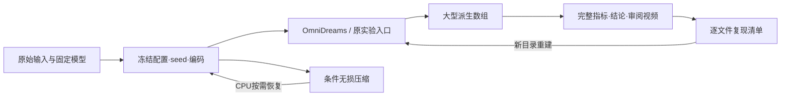

# 2026-09-22 存储清理与恢复

任务 `WS-STORAGE-CLEANUP-20260922`。用户授权：已收口实验可只保留结论和复现所需材料，不要求全部大型 artifact 常驻。源码起点为当前分支的 `b7f97bda`；此次未重跑推理、训练或科学评价。人工 verdict 为 null，`failure_ledger_delta:none`。

清理开始可用约0.91GiB，完成约48.4GiB，实测净增约47.5GiB，使用率从100%降到94%。精确字节数见 [result.json](result.json)，以文件系统可用空间差为准；两个清理阶段与无损压缩曾并行，不将各阶段瞬时空间差相加。



## 处理范围

| 类别 | 操作 | 文件体积变化 | 保留与恢复 |
|---|---|---:|---|
| pip HTTP 下载缓存 | 删除552个文件 | 释放2.54GiB | 已安装环境、wheel、模型均保留；需要安装时重新下载 |
| 已收口 V7.5 生成数组 | 删除46个 `.npy` | 释放21.71GiB | 完整结果/协议/seed/输入编码、全部指标与MP4保留；46份明确复现步骤 |
| V7.5 条件数组 | 63份无损gzip归档 | 23.69GiB → 0.47GiB | 每份压缩后与原件逐字节比较，再删除原件；CPU恢复 |
| 当前 actor 正反案例 | 保留23份生成数组 | 约6.78GiB保留 | 最新主图与对象移除/减速证据可继续复核 |

没有移除整个run。未删除原始数据、模型权重、关键checkpoint、安装环境、任何实验JSON/YAML/指标/失败记录。KITTI压缩包只有选择性抽取，保留原件。V6.4旧特征曾做只读候选检查，但其历史worker环境路径已不存在，未删除这些特征；该缺口不是本次清理造成。

## 审计文件

- [删除清单](phase2-v75-output-plan.json)：旧生成数组逐文件大小、原因与恢复索引；4个未满足自动恢复检查的following输出保留。
- [复现步骤](replay-recipes.json)：46个输出的真实输入路径、embedding、seed、协议、原结果与审阅视频。
- [环境快照](environment.json)：136个已安装包的名称/版本，以及项目和官方源码版本；不记录token或下载URL。
- [压缩清单](conditions-compacted.jsonl)：原路径、压缩路径、原/新大小和逐字节验证结果。
- [恢复验证](restore-test.json)：经符号链接恢复一份640,696,448字节的条件数组，并逐字节复核；验证后的临时展开件已清理，压缩件仍保留。
- 完整机器侧清单、删除事件日志和本轮清理脚本：`/root/autodl-tmp/cleanup_manifests/20260922/`。重要记录另已复制到本地工作区与本目录。

清理后的4个旧条件符号链接暂时指向未展开的`.npy`，目标压缩件均存在；恢复脚本会解析到真实目标。它们不是输入丢失。最新主图使用的生成数组不受影响。

## 按需恢复一个条件文件

在 `/root/autodl-tmp/motion_proj` 执行；路径可以是符号链接入口：

```bash
python3 scripts/worldsim_v75/restore_compacted_array.py \
  --path /root/autodl-tmp/runs/worldsim_v75/WS-V75-NATURAL-ROLLOUT-01/20260920-seed43/gt_clean/conditions.npy
```

恢复保持原始字节，不需要GPU，不覆盖已有文件，也不改变原终态记录。只展开要使用的输入，避免一次恢复全部约24GiB。

## 复现已删除的生成数组

下面第一条仅CPU预检，已对46/46完成输入、seed、条件数组形状、embedding和审阅视频帧数检查。先在 `replay-recipes.json` 中选择 `index`：

```bash
source scripts/worldsim_v75/environment.sh
CUDA_VISIBLE_DEVICES= OMP_NUM_THREADS=1 python scripts/worldsim_v75/replay_archived_generation.py

# 只有显式 --execute 才加载模型。必须填写新的输出路径；OOM停止。
python scripts/worldsim_v75/replay_archived_generation.py \
  --index 0 --execute \
  --output /root/autodl-tmp/runs/worldsim_v75/reproduction/NEW_RUN/generated.npy
```

该工具直接读取无损条件压缩流，复用保留的官方OmniDreams权重、embedding、seed和逐块输入时序，恢复保存条件下的生成过程。它不是重新执行策略反馈，也不是新增独立科学样本。完整闭环复现应使用清单对应的原入口和冻结协议，在新run中重新执行感知—策略—相机—生成；原决策、相机轨迹和输入场景仍保留。

本次没有调用GPU检验新生成的逐像素一致性。清理保留了执行复现所需材料和已验证的原指标；新的输出需要重新评价。MP4为有损审阅副本，不能解码成数组后冒充旧精确指标的输入。

## 后续保留规则

新实验收口后保留完整配置、输入角色、源码版本、seed、原始结果与结论；大型派生产物按后续用途决定驻留。条件数组默认无损压缩，关键主图正反案例保留必要原始输出，已关闭路线的非关键数组保留可执行恢复清单即可。长期规则见[资产保留政策](../../ARTIFACT_RETENTION.md)，当前研究状态只写[RESEARCH_STATUS](../../RESEARCH_STATUS.md)。
