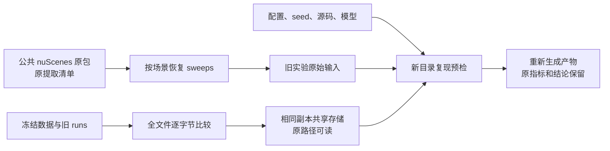

# V4 数据与早期 runs 清理记录

2026-09-22，第二轮。依据用户明确授权清理 V4 数据、早期 runs 及上一轮遗漏的下载残片。代码基线 `ebea0a64`，分支 `research/worldsim-v7.4-h2-generative-surface`。研究结论不变；`model_calls=0`、`failure_ledger_delta=none`、`human_verdict=null`。

**本轮实际新增可用空间 44.691 GiB：48.377 → 93.068 GiB。磁盘已用 606.932 GiB（原约 652 GiB）。** 最终空间以 `statvfs` 差值为准，不能相加各阶段瞬时空闲增量：释放可能延迟，且部分检查同时进行。逐文件核验见 [result.json](result.json)。



## 实际清理

| 范围 | 处理 | 文件占用释放 |
|---|---|---:|
| V4 数据 | 36,776 处相同文件去重；删除来源明确且不与其他文件共享存储的 14,612 个展开 sweeps | 约 12.35 GiB |
| 早期 runs | 16 次 profile100 预检的 28 个大型 checkpoint；相同 checkpoint/缓存去重；下载分片与已安装包缓存 | 约 20.77 GiB |
| 遗漏模型下载残片 | DVGT-2 / VGGT-Ω 的 16 个下载分片及 NoKSR 中断压缩包 | 约 11.61 GiB |

V4 目录由此前约 111 GiB 降至 **98.158 GiB**；runs 由此前约 207 GiB 降至 **185.612 GiB**。这些是去重后按同一次 `du` 计数的物理占用；单独扫描共享文件所在的子目录会重复归属，不能再次相加。全部操作共删除 14,827 个文件、合并 38,923 处完全相同的副本。

V4 的数据去重释放 5.481 GiB，公共原包展开 sweeps 释放 6.871 GiB。第一次清单约 10.6 GiB；去重后其中一部分已与其他路径共享 inode，不再删除，以免只破坏入口而不释放空间。没有覆盖到可靠分片来源的 sweeps、samples、标定/元数据、处理后数据及其模型依赖继续保留。公共原始数据仍在 `/root/autodl-pub/nuScenes/Fulldatasetv1.0/Trainval`，未删除任何公共原包。

旧 runs 保留每个版本目录、正式 checkpoint、固定表面、配置、源码快照、原始指标、日志和好坏案例。只移除已有正式结果覆盖的 100 步预检大文件。V6.3–V6.7 的特征缓存以**相同内容去重**处理，不依赖重装已经缺失的旧 IR-WM 环境。共享文件按冻结资产使用，复现写新目录；若需修改某份内容，先复制成独立文件。

## 验证与边界

- 16 个 DVGT-2 / Ω 分片与完整 checkpoint 对应字节范围逐字节一致；完整模型保持可读。Ω 分片从完整文件的 251,658,240 字节处开始，未误当成从零开始的完整分片集。
- 所有合并文件先作完整字节比较，随后验证原路径与保留源指向同一 inode，大小一致。没有计算新哈希或用近似张量相等代替文件相等。
- 公共原包 10 个分片均存在、可读并能解析首个 tar 成员；逐文件来源沿用原提取清单。实际恢复了一个目标 sweeps 样本，并与删除前原件逐字节比较通过。没有重新完整扫描约 294 GiB 的公共压缩包，也未声称全量恢复已经测试。
- 预检对应正式 checkpoint 全部存在；V7.5 的 956 个大文件大小、inode、mtime 均未改变，其中最新 actor 的 23 个生成数组全部保留。
- 扫描 data/runs/models 的符号链接，未发现本轮清理新增的断链。未运行模型、训练、旧实验重放或关机任务。
- 恢复 sweeps 需要当前公共数据挂载；压缩 tar 按流读取，可能较慢。复现历史 GPU 预检仍需要其原环境和足够内存。精确命令与依赖在保留的 `resolved.yaml`、`source_snapshot/`、`stages/` 和 `profile-plan.json` 中。

## 恢复入口

从项目根目录先检查所需场景，再显式执行恢复。按需恢复，不自动重启历史实验：

```bash
cd /root/autodl-tmp/motion_proj
/root/autodl-tmp/envs/motionproj/bin/python scripts/storage/restore_v4_sweeps.py --scene scene-0048
/root/autodl-tmp/envs/motionproj/bin/python scripts/storage/restore_v4_sweeps.py --scene scene-0048 --execute
```

脚本默认检查；`--execute` 只从公共原包提取所选场景清单中的缺失 sweeps，保留现有文件并校验大小。可重复提供 `--scene`。数据去重与旧缓存去重不需要恢复，旧路径直接可读。下载分片无需恢复即可加载完整模型。

100 步预检复现见 [profile-plan.json](profile-plan.json)：保留 scene、原命令、配置、源码快照与正式 checkpoint 路径。将命令的输出改到新 run 后再执行；不覆盖历史终态，不把重跑当作新增独立证据。

逐文件 sweeps 清单：`sweeps-plan.jsonl.gz`；去重来源映射：`dedup-applied.jsonl.gz`、`legacy-dedup.jsonl.gz`。这些是 gzip 压缩的 JSONL，可直接用 Python `gzip.open(..., 'rt')` 读取。下载与包缓存见 `download-plan.json`、`sim-download-plan.json`、`wheel-plan.json`。本报告目录含核验结果和本次审计脚本，总体约 3 MiB。

完整远端操作账本：`/root/autodl-tmp/cleanup_manifests/20260922-r2/`。上一轮 V7.5 数组压缩与生成回放说明仍见 [第一轮报告](../storage_cleanup_20260922/README.md)。当前研究状态只更新 [RESEARCH_STATUS](../../RESEARCH_STATUS.md)，不在 AGENTS 或 failure 账本重复记录。
