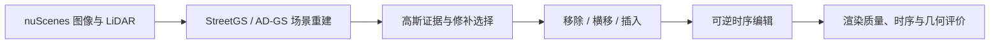

# V4 数据退出常驻存储

2026-09-22，依据用户要求直接删除 V4 数据。**已删除整个 `/root/autodl-tmp/data/worldsim_v4`，实际释放 96.465 GiB；当前已用 510.472 GiB，可用 189.528 GiB。** 此结果取代上一轮“V4 保留约 98.2 GiB”的存储安排；上一轮报告保留为当时的操作记录。

## V4 研究什么

V4 是 2026-08-11 至 08-13 已完成的 EviDelta-GS 场景编辑路线。在固定 StreetGS/AD-GS 重建上，研究对象移除、横移、插入后的证据估计、修补选择与时序一致性；数据是 nuScenes 的 6 development / 6 validation / 18 test 场景。

冻结结论：M1 证据场独立验证失败；M2 修补选择改善部分图像指标，但洞内几何 MAE 从约 2.14 m 恶化至 5.53 m；M3 在 18 场 test 中保留 12 可评与 6 abstain，得到有限的短片时序改善。没有证明普遍几何修复优势、长时序或闭环驾驶安全。

来源：[V4 问题定义](../../archive/2026-08/worldsim-v4-final/snapshots/WS_V4_P0_SCOPE.md)、[V4 最终结果](../../archive/2026-08/worldsim-v4-final/snapshots/RESEARCH_STATUS_V4_FINAL_SNAPSHOT.md)。这些结论均未因清理改写。

## 删除与保留

- 删除了 V4 目录下的原始展开数据、DriveStudio/AD-GS 派生图像、LiDAR、depth/flow/mask、元数据副本和其他处理缓存，共涉及 897,964 个普通文件（其中预处理模型在删除前移出）。没有把大批数据转存到另一个临时目录。
- 约 1.7 GiB 官方预处理权重及其小型配置移到 `/root/autodl-tmp/models/legacy_v4_preprocess`，保留 Depth Anything V2、CoTracker、SegFormer 的既有版本，避免重建输入时再次下载。
- 保留所有版本的研究报告、配置、代码、原始指标、正式 checkpoint 和既有图表。当前 OmniDreams 的 AV2、官方样例、模型与 V7.5 runs 保留。当前 V7.5 代码/协议中未发现 V4 数据引用，也没有 V7.5 符号链接指向删除目录。
- nuScenes 公共原包及元数据包仍在 `/root/autodl-pub/nuScenes/Fulldatasetv1.0/Trainval`。原提取清单、scene 索引、适配器清单/划分已另行保留。
- 旧 V4、V7.4、V8.1 及 simimpact 中共有 3,124 个输入符号链接指向被删除的数据，今后使用它们必须先恢复输入。这是本次整体退出常驻存储的已知影响；不把它们误报成“旧实验仍能直接运行”。其他旧版本配置中的文本路径引用也可能需要恢复。

## 恢复方法与边界

完整历史恢复要重新准备数据和派生输入，不是只恢复几份文档，也没有重新执行 GPU 预处理验证。

1. 从公共 `v1.0-trainval_meta.tgz` 恢复 `nuscenes_meta`，建立 `drivestudio_raw_trainval` 的 metadata/maps 入口。地图扩展原 ZIP 保留在 `/root/autodl-tmp/nuScenes-map-expansion-v1.3.zip`。
2. 使用保留的 scene/role 清单和 `scripts/prepare_dr_v2_drivestudio_scene.py` 或 `scripts/prepare_worldsim_v4_baseline_data.py` 从公共十个 blobs 原包提取所需场景。新 run 写新目录，不覆盖旧终态。不能把恢复数据或重跑当成新的独立 test 证据。
3. 按 `configs/worldsim_v4/{baseline_data_v1,m1_validation_data_v1,m3_test_data_v1}.yaml` 与原 run 的 `resolved.yaml`、`stages/` 命令重新处理。DriveStudio 入口是 `scripts/preprocess_dr_v2_nuscenes_single.py`；AD-GS 入口是 `scripts/prepare_worldsim_v4_adgs.py`，随后按旧记录恢复 depth、flow 与 sky mask。恢复旧配置时可将 `data/worldsim_v4/model_staging` 链接到新的 `models/legacy_v4_preprocess`。
4. 原有 `scripts/storage/restore_v4_sweeps.py --scene scene-0048` 仍默认只检查；清单自动回退到保留的退休记录。它只恢复 sweeps，不能替代上述完整数据准备。

恢复索引：`provenance.tar.gz` 包含原提取清单、适配器记录和 scene 索引；`raw_input_index.jsonl.gz` 保存本次删除前的原始输入路径及大小；`affected_legacy_links.json.gz` 列出需要恢复的旧链接。它们是来源记录，不是大型输入备份。权重位置见 `plan_summary.json`，删除空间与边界见 `result.json`。

远端完整账本：`/root/autodl-tmp/cleanup_manifests/20260922-v4-retire/`。公共原包需要仍可挂载；恢复可能耗时且派生输入可能需要 GPU。此次仅做清理，`model_calls=0`、`human_verdict=null`、`failure_ledger_delta=none`。当前状态只写入 `docs/RESEARCH_STATUS.md`。
