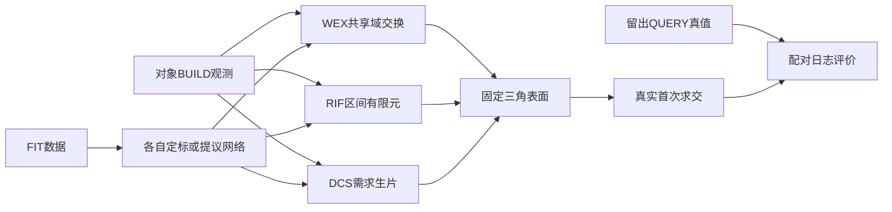

# V74 固定表面真实留出比较

配置冻结后统一读取，两个数据集各自 FIT 与 DEV。43 ready 对象和23缺BUILD合同对象均保留；没有自有QUERY返回时指标未定义，不填零。以下是预定筛选标准计算，人工verdict留空。

## nuscenes

日志等权均值。命中/提前/缺失/召回单位%，侵入和距离单位m。

| 方法 | hit | early | miss | recall | free | distance | 中位面数 | 中位构建秒 |
|---|---:|---:|---:|---:|---:|---:|---:|---:|
| WEX | 34.732 | 7.522 | 53.680 | 70.826 | 0.046 | 0.321 | 697.0 | 0.054 |
| A0_soft | 34.634 | 6.789 | 54.253 | 70.638 | 0.042 | 0.322 | 694.0 | 12.310 |
| A1_fixed | 34.732 | 7.522 | 53.680 | 70.826 | 0.046 | 0.321 | 697.0 | 0.051 |
| A2_greedy | 34.732 | 7.522 | 53.680 | 70.826 | 0.046 | 0.321 | 697.0 | 0.045 |
| A3_milp | 34.914 | 7.522 | 53.680 | 70.826 | 0.046 | 0.321 | 697.0 | 0.052 |
| RIF | 37.208 | 14.840 | 20.379 | 74.103 | 0.512 | 0.198 | 1376.0 | 4.599 |
| B0_sampled | 37.794 | 9.684 | 20.678 | 67.068 | 0.538 | 0.244 | 568.0 | 0.705 |
| B1_exact | 31.168 | 8.910 | 22.839 | 63.072 | 0.387 | 0.282 | 534.0 | 0.795 |
| B2_regular | 30.608 | 10.021 | 20.719 | 63.533 | 0.591 | 0.275 | 1984.0 | 4.140 |
| DCS | 25.936 | 2.398 | 66.777 | 59.590 | 0.007 | 0.381 | 160.0 | 0.397 |
| C0_fixed | 19.831 | 1.725 | 74.161 | 50.248 | 0.002 | 0.427 | 112.0 | 0.013 |
| C1_residual | 26.342 | 3.837 | 65.830 | 62.118 | 0.003 | 0.378 | 136.0 | 0.301 |
| C2_local_network | 25.484 | 3.350 | 67.326 | 58.930 | 0.003 | 0.384 | 144.0 | 0.344 |
| C3_no_demand | 26.238 | 3.191 | 66.741 | 59.032 | 0.004 | 0.384 | 144.0 | 0.339 |
| surfel_pca_4096 | 39.764 | 9.334 | 47.105 | 73.385 | 0.071 | 0.309 | 296.0 | 0.001 |
| V73_r6 | 40.983 | 25.628 | 18.063 | 77.888 | 0.239 | 0.169 | 1152.0 | 历史复用 |
| V73_r7 | 47.810 | 24.312 | 9.166 | 84.943 | 0.298 | 0.091 | 1152.0 | 历史复用 |
| V73_R8 | 32.518 | 5.438 | 57.430 | 76.511 | 0.029 | 0.287 | 4392.0 | 历史复用 |
| NKSR_ks_native | 54.491 | 14.381 | 26.097 | 75.040 | 0.174 | 0.273 | 2097.0 | 0.172 |

| 候选−控制 | Δhit(pp) | Δearly(pp) | Δmiss(pp) | Δrecall(pp) | Δfree(m) | 支撑保护 | 主筛选路径 |
|---|---:|---:|---:|---:|---:|---|---|
| WEX − A0_soft | +0.098 | +0.733 | -0.573 | +0.188 | +0.004 | True | False |
| WEX − A1_fixed | +0.000 | +0.000 | +0.000 | +0.000 | +0.000 | True | False |
| WEX − A2_greedy | +0.000 | +0.000 | +0.000 | +0.000 | +0.000 | True | False |
| WEX − A3_milp | -0.182 | +0.000 | +0.000 | +0.000 | +0.000 | True | False |
| RIF − B0_sampled | -0.586 | +5.156 | -0.299 | +7.035 | -0.026 | True | False |
| RIF − B1_exact | +6.040 | +5.930 | -2.460 | +11.031 | +0.125 | True | False |
| RIF − B2_regular | +6.599 | +4.820 | -0.340 | +10.571 | -0.079 | True | False |
| DCS − C0_fixed | +6.106 | +0.673 | -7.384 | +9.342 | +0.005 | True | False |
| DCS − C1_residual | -0.406 | -1.439 | +0.947 | -2.528 | +0.004 | False | False |
| DCS − C2_local_network | +0.452 | -0.952 | -0.549 | +0.660 | +0.003 | True | False |
| DCS − C3_no_demand | -0.301 | -0.794 | +0.036 | +0.558 | +0.002 | True | False |

## av2

日志等权均值。命中/提前/缺失/召回单位%，侵入和距离单位m。

| 方法 | hit | early | miss | recall | free | distance | 中位面数 | 中位构建秒 |
|---|---:|---:|---:|---:|---:|---:|---:|---:|
| WEX | 37.752 | 10.424 | 42.892 | 81.307 | 0.109 | 0.128 | 1032.0 | 0.076 |
| A0_soft | 37.247 | 10.179 | 43.657 | 81.054 | 0.110 | 0.128 | 1010.5 | 17.621 |
| A1_fixed | 37.752 | 10.424 | 42.892 | 81.307 | 0.109 | 0.128 | 1032.0 | 0.081 |
| A2_greedy | 37.752 | 10.424 | 42.892 | 81.307 | 0.109 | 0.128 | 1032.0 | 0.080 |
| A3_milp | 37.752 | 10.424 | 42.892 | 81.307 | 0.109 | 0.128 | 1032.0 | 0.091 |
| RIF | 41.140 | 12.288 | 15.523 | 88.995 | 0.879 | 0.105 | 1720.0 | 4.680 |
| B0_sampled | 38.892 | 12.386 | 14.689 | 85.449 | 0.951 | 0.122 | 776.0 | 0.822 |
| B1_exact | 30.934 | 8.776 | 19.326 | 80.473 | 0.710 | 0.155 | 709.0 | 0.936 |
| B2_regular | 32.899 | 10.667 | 15.499 | 82.493 | 1.264 | 0.141 | 2023.0 | 4.401 |
| DCS | 26.511 | 3.084 | 63.402 | 61.417 | 0.069 | 0.276 | 260.0 | 0.435 |
| C0_fixed | 19.246 | 2.721 | 74.750 | 55.071 | 0.018 | 0.315 | 156.0 | 0.013 |
| C1_residual | 32.550 | 4.474 | 55.022 | 63.044 | 0.076 | 0.267 | 216.0 | 0.366 |
| C2_local_network | 28.267 | 3.444 | 61.682 | 63.573 | 0.048 | 0.270 | 256.0 | 0.397 |
| C3_no_demand | 27.722 | 3.511 | 62.320 | 62.991 | 0.045 | 0.273 | 256.0 | 0.392 |
| surfel_pca_4096 | 46.527 | 15.452 | 31.558 | 86.350 | 0.317 | 0.103 | 472.0 | 0.002 |
| V73_r6 | 42.120 | 27.291 | 11.770 | 92.166 | 0.812 | 0.087 | 1152.0 | 历史复用 |
| V73_r7 | 47.138 | 29.804 | 7.272 | 91.757 | 1.218 | 0.081 | 1152.0 | 历史复用 |
| V73_R8 | 37.233 | 6.667 | 44.892 | 88.624 | 0.125 | 0.097 | 4568.0 | 历史复用 |
| NKSR_ks_native | 66.425 | 20.674 | 5.010 | 90.875 | 0.896 | 0.085 | 5431.5 | 0.201 |

| 候选−控制 | Δhit(pp) | Δearly(pp) | Δmiss(pp) | Δrecall(pp) | Δfree(m) | 支撑保护 | 主筛选路径 |
|---|---:|---:|---:|---:|---:|---|---|
| WEX − A0_soft | +0.505 | +0.245 | -0.765 | +0.253 | -0.001 | True | None |
| WEX − A1_fixed | +0.000 | +0.000 | +0.000 | +0.000 | -0.000 | True | None |
| WEX − A2_greedy | +0.000 | +0.000 | +0.000 | +0.000 | +0.000 | True | None |
| WEX − A3_milp | +0.000 | +0.000 | +0.000 | +0.000 | -0.000 | True | None |
| RIF − B0_sampled | +2.248 | -0.098 | +0.834 | +3.545 | -0.072 | True | None |
| RIF − B1_exact | +10.205 | +3.513 | -3.803 | +8.522 | +0.169 | True | None |
| RIF − B2_regular | +8.241 | +1.621 | +0.025 | +6.501 | -0.385 | True | None |
| DCS − C0_fixed | +7.265 | +0.363 | -11.349 | +6.346 | +0.052 | True | None |
| DCS − C1_residual | -6.039 | -1.389 | +8.380 | -1.628 | -0.006 | False | None |
| DCS − C2_local_network | -1.756 | -0.360 | +1.720 | -2.156 | +0.021 | False | None |
| DCS − C3_no_demand | -1.211 | -0.427 | +1.081 | -1.575 | +0.025 | False | None |

小样本区间按日志配对有放回bootstrap枚举。全对象合同分母、逐日志原值、全部七指标区间、缺输入与面预算情况保存在 paired_log_comparisons.json；区间跨零不表示已证明等效。现代外部基线与历史训练来源、原生面预算须单列，不能据此伪造同预算论文排名。
