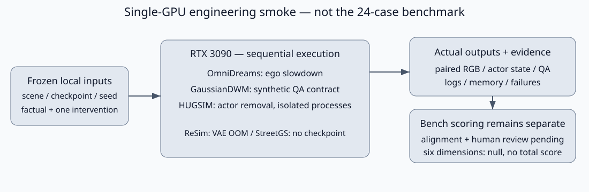
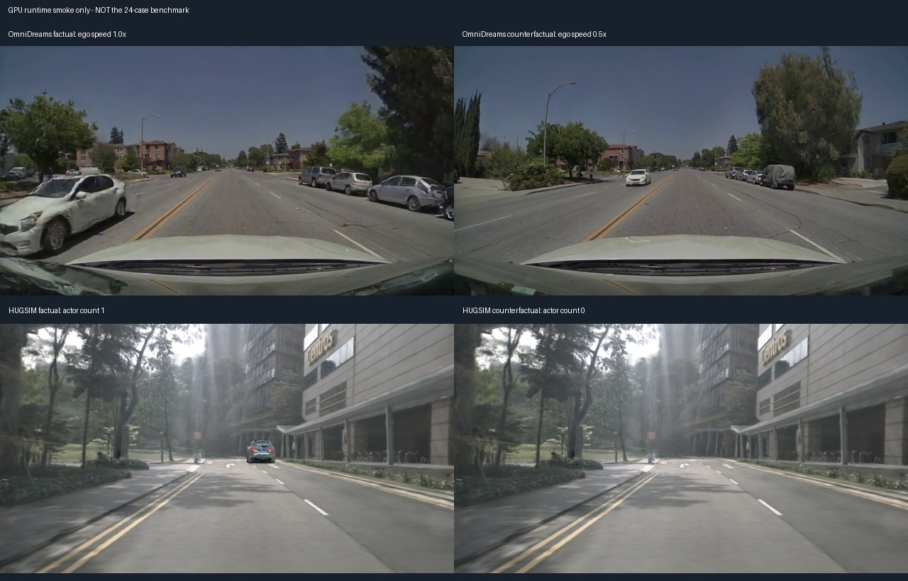

# 单卡五系统首轮运行结果

任务 `WS-V75-DOWNSTREAM-GPU-SMOKE-01 / 20260923-r1`。2026-09-23，单 RTX 3090 24GB，seed 42。依用户要求跳过 DriveEditor；不训练、不恢复旧队列、不做电源操作。

## 结果与范围

三个系统完成工程 smoke；两项阻塞。**正式 24-case benchmark 完成数仍为 0**。已有候选的人工道路/语义 verdict 不代填，六维分数均 null、没有总分。以下真实新输出不是复用旧图，也不拿不同场景组成公平排名。



| 系统 | 本轮真实输出 | 资源/边界 |
|---|---|---|
| OmniDreams single-view 2B | ego 速度1.0→0.5；两段各61帧、共16次生成 | 峰值12.81 GiB；官方ClipGT场景，不是pilot场景 |
| ReSim | 成功加载公开checkpoint；0段生成视频 | 官方49帧512×896 VAE编码 OOM；申请5.36 GiB、剩余4.46 GiB；停止、不降配置重试 |
| GaussianDWM QA兼容版 | 官方合成合同样例返回1条回答 | 峰值21.24 GiB；64-token smoke预算；不是驾驶质量或paired outcome |
| Street Gaussians | 0次新渲染 | 本地训练checkpoint已退役，保留环境亦缺CUDA扩展；仅复用历史证据 |
| HUGSIM | actor removal，两个分支各9帧×6相机，共108次渲染 | 峰值3.02/2.56 GiB；官方scene-0383，固定开环动作，无AD client |



HUGSIM 两分支9个时刻的 ego 位置和时间完全相同，actor 数为1→0；相机级像素变化见 `summary.json`。这只验证编辑状态和实际图像变化，没有把全图差异当作背景保持分数。OmniDreams 两分支复用相同初图、prompt、actor状态、地图、时间和seed，仅改变ego位姿进度；首帧条件相同、末帧条件有194,061个像素改变。输出图像差异不等于轨迹遵从已评分。

## 运行时发现与修复

1. **ReSim 输入与checkpoint路由。** 原GPU-free adapter给出24帧/5帧前缀，而官方49帧配置的3个条件latent对应9帧RGB，不能直接算相同case。另建native-horizon smoke：scene179的56–104帧，以64帧为轨迹原点，8个未来点覆盖0.5–4秒；只改速度倍率。最初包装器错误要求`30000-ema`，但公开包和官方默认是`30000`；改成真实checkpoint路径存在性检查。第二次加载成功，仅固定正弦位置编码按上游逻辑被移除；在首次VAE编码时OOM，没有去噪视频。两次日志均保留。
2. **GaussianDWM 发布合同不一致。** 原版strict加载因6个`traj_head.mlp.*`参数失败。官方README明确CVPR包不含trajectory代码，QA实现也不调用此head。兼容包装仅排除这6个确切参数，其余仍由官方`strict=True`加载；原权重和第三方源码未改。不声称恢复trajectory能力，不把适配版本称作原样上游。tokenizer仍有上游加载警告，当前回答仅作接口smoke。
3. **HUGSIM 分支串扰。** 首轮factual已完成54次渲染，但同进程counterfactual报`KeyError: agent_0`。源码中`Camera(..., dynamics={})`使用可变默认字典，renderer又原位加入planning actor。第二轮两分支分别在新进程运行，均完成54次渲染；不是为结果更换seed、动作或场景。首轮失败记录与factual输出保留。
4. **资产准备不等于语义对齐。** GaussianDWM三个下载归档含跨scene-index目录，不能按归档名直接拼成六视角场景；还需真实RGB/Gaussian/CLIP文本特征对齐。HUGSIM导出场景也未与pilot 179/191/204对齐。前一轮的`ready_for_gpu_preflight`是文件级准备状态，不是全链路已验证。

这些发现属于工程、数据与资源边界，不作为科学方法失败结论。`failure_ledger_refs=[]`，`failure_ledger_delta=none`。

## 复现与证据

完整产物根：`/root/autodl-tmp/runs/worldsim_v75/WS-V75-DOWNSTREAM-GPU-SMOKE-01/20260923-r1`。配置、源轨迹、条件、RGB、状态及原始失败日志均保留；轻量结果/日志副本已放入本目录（Git副本仅去除尾随空白）。`summary.json`给出逐系统输入角色和精确路径。

入口脚本位于 `/root/autodl-tmp/motion_proj/scripts/`：

- `run_cfbench_omnidreams_smoke.py --output <new-dir>`：先source `worldsim_v75/environment.sh`。
- `prepare_cfbench_resim_smoke.py --output <new-dir>` + `run_resim_sample.py`：本轮已OOM，不自动重跑。
- `run_cfbench_gaussiandwm_smoke.py --exclude-unreleased-trajectory-head --output <new-dir>`：使用gaussiandwm环境。
- `run_cfbench_hugsim_smoke.py --branch factual|counterfactual --output <new-dir>`：使用hugsim-impact环境，两次独立进程。
- `summarize_cfbench_gpu_smoke.py --run-root <run> --evidence-root <evidence>`：CPU汇总和审阅图。

验证命令（远端仓库）：

```bash
/root/autodl-tmp/envs/motionproj/bin/python -m pytest -q \
  tests/test_cfbench_gpu_smoke.py \
  tests/test_worldsim_v75_downstream_bench.py \
  tests/test_download_http_ranges.py
```

结果17 passed。其余变化包括此前DriveEditor NumPy1目标环境的18/18输入检查及精确字节门；该模型本轮没有GPU调用。当前执行范围和下一步仅维护于 `docs/RESEARCH_STATUS.md`。
