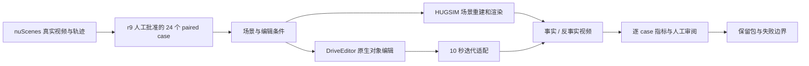

# V7.5 r9 24-case 收尾证据

更新：2026-09-26。本页记录已发生的执行与证据边界；早期准备协议仍见 [V7.5 benchmark](../../../../v75/DOWNSTREAM_COUNTERFACTUAL_BENCH.md)。[机器可读摘要](summary.json)仅索引保留资产，不代替原始视频和人工评分。

## Architecture components

## 已确认的执行数量

| 项目 | 有效记录 | 边界 |
|---|---|---|
| r9 case | 24 个获人工批准，6 个 ego、18 个对象 | 获批清单的 `status=human_approved_no_inference` 是批准时快照；后续模型执行以各结果文件为准 |
| HUGSIM | 7 个场景完成 ground/scene 各 30k 与导出；24 个 case 各有 100 帧、10 Hz 的事实和反事实视频 | 使用 10 Hz 输入适配官方 12 Hz 流程；scene-0242 稀疏 COLMAP 点仅 2,834，scene-0998 相机更新平移 P90 约 4.81 m；这些是质量风险，不自动裁决模型性能 |
| DriveEditor | 18 个对象 case 有 10 帧、1 秒的原生事实/反事实对；其中 11 个另有完成的 100 帧、10 秒迭代反事实 | 6 个 ego case 不属于其原生对象编辑接口；7 个对象 case 没有完整 10 秒迭代结果；原生与迭代指标不可混为一个分母 |
| OmniDreams | 早期 24 对/48 段生成保留在 V7.5 旧轮记录；r9 原始参考与批准清单保留 | 旧生成不能冒充 r9 新运行 |
| ReSim / GaussianDWM / RecEdit-Drive | ReSim 停止；GaussianDWM 仅有接口 smoke；RecEdit-Drive CPU 预检通过但专用权重缺失 | 没有这三种方法的 r9 完整 24-case 结果，也没有统一 leaderboard |

HUGSIM 的自动指标包括 factual 对原始 RGB 的重建指标、编辑区域变化和背景保持；其 outcome、输出轨迹与对象身份未观测时为 `null`。DriveEditor 原生 paired 指标描述 10 帧对象编辑，不能当作 10 秒闭环或 ego 成绩。两份人工评分工作簿保存在证据包内；本页不把缺失的评分维度补成零，也不合成总分。

## 证据及复现

远端保留包：`/root/autodl-tmp/retained/worldsim-v75-r9-24case-20260925/`。其中 `README.md` 记载输入、环境、上游提交、清理和恢复边界；`evidence/`、`videos/`、`config/` 分别存放结果与工作簿、119 个 MP4、脚本和配置快照。119/119 视频 SHA-256 已校验；24/24 HUGSIM `result.json` 与 `auto-metrics.json` 已校验。批准清单 SHA-256：`43bcbfa786dce4e740c6804f0c01bc6fbcf291c3eab6544fa3cd83a7a56b6e64`。

2026-09-25 清理后，旧模型权重、HUGSIM 七场景训练 checkpoint、适配输入和多数中间运行目录已退役；保留视频、指标和配置不能直接恢复训练状态。数据盘可用空间从约 141 GiB 增至 378 GiB。后续复现需重新取得输入和权重并重训，不能把保留 MP4 当完整训练资产。

**结论范围**：该批次证明特定路径能产出有审计记录的 paired 视频，并暴露方法能力和几何质量边界；样本相关、缺失维度和不等价接口阻止六模型总分或普遍优劣结论。可复用的 DriveEditor 能力边界见 [V75-F02](../../../../research_failures/entries/V75-F02.md)。
