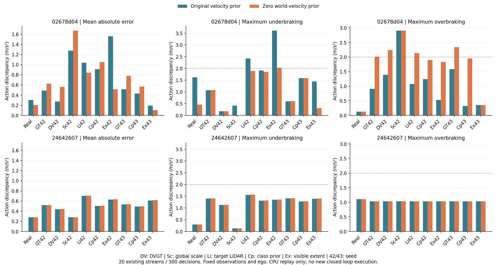

# 普通世界速度先验控制收口

`WS-V75-VELOCITY-PRIOR-CONTROL-01 / 20260920-r1`。来源 revision `c92f8a40`。这是既有流的 CPU 策略回放，不是新的生成或闭环运行。人工 verdict：null；`failure_ledger_delta:none`。

## 组件与唯一改动

仅将 `MotionTracks` 新轨迹的世界速度均值改为零；不改协方差、噪声、关联门槛或 IDM。规则相同不等于全部轨迹 ID 相同；本次300次评价选中的框/缺失状态均未变。

一手启发来自 [SORT](https://github.com/abewley/sort/blob/master/sort.py)与 [FilterPy](https://github.com/rlabbe/filterpy/blob/master/filterpy/kalman/kalman_filter.py)的未观测速度零均值初始化。迁移的只是普通先验思想，图像速度零与世界速度零不是同一物理假设；没有运行完整 SORT，也不称成熟跟踪器榜单。

## 完整范围与结果

两曝光开发日志、20条既有流：2条真实基线和18条已生成分支。300次评价决策、340个唯一观测（含40个历史观测）。复现原实现700次访问，保存动作/检测/前车均精确一致。6.471秒，CUDA未初始化，0次新模型调用。

主项事前指定02678d04的seed42目标LiDAR分支，相对其**条件状态**参考且排除共同初帧，共14决策：平均绝对动作误差1.102→0.891、最大欠制动2.420→1.890、最大额外制动1.114→2.142 m/s²。第三项失败；两个真实基线均通过，但四个GT生成流仅第二日志的两个通过。因此 `generation_admitted=false`，没有启动新的实际反馈，不搜索更多速度/噪声参数。

图相对**物理参考**、每条15决策；不可混成主项的14决策条件参考。第一日志部分分支改善、部分恶化，第二日志大多不变或小幅变化。仅动作更接近参考不足以证明世界状态更准确，更不能推出反事实仿真保真度。

- [协议](protocol.json)、[完整结果](result.json)、[矢量图](velocity-prior.svg)、[PDF](velocity-prior.pdf)。逐决策JSON保留在两个日志子目录中。
- 原始观测与视频由协议列出的来源运行持有；本目录仅存轻量协议、结果、图。原始本次输出：`/root/autodl-tmp/runs/worldsim_v75/WS-V75-VELOCITY-PRIOR-CONTROL-01/20260920-r1/`。
- 脚本：`scripts/worldsim_v75/replay_velocity_prior_control.py`；图表从逐决策记录重算320个汇总量后生成。

此次负结果关闭这个唯一速度先验变体，不宣称否定所有跟踪方法，不重开旧形状主候选，不登记新的重建/生成科学失败卡。
