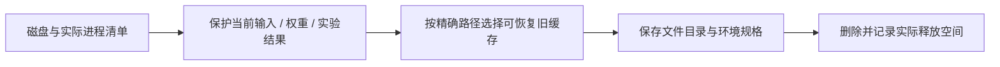

# 2026-10-09 数据盘清理

用户授权删除不重要的旧文件，要求至少释放 200GB。本轮按精确路径清单删除前检查实际进程和当前依赖，记录位于 `/root/autodl-tmp/cleanup_manifests/v77_20261009_200GiB`。

实际释放 **218,707,005,440 字节 = 203.687 GiB ≈ 218.7 GB**；清理前可用 8.430 GiB，清理后可用 212.117 GiB。SAM3 后续占用单列在 r53 `disk_after_sam3.json`，不将下载前空间当成下载后剩余。

删除共 505 个目标：100 个旧 AV2 日志 sensors 缓存目录（约 82.6 GiB）、401 个不再使用或重复下载的权重/下载分片文件、4 个不活跃环境。权重包括旧 v6/v72/v75/v81、DINO、旧 Hunyuan 和 DiffuEraser 等实验依赖；完整实际路径以 `plan.json` 与 `deletion_log.jsonl` 为准，不以本摘要代替清单。

保留全部 runs 实验结果、关键 checkpoint、人工/AI 评分、失败图片与视频、当前 nuScenes 数据、完整官方 DriveEditor、r47、VGGT-Ω、恢复的 encoder，以及 motionproj/driveeditor/v75/当前 worldsim/SAM2 环境。AV2 的标定、位姿、标注、地图、scene manifest 和渲染结果仍在；只移除了可从公开来源重新取得的 sensors。

恢复注意：

- AV2 每文件目录及公开 S3 prefix 位于 `removed_sensor_file_inventory.jsonl.gz`；需要时从记录的 S3 prefix 重新下载。旧 `.complete` 标记仍可能存在，不能直接依赖旧下载器的跳过逻辑判定传感器已齐。
- 4 个旧环境的 `conda-meta`、包清单、`pyvenv.cfg` 位于 `environment_specs/`，对应现有源码入口。它们是恢复规格，不是可立即还原的完整环境备份。
- 删除权重的路径和大小留档；需从原模型官方来源重新取得，未保留一份同体积隐藏副本。用户独有场景资产与唯一实验产物没有纳入本次清理。

机器仍为 CPU 模式，无训练/推理控制器。此操作不包含关机授权。
