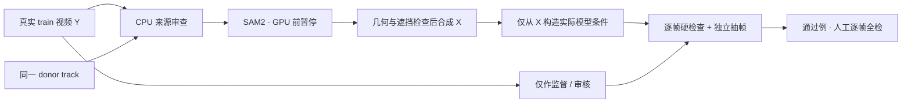

# 独立质量协议审核

任务：`WS-V77-TARGET-PROTECTED-20260929/r1`。审核对象：`QUALITY_PROTOCOL.md` v1。审核者：独立 subagent `data_quality_review`。此文件不包含任何用户 verdict。

结论：协议的阶段隔离、真实 Y 监督、单一 donor、冻结架构、逐例抽帧和人工逐帧全检要求符合本轮范围。以下补充应在批量合成前固定；它们不是逐场景调参授权。

## 需要补充的五项

1. **单独审查模型真正看到的条件。** 给实际 DriveEditor 输入逐字段保存来源和变换链，至少覆盖条件帧、参考图/参考 crop、masked RGB/latent、concat mask、box/pose。Y 与 protected GT 可以用于监督和评价，不能进入可部署条件路径。deletion 条件中的 target appearance 应遵从现有接口的关闭方式。记录每帧模型洞扩大后仍可见的 protected 像素，而不只记录合成 alpha 后的可见像素；若扩大矩形把 B/C 的所有证据吞掉，应拒绝或明确归入另一任务，不混入本轮 well-observed 组。用已知修改 Y 隐藏区但保持 X 不变的探针检查条件输出不变，能直接发现意外泄漏。

2. **donor 的可见车身完整性不能由 visibility=4 代替。** 可见度最高档仍可能有局部遮挡。若 donor 被邻车、杆、围栏或画边挡住，SAM2 只会给可见部分；平移后那块缺失可能成为不合理缺口。第一阶段优先拒绝这种 donor，不做 amodal 生成补车。独立 reviewer 需看到 donor 首/中/末和最差帧的全图及 crop，不能只看 receiver。

3. **明确全部前后遮挡关系和实际地面证据。** 除 A 在 B/C 前面，还需检查真实前景（杆、围栏、行人、路边物体）是否应遮挡 A。二维 cutout 不能一律覆盖所有已有像素。缺少可靠层次/深度证据时拒绝该候选。地图 drivable/lane/parking 是位置支持，不能单独证明路面高度、前景遮挡或轮胎接地。donor 与 placement 视角门槛之外，首/中/末应看车轮接地、投影形状与道路透视是否相容。

4. **边缘处理域与影子也要闭合。** 保存 alpha 原始支持域、feather/color/Poisson 影响域和最终删除洞；X−Y 的非零位置必须被申报的合成影响域解释。若合成加入阴影/反射，应纳入影响域和删除覆盖；若不加入，也应如实标注并由抽帧检查是否出现明显悬浮或光照冲突。不要靠固定模糊抹去接缝。逐帧边缘参数连续，同时检查可见 protected 像素是否受到额外合成操作污染。

5. **10Hz 请求时间和实际曝光时间分开校验。** 若源曝光约 12Hz，唯一曝光最近邻选取到 10Hz 时自然可能出现约 167ms 的间隔；v1 的 150ms 上限可能系统性排除有效序列。先用实际时间戳证据确认，再全局冻结可接受上限（如 180ms）或使用原始曝光节奏，不能逐例放宽。轨迹插值、几何投影、yaw/scale/mask 连续性均按实际曝光时间计算，预览的固定 fps 不能替代该校验。

## 审核状态的含义

- `source_pass`：抽检来源帧没有明显来源缺陷，仍需通过 SAM2、几何放置、实际模型条件和最终合成检查。
- `source_reject`：来源已有明确不符合第一阶段的证据，记录具体帧与原因，不送入批量分割。
- `source_uncertain`：当前证据不足，不能自动进入下一阶段。
- 最终 `synthetic_pass` 只在硬检查及独立最终抽帧通过后使用，仍不等于用户的逐帧全检通过。
- 任何单帧/少量抽帧结论均不认证整段时序质量；用户 verdict 均保持为空。

## 等待的逐例材料

每个候选至少需要 receiver 与 donor 的首/中/末、最差清晰度帧（重复帧可去重），原图上下文与可读 crop、明确目标/受保护实例、帧号与实际时间戳、可见度/尺寸/截边等统计。source 阶段不要求已存在合成结果；没有放置与 mask 证据时不会给 synthetic verdict。

最终合成阶段另外需要真实 Y、合成 X、target/protected mask、实际 model 输入及 hole、相同帧的 donor 与 placement 投影、逐帧轨迹/mask 统计，以及最大遮挡/最差风险帧。拒绝和不确定样本保留诊断证据。
