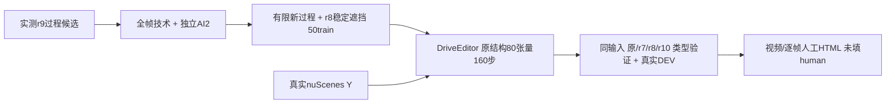

# r10：有限遮挡过程候选的同预算试验

task/run WS-V77-TARGET-PROTECTED-20260929/r10；failure_ledger_refs [V77-F02]；默认wm-3090-1001。

r9盘点和有界工厂未达到预案8 train / 3 val / 2val scene扫过覆盖目标，因此按规则不在r9启动训练、不继续扫同一位置网格。保留全部几何/过程缺额。这不是模型否定，也不据此修改架构。

下一最小证据试验使用r9已经得到、经过全帧技术检查与独立AI2的有限过程候选；不是把未通过质量的输入硬凑到覆盖目标。预先接受扫过验证可能只有1个独立场景，因此仅为探索性类型验证，不报告充分泛化。所有未知、拒绝、原用户评分保留。

数据最多50train，优先新的真实扫过B与显露候选，再填入已有r8独立技术AI2的稳定遮挡控制；每scene最多3例，至少20scene，背景/单保护/密集均保留。所有r8合成评测scene及所有r7 receiver/donor训练隔离scene不引入train；新增扫过验证只能用未参加r7/r8/r10任何训练的世界。至少3个扫过训练例覆盖3scene、至少1个隔离扫过评测scene才执行，否则本pilot也不训练，下一步必须更换来源/窗口抽取入口。人工null。

原结构80空间attention张量、官方106目标encoder、320×576、160steps、AdamW1e-5、seed6201、原loss，均同有效r7/r8，r10从原模型初始化。时间跨度/10帧/原fps条件不改；无法在一秒出现的完整过程仍开放，不用数据支持运动替代分布统计。

保留冻结r8的合成7与真实DEV8，新增所有合格隔离过程例（最多4）；四权重原/r7/r8/r10同RGB/H/seed42/25步/无previous。旧三臂在逐项输入一致后复用PNG；r10新采样、新增过程四臂新采样。按扫过/稳定遮挡/有几何其他帧支持/无支持/未知分开，真实隐藏GT未知。接下来不同时加入保护加权、矩形hole、步数或模块改变，不用final。

停止：同预算一次，不补seed。若新过程GT或真实DEV无稳定收益，不推广r10。不能因单世界验证胜负宣布时序解释已成立或被完全证伪。

