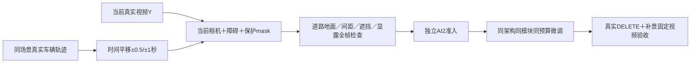

# r12：真实轨迹时间平移遮挡

task WS-V77-TARGET-PROTECTED-20260929/r12，wm-3090-1001，v77，failure_ledger_refs [V77-F02]。

r11过程来源32世界均无候选，不训练。端点拟合仍依赖人工放置中点，地图/地面/ego/邻车约束未通过；不能因此否定模型。r12复用相同冻结32来源，但完全更换轨迹产生机制：在同世界8真实keyframe上下文内，原始车辆轨迹时间平移±0.5/±1秒。无需猜新的道路中点或世界速度，GT轨迹没有支撑即拒绝；不能外推。

Y保持当前真实RGB，不用生成图片监督；A为当前相机投影下的平移真实轨迹及已有mesh。A位置对当前Y中所有GT actor重新验证0.3m距离、地图、LiDAR支持、ego禁入和正确前后深度。GT车底离真实拟合地面>0.35m拒绝，小偏差统一贴地且保存修正。每帧位置/yaw/尺度连续、hole覆盖全部合成影响，不同时换网络、loss或模块。

最多32来源，每个真实car track四次固定时间偏移，各过程最多2候选/source。不放宽既有空间、分割或连续性门槛；技术通过后仍需独立gpt-6-sol xhigh无fast看0/5/9。目标沿用8扫过train/≥3世界，3扫过val/≥2全旧训练隔离世界，约50train/≥20世界。覆盖不足时不启动相同训练或无限枚举偏移。

满足数据准入再同80张量/160步/官方106encoder/原loss/seed6201控制；GT验证和真实DELETE DEV均冻结、无final。时间平移是训练遮挡制造，不是把未来GT暴露给推理条件；Y仅监督。真实被隐藏实体身份没有RGB GT时保持未知。

真实任务收益条件继承r11：固定真实DEV跨至少两个scene明确删净/保保护车收益，无新严重误删，实际视频帧主/独立检查一致。满足并交付保存推送、确认无其它作业后才关机；目前条件false，不自动关机。
