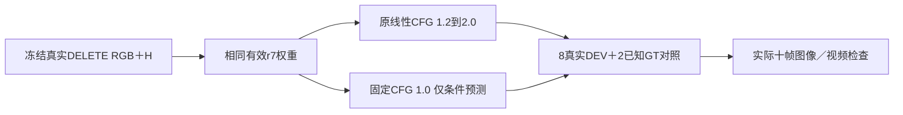

# r13：采样条件外推的单一强控制

task WS-V77-TARGET-PROTECTED-20260929/r13，wm-3090-1001；failure_ledger_refs [V77-F02]。

r11/r12两类数据入口都0合格候选，不训练；保存全部拒绝和工程证据。地面raw支持恢复不能解决所有放置/观测缺口，不继续枚举同来源/偏移。本轮先做一个廉价强控制，检查已有适配权重在采样条件外推中的错误是否放大：同有效r7参数、相同输入/删除范围、seed42、25steps、previous=false，唯一修改2D guider从官方线性1.2到2.0改为固定1.0。x_u+1*(x_c-x_u)=x_c，未改变architecture或训练、不改3D guider。

不预先认定CFG有错，不保证改善，不扫参数。固定8真实曝光DEV全跑，加P006/P012两个已知Y保护车/额外实体哨兵。原/r7/r8/r10输出保留。只有跨例真实去目标＋补景收益且无新严重误删，经实际10帧主/独立复核，才能考虑推广与满足用户条件关机。单帧或合成MAE不能替代真实验收。失败则关闭该采样策略，不试1.1/1.3等网格，继续有依据的数据或更新范围控制。

真实隐藏身份缺GT保持未知，人工0/1/2为空，不声称final或三秒长视频结论。目前关机条件false；仍需交付并提交推送、核实无其它作业才能关机。
