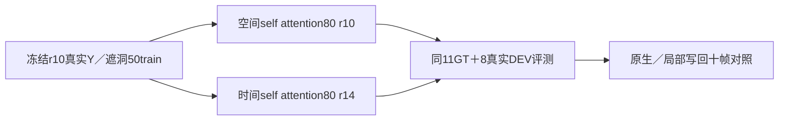

# r14：同数量时间自注意力控制

task WS-V77-TARGET-PROTECTED-20260929/r14，wm-3090-1001，failure_ledger_refs [V77-F02]。

源码及实际checkpoint键确认r7/r8/r10只更新空间transformer_blocks.attn1，未更新时间time_stack.attn1。本轮不预设模块错误；用相同50训练例/25world及11GT/8真实冻结验证，唯一更换更新张量的时间位置。两组均80张量、49,574,080参数，保持原模型初始化、官方106目标encoder、160steps、320×576、AdamW1e-5/0.01、seed6201、原StandardDiffusionLoss。既有空间和条件模块冻结，不同时扩范围、加权loss或加训练步数；原结构不变。

r10训练集合及原QA完整保留，本轮不声称解决过程覆盖缺额：4个扫过train/3world，新扫过val仅1world，dense train1world、一秒窗口仍限制结论。r11/r12零候选数据不训练、不混入集合，final未用。两组实际训练采样顺序/数据窗口要核对。

推理同默认CFG线性1.2到2.0、原seed42/25steps/previous=false/576×1024，r13 CFG1不叠加。原/r7/r8/r10的19例结果在每帧X/H/Y一致时复用，r14新跑19窗。报告分开旧合成/新过程GT与真实无GT任务；loss或GT MAE下降不能替代真实DELETE跨例收益。

同一160步只做一次；若GT和真实都无收益，停止这个更新位置，不临时继续加步数或扩参数救结果。原权重/所有拒绝/优化器/反例保留。实际视频帧主/独立复核跨至少两scene真实去目标及保护车收益、无新严重误删，才扩为3秒真实视频确认。完成真实收益验收、HTML交付、保存推送及确认无其他任务后才关机；目前条件false，人工空。
