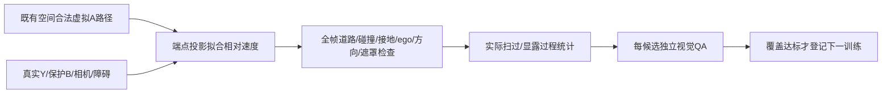

# r15：合法虚拟路径上的相对运动工厂

r9固定世界直线忽略合法路径曲率；r11新来源中点摆放和r12真实车辆时间平移均零产出并已关闭。本轮只复用已经通过空间检查的虚拟A空地路径，用现有路径yaw方向的线性相对速度偏移改变A/B过程，不复制当前真实演员轨迹作为A，不再次枚举旧放置网格。目标±0.4归一化投影跨度用端点导数拟合，最多2解/锚点、4旧锚点/source、48sources、2sources/world；没有额外速度/seed网格。

所有当前GT/LiDAR地图、0.3m物理间距、2.5m原地面支持、原ego/视野/连续性、精确SAM2/depth顺序/H覆盖重查。额外要求速度与yaw方向≤25°且不能高速倒车，不放宽质量。旧合法不意味着新路径仍合法；拟合跨度不是实际SAM2扫过，精确轮廓过程再认定。GT Y永远真实，合成RGB先擦完才条件编码。

training/validation按所有旧训练worlds隔离，旧验证world可继续作曝光开发验证，不叫新final。目标维持8个扫过train/3个扫过val且至少2隔离val-world；每新候选抽0/5/9独立gpt-6-sol xhigh且无fast质量检查，机器逐帧合同通过，AI2才可训练。覆盖未达则本工厂训练0，保留全部拒绝，停止相对速度算子，不临时追加网格。其它过程通过也不能把覆盖目标换掉。

此run只有CPU造数据，不预设r14效果或更新训练模块；模型控制待数据与r14实际结果后另登记，不叠加多模型。真实跨例DELETE＋补景关机条件尚false，人工空，final未用。task WS-V77-TARGET-PROTECTED-20260929/r15，failure_ledger_refs [V77-F02]。
