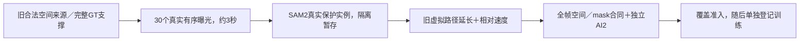

# r16：三秒真实曝光与遮挡过程数据

task WS-V77-TARGET-PROTECTED-20260929/r16，wm-3090-1001，failure_ledger_refs [V77-F02]。

r15已得到6扫过train/4world，但val扫过仍0。一秒可能截不到遮挡跨车身的过程；本轮只扩真实观测时长，不改变网络、loss或增加旧训练步数。依据旧合法空间锚点、完整8关键帧GT支撑冻结最多48来源/每world≤2；所有曾训练world只能train，其余曝光world作DEV val，未曝光final不使用。先每world一例，再按真实输入变化选第二例，不依据任何模型输出。

曝光固定原始keyframe起点后约50ms的0:30个10Hz目标，有序唯一匹配，误差≤55ms、间隔≤180ms、不复制、不插帧。只保留全窗口高质量primary，secondary需完整GT和同标准观测；其它真实参与者仍由全GT上下文约束，不能因不分割而忽略障碍。旧一秒AI2不传递到新三秒数据。真实Y不修改，全部合成X影响先擦除再resize/encoder。

只延长已有虚拟空间路径；最多4旧锚点、两种端点目标±.4拟合相对纵向速度（.25–8m/s），另外一个世界静止对照。全30帧复查原道路/地面支持≤2.5m/GT与ego距离≥.3m/禁压ego/尺寸/截边/深度/连续性/85%最大保护遮挡。可复用r12明确修正：原拟合平面±.08m真实地面返回用于支持，阈值不放宽，修正前后证据留存。独立gpt-6-sol xhigh无fast逐例0/15/29视觉，仅AI2可进入下一阶段。

目标结合旧合格过程达到8扫过train/≥3world、3扫过val/≥2未训练world，整体约50train/≥20world、单world≤3。两种端点拟合及一个静止对照只跑一次固定来源；不足则停止本次具体搜索、保留拒绝，不无限放宽阈值或速度网格。训练0；30帧训练/10帧稀疏采样及fps条件尚未选择，需后续明确采样合同和显存探针后单独登记，不能把3秒源数据冒充3秒模型验证。

真实DELETE＋补景跨至少两scene的目标删除/保护对象与视频收益仍是收口条件。新数据AI2、合成MAE下降或loss下降不能触发关机；人工0/1/2空。保留所有旧/新资产和拒绝，无新自动化。
