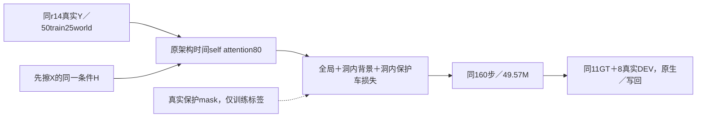

# r18：固定数据的恢复区域宏平均损失控制

task WS-V77-TARGET-PROTECTED-20260929/r18，wm-3090-1001，failure_ledger_refs [V77-F02]。

r14有限新过程GT改善但真实关键失败仍在。r10实际被遮保护像素仅画面约.344%，原blank mask_fuse全零使二维扩散损失按整幅均匀平均；这是监督稀疏证据，不是已证明的梯度原因。本轮只改已有损失归约，不把B/C加到网络输入，不改DriveEditor架构、encoder、数据、模块、采样条件或预算。

保持r14同50train/25world、11GT/5world与8已曝光真实DEV、原初始化、官方106目标encoder、80时间self attention/49,574,080参数、160步、320×576、AdamW1e-5/wd.01、seed6201，实际160次case/window顺序必须一致。r15/r16新数据仍因验证过程缺额不混入训练。final未用。

r17因原训练循环未传protected标签而在部分步数停止，实际只有global+H，不能作为三项损失控制；r18从原始权重重新开始，不续训无效快照。训练核心仅修正这一参数传递，并逐步断言所有single/dense的真实B损失非空，记录实际启用次数。

二维epsilon加权平方误差仍采用官方sigma权重；每帧先对通道平均，再求全图均值、H内非保护像素均值、H内保护像素均值，对存在的项等权平均。空区域不除零、不伪造loss。H与B采用原保守latent maxpool标签，H-bg=H且非B。无可调倍率、权重网格或附加网络；三维损失不改。全局项保留，GT标签仅BUILD监督，QUERY不需要B真值。

同默认CFG1.2→2.0、seed42、25steps、previous=false、10帧576×1024。旧五臂95窗仅输入逐帧相同才复用，r18新19窗；GT指标与真实单帧/视频保持分开。教师loss新旧公式不同，不能用数值直接比较。一次160步，无效则停止该具体归约控制，不加倍率或步数救结果。

数据AI2、合成误差或训练loss下降均不满足关机条件；必须真实跨至少两scene的删净/保护对象收益、无新严重误删，独立视频帧复核并扩三秒确认，保存交付推送且无其它作业后才关机。人工评分空，全部反例和原模型保留。
