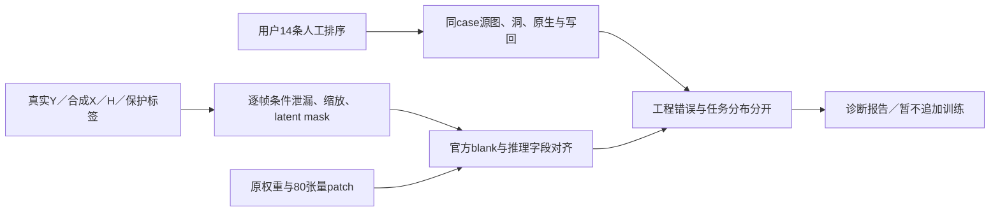

# r19：人工反例驱动的工程与合成合同诊断

WS-V77-TARGET-PROTECTED-20260929/r19，CPU只读审计，failure_ledger_refs [V77-F02]。

用户最新要求先排查、不要持续盲迭代。已停止r18后续评价，保留160步checkpoint与监督证据，尚无r18新评价窗；控制器的-15保留为用户中止，不当科学负结果。关机前真实收益条件仍未满足，不关机；本诊断不加载GPU模型，不造新训练数据，不更换架构或启动训练。

保存人工原文排序，不代填0/1/2，也不把部分排序当全体通过率。r9名称歧义原样保留、按实际checkpoint追溯。逐帧复查当前r14固定61数据例（50train/11val）与8真实DELETE窗口；同输入比较官方字段、条件/监督路由、mask覆盖及缩放；按actual160训练step计算分布。核对Y原始RGB来源、M006/M009实际输入重复、两臂80张量shape/finite/update与部署记录。统计mask分布差异不直接等于因果；SAM2输出不是像素GT，未mask的SAM像素只能当漏目标疑点。
