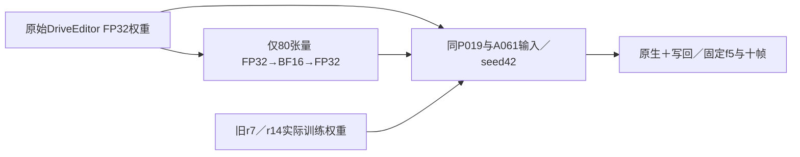

# r20：零训练初始化舍入对照

task WS-V77-TARGET-PROTECTED-20260929/r20，wm-3090-1001，failure_ledger_refs [V77-F02]。

用户要求暂停盲目迭代、先排查工程/数据。r19 CPU逐张量确认model_init会先将整个模型转BF16，再将训练参数转FP32；舍入变化混入了最终patch。本轮只作初始化精度的零训练诊断，不训练、不换mask或数据、不恢复r18评价。

事前固定temporal_P019（用户指出微调新增幻觉）与A061_w08（用户指出真实收益）。原始、已训练r7、已训练r14的旧输出仅核对逐帧输入相同后复用；新增r7范围舍入、r14范围舍入两臂，共4个10帧窗口。两臂均重新加载原模型，仅将对应80个张量舍入到BF16再恢复FP32，优化步数0，不能命名为微调模型。其余条件完全相同：576×1024、10帧、seed42、25steps、原默认CFG、previous=false、原alpha写回，300秒/窗口，异常保留并停止、不换seed救结果。

只判断舍入本身是否足以复现已知幻觉/可见改动；模型间像素差不是质量指标，也不能由两例推出所有失败原因。GT、人工原文排序与助手固定帧观察分开。全部输入和输出保留，关机条件false，诊断后回到工程报告，不继续自主训练迭代。
