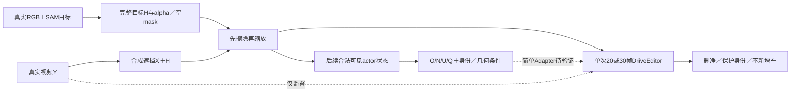

# r21：入口修复与整窗支持，进入简单条件之前

task WS-V77-TARGET-PROTECTED-20260929/r21，2026-10-02，wm-3090-1001，failure_ledger_refs [V77-F02]。

用户最新授权恢复auto research：工程bug直接修，先验证Temporal reveal＋projected actor-state条件，条件有效后才加surfel。原架构不再完全不变：保留原9通道及骨干，后续新增空间残差与独立受区域约束的身份分支。研究目标是实际DELETE中保护车与无车背景两侧的跨场景收益。

本run只修入口和验证单次模型长窗，不做正式微调。保存旧70例与旧权重；从已有SAM另建v2 mask，无GT硬裁，目标alpha全1、洞外全0，空目标帧零写回。有可见保护实例时冲突必须拒绝；仅GT邻车投影交叠只记疑点，不当分割真值。先复核8个已曝光真实DEV的输入修复，正式模型比较时统一使用同一个新入口。

初始化FP32修复继承r19。按Y/H/实际遮后条件去重；旧目录不改，得到新的目录与重复映射。新训练/验证同时隔离背景scene和mask来源；旧跨split共享mesh只能作开发探针，不能冒称新独立评测。

冻结长窗工程探针：r16/L001，真实30帧，320×576。先30帧训练前向/反向（无optimizer.step）与3采样步推理，只核对shape、梯度、显存和单次整窗；若显存OOM则固定退到20帧，同类对照统一长度/分辨率。不能拆窗后声称长证据进入同一次调用。3步不是效果评测。最多两种长度，不扫分辨率/seed。训练仅原sigma加权去噪latent损失，未启用新区域损失。

后续主方案保留用户原文，不在本run偷做surfel或多分支搜索。先50条工厂质量样本，达标后300–500条/至少30scene；60% reveal、25%密集已知背景、15%普通背景。合法条件必须在遮洞之后构造；O/N/U由真实观测支持，N不能设成1−O。轨迹/GT几何辅助须明示；无真实证据的区域保持未知。固定A无条件/B几何存在状态/C加身份，D仅在C收益成立后登记。

资源先预算，不删除原始输入、关键checkpoint和失败证据。用户允许清不重要旧物，仍先确认可重建与归属。原关机条件沿用，未取得真实任务两侧收益不自动关机。人工分数空，final未用。
