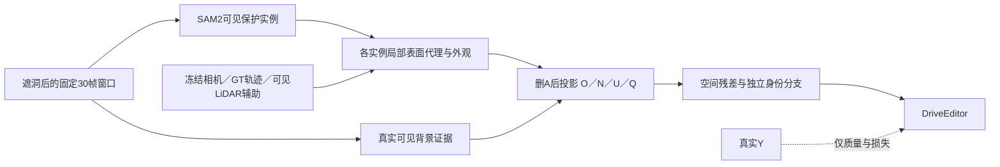

# r22：先验证合法可见条件，再启动模型对照

task WS-V77-TARGET-PROTECTED-20260929/r22，failure_ledger_refs [V77-F02]。

先用r16的L001、L007、L009三个既有已曝光DEV长窗做最小合法输入实验，分别覆盖保护显露、静止遮挡物背景、扫过保护车；其质量检查和GT只进入评估。SAM2在灰洞RGB上重新跑，旧完整Y上的SAM仅作监督，不生成条件。30帧在同一次模型调用中，320×576，r21已验证。冻结相机、GT轨迹、LiDAR均属POC额外几何辅助，不声称自动估计；窗口外RGB、隐藏Y、隐藏Y的特征均不允许进入状态构建。

首先实现actor-local cuboid表面代理（不是surfel）、按身份和深度分配的投影、正证据背景、未知/冲突、可信度。稀疏没有投影必须未知，不补成道路。全部来源逐帧登记。通过隐藏像素替换不变性、删除A后可见性、不同身份不平均、无证据变未知检查；几何代理误差用可见留一帧和真实监督单独计量，不能把表面格重合直接称纹理证据。

仅当合法条件在实图上可用，才接零初始化空间residual和独立局部身份attention；adapter off恢复基础输出必须验证。此run不做正式50条训练，不使用surfel，不修改原损失。条件稀少/错配则记录具体来源并修该一环，不能使用完整GT状态救效果。

新50条数据pilot作为后续独立登记。必须使用同一真实入口H/alpha定义、按全窗显露证据检查遮挡，不沿用每帧必须露15%的旧门槛；背景scene和mask来源隔离。原始资产和旧结果全部保留。原模型/r7为控制；人工分数留空。
