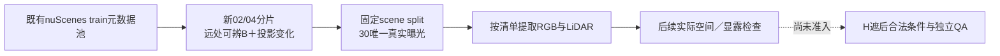

# r37：先补可放置空间的来源，再制造遮挡

旧r23源池主要来自03/07两分片；r33静止A解普遍撞上ego/尺度/地面限制，r35证明不能靠放宽水平截边解决。本轮只新增02/04两个公共分片的固定来源，先选全8关键帧B至少16m、保留旧72×40/边界/面积标准，并有归一化投影中心或尺度变化≥0.20的真实对象；每scene一条、最多20scene，先car，再可辨像素。门槛只是新来源筛选，不等于合成A空间或时序已经合格。

这不是按模型输出选容易的评测集，而是训练来源收集。剔除既有RGB源scene与旧r7训练scene；新scene按seed3701冻结80/20训练／DEV，全部来自官方train，不能称最终测试。mask形状仍train sedan、DEV suv，已知两种旧形状的限制保留。

先准备30真实曝光，无复制／插帧；旧单帧可见性等级不继承为输入AI2。相机/轨迹/LiDAR仍明示几何辅助。完整Y永不作为未来条件输入。来源完成后才登记有界合成检查；本轮训练0，不提前调用DriveEditor，不新增自动化。只读取这两个分片一次，缺文件或错误则记录并停止，不重抽所有归档。
