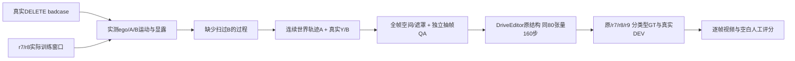

# r9：遮挡过程覆盖控制

Task/run: WS-V77-TARGET-PROTECTED-20260929/r9；host wm-3090-1001；failure_ledger_refs: [V77-F02]。

## 问题与先验盘点

用户要求围绕真实 DELETE badcase 的运动—遮挡—显露过程补分布。实际r7训练68个唯一10帧窗口（9个receiver场景）和r8训练50例（25场景）中，B归一化遮挡中心跨度≥0.20且至少3帧有效重叠的扫过例均为0；r8已有12例世界静止A（轨迹直径≤0.20m）＋运动ego（相机路径≥0.50m）且投影变化≥8px。不能把第一类说成完全缺失，也不能把所有DELETE失败归因时序。

## 有界方法

继续真实nuScenes Y / 两种已有DEV mesh轮廓 / 原10帧架构。固定两种新增世界轨迹：A在世界固定位置；A从中时刻合法位姿出发以固定世界速度沿真实B朝向±2/±4m/s行驶。不随B逐帧加固定偏移。位置、尺度和朝向连续，完整SE3相机投影；单秒窗口先验证是否实际能产生扫过，再决定后续是否扩时间，不能凭代码支持运动声称分布覆盖。

复用已提取RGB、SAM2保护实例、地图/真实地面、已保存合法空间候选；空间/完整遮罩规则保持。主要补扫过与可见性转变（遮挡比例变化≥0.15）；恢复证据分离为GT cuboid表面16格上其他帧可见的几何对应代理、无代理证据、未知。代理不是精确真实纹理对应。没有真实可见证据时不能报告模型没有利用时序。

最多每source/过程2例、每scene3例，单次冻结候选采样。保留r8合格稳定遮挡控制以凑约50train/≥20scene；新训练拟补至少8个扫过例/≥3scene，新增验证拟至少3个扫过例/≥2个与r7/r8/r9训练隔离scene。若缺额，报告并停止本轮训练，不降低门槛或无限扫格。背景/单车/密集保持，密集来源缺额明示。

全帧检查实际X/Y/H、GT重解码、编码前合成影响完全擦除、ego禁入、地图/地面/GT间距≥0.3m、A完全前于活跃B、未知动态实体拒绝、位姿/尺度/轮廓连续。每个新case独立gpt-6-sol xhigh（禁止fast）抽帧看输入；技术和独立AI均2才准入。人工评分留空，旧判定不改。

## 控制与停止

原/r7/r8/r9保持原结构与同80空间attention张量、官方106目标encoder、320×576、160steps、AdamW lr1e-5、seed6201、原loss；r9从原权重开始。本轮只改数据过程，不加loss/模块/步数。评测冻结r8合成7例与真实DEV8例，另按新增过程分层选隔离合成例。相同RGB/H/seed42/25步/无previous条件，旧臂一致可复用；新过程四权重都推理。

在真实任务仍无收益时不推广r9；新过程GT改善但真实无收益，保留mask空间分布/任务监督差异开放，不能自动宣布网络错误。没有改善不换seed救结果。最终集不使用，无电源/自动化授权。

## 输入层缺额后的唯一fallback（运行前冻结）

复用合法旧锚点的首轮46候选只有7 sweep / 5 scenes，其中隔离验证仅scene-0289两例，未满足8 train / 3 val / 2 val scene。没有训练/新模型输出。只增加一次空间来源扩展：按真实ego+B位移，选择最多12个未参与任何r7/r8训练的source world及4个旧训练world，每scene一源；固定25个中时刻地面锚点与[0,-4,+4]m/s速度，原物理/像素阈值不改。不按生成效果选源。保留旧搜索负证据；此fallback仍缺额时停止本轮训练，转下一单独长窗数据研究，不继续扩大同一位置网格。
