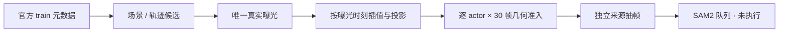

# CPU 来源脚本独立审查

审核文件：`prepare_source_pool.py`；同时只读查看 `prepare_context_extract.py`。未运行 GPU、未改主脚本、未改变冻结采样参数。

## 需修正的实质问题

1. **全部曝光几何准入尚未执行。** `prepare_source_pool.py:269` 得到 `p` 后，不论 `p=None` 或不满足 `good(p)` 都加入 `f['actors']`；第272行仅检查每帧候选列表非空，第274行即标为 `pending_pixel_review`。这不能证明同一个主 actor 在全部30帧都有有效投影，也不能证明它们满足尺寸/截边门槛。应逐 `instance_token` 记录全部帧的投影、尺寸、边界门槛结果与失败帧；只有真正满足的 actor 可用于下阶段 donor/protected 提案。clip 可以保留作诊断，但应避免其一个有效 actor 掩盖另一个无效候选。

2. **关键帧插值缺失间隔门槛。** 第261–268行对任意相邻标注时间直接插值，没有执行协议 `gap ≤600ms`。若存在缺失 keyframe，即使 RGB 曝光连续，也会跨较大间隔构造未经支持的车辆轨迹。应先验证时间间隔正且不超过600ms，记录拒绝帧和缺失区间。

上述修改需实际应用到已有结果。`main()` 第283–285行复用已有 pool/selection/manifest；只修改函数不会重新计算已经产出的 manifest。建议保留本次选择不变，对已选 manifest 追加确定性几何资格验证与版本/门槛记录，并备份旧结果。

## 下阶段必须保留的边界

- 当前 `hull` 为 GT 3D box 八角点的图像凸包；脚本没有 SAM2，也没有实例 mask。可用于定位/一致性统计/几何提案，不能作为车辆像素真值或直接 cutout。建议在消费端要求 `mask_source=SAM2` 与明确 mask 文件存在，包络字段显式标为 `geometry_only`。
- `source_manifest.frames[].actors` 仅含最多4个已选候选，不是画面中全部 actor。完整各类 annotation 已由 `prepare_context_extract.py` 保存到 `source_context.json`。碰撞、邻车保持与前景遮挡检查应消费完整 context 并插值，不能据候选列表稀疏宣称无邻车/无碰撞。
- 当前脚本没有构造模型输入，未发现把 Y 写入训练条件的现成路径；这不认证后续 loader 无泄漏。模型条件的逐字段 provenance 与隐藏区不变探针仍需在合成/训练 loader 阶段执行。
- `make_index()` 用标注时刻位置与真实 camera keyframe 姿态做候选预筛；最终 `resolve()` 已改用实际曝光时刻插值。来源判定、配对和未来合成应以最终逐帧结果为准，不能继续复用未对齐的 anchor projection。

## 已核对合理的部分

官方 train split 与旧 DEV 排除有显式判断；同一轨迹按关键帧时间排序收集；四元数 slerp 没有逐帧换实例；camera→ego→world 变换与 inverse 投影顺序一致；最终内参按真实 RGB 宽高缩放；曝光唯一、nearest误差≤55ms、最大gap≤180ms和禁止外推均有实现。源图解码还检查1600×900，故候选阶段 `.64` 缩放假设与实际抽取约束一致。

本次为代码审查，不是来源图像或合成质量通过记录。
