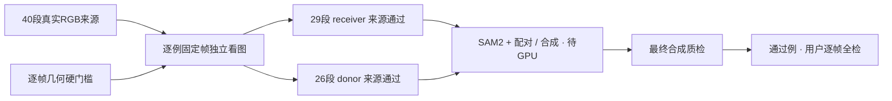

# Target + Protected Actors：独立来源质量审核

任务：`WS-V77-TARGET-PROTECTED-20260929/r1`。实际完成40段可读来源的固定首/中/末、最差清晰度帧审核；每个case均调用图像查看，边界疑点另查原始crop。完整证据逐例保存在 `source_reviews.json`，后续追加分批保存在 `batch02_reviews.json`–`batch05_reviews.json`。没有用户verdict，也没有GPU或最终合成质量判定。

| 角色 | source pass | source reject | source uncertain |
|---|---:|---:|---:|
| Receiver：真实Y中可辨primary/背景材料 | 29 | 9 | 2 |
| Donor：完整可见车辆cutout来源 | 26 | 11 | 3 |

来源通过只针对当前primary及窗口，不代替未来放置、视角匹配、mask或最终合成判定。receiver-only通过的 S030/S035/S061 不能因SAM2推理完成自动成为donor。S011/S012/S046的图像即便部分清楚，也保留关键帧插值间隔的硬拒绝。S001/S002缺RGB，没有看图，**不在40例视觉审核里，也不赋造视觉结论**。

来源局限：本批素材集中在Boston、少量日志及相近道路环境，多例为外观高度相似的深色Toyota跟车正面，S044/S045也有相近桥梁和车辆外观；不同scene/instance编号不能直接解释为独立车型、照明、视角或环境覆盖。首/中/末和最差清晰度抽帧只能提供来源准入证据，不能认证全部帧的时序、实例mask连续性或未来合成是否无抖动。当前没有生成合成输入X，也没有完成Target+Protected类别占比验证；后续仍需逐帧几何/alpha检查、独立最终合成抽帧，以及用户对每一帧的人工全检。所有人工评分保持空白。
