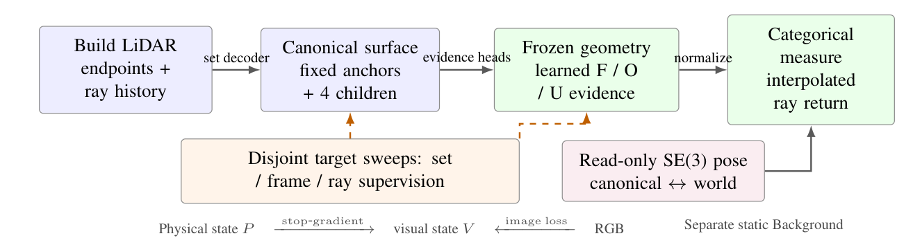
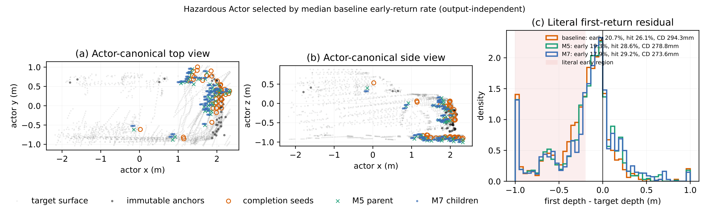
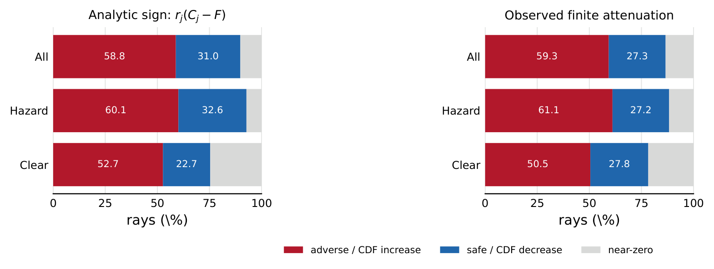

# 面向物理一致驾驶场景重建的证据化目标体表面

Evidential Actor Surfaces for Physically Consistent Driving Reconstruction

作者：匿名作者

> 中文精翻阅读版，对应 v7.1 分支提交 ec9c2e08 的 7 页英文主稿。正文、公式、图注、表格和文献编号与该版本对应，不混入 supplement 的内容，不增补实验结论。图像保留英文原图；图内术语对照属于译注。参考文献保留英文著录信息，便于检索。

## 译者说明：术语约定

为避免中文表述产生歧义，全文采用以下译法：

| 英文术语 | 本文译法与含义 |
| --- | --- |
| Actor | 目标体：具有跟踪身份的场景目标；不指执行算法的智能体。 |
| canonical frame / canonical surface | 规范坐标系 / 规范表面：在目标体自身坐标系中对齐后的几何。 |
| return / first return | 回波 / 首回波；涉及算子输出时，具体指对应的回波深度。 |
| early return | 提前回波：预测回波深度小于实测深度减去容差。 |
| hit / hit recall | 命中 / 命中召回率：预测深度落在实测深度的容差范围内；分母仍包含未命中的目标射线。 |
| Free / Occupied / Unknown | 自由 / 占用 / 未知，分别缩写为 F / O / U；“自由”指观测支持的未占用空间。 |
| mass | 质量：证据或概率分配的权重，不是物体的物理质量。 |
| categorical return measure | 类别型回波测度：定义在离散深度采样位置上的归一化回波分布。 |
| literal point-surface return | 按几何定义直接计算的点表面回波：波束管内点中心的最小正投影深度，不是期望深度。 |
| hazardous / clear strata | 危险组 / 非危险组：按目标体的危险性标签分层，不表示其几何重建正确与否。 |
| producer / build observations | 数据生成端 / 构建观测：生成训练样本的数据处理端，以及用于构建模型输入的观测。 |
| state ownership | 状态所有权：某类变量由哪个状态独立持有，以及哪些损失可以更新这些变量。 |

下文严格区分“相对下降百分之多少”和“下降多少个百分点”。公式保留原文符号及编号。

---

## 摘要

面向物理查询的驾驶场景重建，既需要准确的表面，也需要可靠的传感器回波。稀疏观测使这两个目标难以兼顾：补全物体能够提高表面覆盖度，却也可能在实测 LiDAR 命中位置之前引入额外表面。我们提出证据化目标体表面（Evidential Actor Surfaces，EAS），这是一种以物体为中心、分阶段学习规范几何与回波证据的表示。该方法采用四子元素补全模型，从经过运动补偿的目标点集、局部表面结构、帧覆盖度和可微射线监督中学习几何。随后，数据生成端的观测在固定几何上监督连续的自由、占用和未知证据。我们将这些证据组合为类别型回波分布；其归一化测度支持精确分析分量衰减如何改变提前回波的概率。相互独立的物理状态、刚体位姿状态和视觉状态提供了 SE(3) 等变性，并将外观优化与物理几何隔离。

在包含 66 个目标体的 nuScenes 开发集子集上，几何模型使危险组提前回波率相对下降 5.12%，Chamfer 距离改善 6.21 mm，命中召回率提高 2.76 个百分点。在相同几何上，与单位权重的类别型能量基线相比，证据化回波测度进一步使危险组提前回波率下降 0.62 个百分点，危险组命中召回率提高 2.32 个百分点。在包含 352 个目标体的冻结 Argoverse 2 评测中，结果揭示了尚存的跨传感器权衡：命中召回率提高的同时，危险组提前回波率也有所上升。

## 1. 引言

重建的驾驶场景可用于传感器仿真、感知分析和反事实回放。近年来，神经仿真器已经能够以很高的保真度表示复杂外观与运动物体 [20, 24, 17]。物理查询则提出了额外要求：重建表面必须与传感器首次遇到物体的位置一致。一辆视觉上合理的车辆，仍可能侵入实测自由空间；一个稀疏但准确的点集，也可能遗漏大部分物体表面。这些误差作用于同一条射线的不同位置，因此需要联合评估表面与回波。

学习这种表示面临两个挑战。首先，运动目标体的多帧观测必须先进行对齐，才能用作补全目标；少量种子点也不足以覆盖稠密的目标表面。其次，图元的位置与它对传感器回波的贡献是两个不同的变量。同一个锚点可能在某一视角下获得占用证据，而在另一视角下获得自由空间证据。若将每个相互重叠的高斯图元都赋予单位不透明度，回波便会依赖采样密度；若将这些观测压缩为单一置信分数，又会丢失其内部结构。

我们通过证据化目标体表面（EAS）应对上述挑战，整体流程见图 1。每个被跟踪的目标体都具有规范物理表面、连续回波证据，以及由独立状态持有的刚体轨迹。我们将 LiDAR 扫描转换至目标体坐标系，以构建模型输入和与之不相交的监督目标。集合解码器将每个补全种子扩展为四个子表面元素。集合距离、局部平面与尺度目标、帧覆盖度和射线损失共同监督这些子元素，而观测锚点保持固定。由此，实测几何可以直接约束最终部署的表面。

对于传感器射线终止，我们在数据生成端保留观测历史，并分别为锚点和子元素学习证据预测头。其自由、占用和未知质量概括了多视角观测中的支持与矛盾。在固定表面上，占用质量为沿射线深度定义的归一化类别分布赋权。这样的组合使学到的证据形成有用的首回波测度。归一化结构还允许我们开展精确的逐分量分析：降低某个分量的权重，会使命中位置之前的概率质量向其余分量构成的混合分布靠拢。我们推导了这一变化的有限幅度表达式，并确定了衰减何时会降低提前回波概率。

动态场景接口遵循相同的变量分离原则。只读 SE(3) 位姿将规范表面放置到世界坐标系中，并列的视觉状态负责承载外观。这使刚体组合具有等变性，并阻止图像优化移动物理表面。因此，该表示既能够学习局部几何，也能够明确控制每类观测可以更新哪些状态。

我们的实验分别考察几何学习、回波组合和坐标状态所有权。在 nuScenes 开发集子集上，表面监督同时改善了危险组提前回波率、命中召回率与 Chamfer 距离。在相同几何上，类别型证据使总体、危险组和非危险组的提前回波率与命中召回率均得到改善。冻结 AV2 评测样本集用于衡量跨传感器表现；解析与数值检验则将回波测度与其衰减响应联系起来。本文的三项贡献如下：

- 提出目标体规范坐标系下的补全表示，使用目标点集、逐帧观测和射线监督进行训练。
- 提出基于数据生成端证据的类别型回波测度，并给出精确的有限衰减恒等式。
- 提出分离物理状态、位姿状态与视觉状态的接口，并通过表面精度、首回波行为和 SE(3) 组合进行评估。

## 2. 相关工作

### 驾驶场景重建与传感器回波

三维高斯泼溅（3D Gaussian Splatting）提供了一种高效的外观表示 [11]。UniSim、LiDAR4D 和 DyNFL 将神经重建扩展到驾驶场景和随时间变化的传感器观测 [20, 24, 17]。此外，LiDAR 还测量了命中端点之前的自由空间区间 [6]。Neural LiDAR Fields 学习用于生成回波的射线权重分布 [7]，CaDDN 则以类别分布表示具有实际度量单位的深度 [14]。我们关注的是目标体补全表面与该表面诱导的回波分布之间的关系。我们分别评估这两个对象，并通过图元级证据将其连接起来。

### 补全与证据化几何

以物体为中心的占用补全，将规范化后的 LiDAR 短轨迹与隐式解码相结合 [23]。PoinTr 学习点集补全，而 SnowflakeNet 以递归方式生成子点 [22, 19]。Gau-Occ 利用补全后的 LiDAR 几何初始化高斯占用表示 [12]。这些方法启发了我们的目标点集构建和子表面解码器。EAS 进一步利用帧覆盖度和实测射线深度监督规范几何。ALSO 与基于证据的占用方法使用传感器观测区分自由、占用和未观测空间 [1, 9, 10]。GaussianFormer-2、GaussRender 和 Vol3DGS 将高斯支撑与占用或射线透射率联系起来 [8, 3, 15]。我们研究连续证据应如何在固定表面上进行组合，并比较累加式透射模型与类别型回波质量两种组合方式。

### 运动与外观分解

从累积扫描中构建监督目标时，运动补偿至关重要 [18]。DualAD 分离静态与动态分支 [4]；DynamicVGGT 预测当前及未来的点图，并使用场景流监督高斯运动 [5]。神经场景图通过物体变换支持动态重建 [13]。EAS 使用标注的刚体运动，将证据对齐至规范坐标系，并将学得的表面重新放置到场景中。其视觉状态遵循 Feature 3DGS 所探索的“在几何上承载属性”原则 [25]，同时对物理载体停止梯度传播，使外观更新由独立状态负责。

## 3. 问题定义

对于被跟踪的目标体 $i$，定义 $Z_i=(ID_i,T_{i,0:H},D_i,C_i)$，分别表示其身份、刚体轨迹、尺寸和类别。构建观测 $B_i$ 包含 LiDAR 命中端点及其传感器原点。与构建观测不相交的目标扫描 $Y_i$ 提供表面与首回波标签。我们学习规范物理状态 $P_i=(S_i,m_i)$，其中 $S_i$ 包含图元中心及其支撑尺度，$m_i$ 包含连续证据。重建过程中保留目标体状态 $Z_i$。

对于目标射线 $r=(o,v,d^\star)$，若回波深度 $\widehat d$ 满足 $\widehat d<d^\star-\tau$，则记为提前回波；若满足 $|\widehat d-d^\star|\leq\tau$，则记为命中。本文取 $\tau=0.20$ m。直接几何点表面算子在横向半径为 $0.20$ m 的波束管内，取所有点中心中的最小正投影深度；若管内为空，则深度为 $\infty$。类别型算子则返回表面深度分布经插值后的中位数。两者均与同一实测端点进行比较。

学习目标联合考虑表面重建与射线一致性。评测同时报告提前回波率、命中召回率和对称 Chamfer 距离：三者分别衡量改变 $S_i$ 所带来的不同影响。目标体的危险性标签仅用于分层评测。只读位姿将 $P_i$ 放置于世界坐标系中，而单独参数化的视觉状态 $V_i$ 提供外观。

## 4. 方法

**图 1. 证据化目标体表面总览。** 经过运动补偿的构建观测产生规范表面。与构建观测不相交的目标数据分阶段监督几何和连续的自由 / 占用 / 未知（F/O/U）证据。冻结后的证据为类别型射线回波测度赋权。刚体位姿与外观分别由独立状态持有。虚线箭头表示监督路径。

> 图内术语对照（译注）：Build LiDAR endpoints + ray history = 构建用 LiDAR 端点与射线历史；Canonical surface / fixed anchors + 4 children = 规范表面 / 固定锚点与四个子元素；Frozen geometry / learned F/O/U evidence = 固定几何 / 学得的 F/O/U 证据；Categorical measure / interpolated ray return = 类别型测度 / 插值后的射线回波；set decoder = 集合解码器；evidence heads = 证据预测头；normalize = 归一化；Disjoint target sweeps = 与构建观测不相交的目标扫描；set / frame / ray supervision = 点集 / 帧 / 射线监督；Read-only SE(3) pose = 只读 SE(3) 位姿；canonical ↔ world = 规范坐标系 ↔ 世界坐标系；Physical state / visual state = 物理状态 / 视觉状态；stop-gradient = 停止梯度传播；image loss = 图像损失；Separate static Background = 独立的静态背景。

### 4.1 经过运动补偿的表面监督

根据标注的传感器、自车与目标体位姿，将每个端点映射至规范坐标系：

$$
x_{it}=T_{it}^{-1}T_{\mathrm{ego},t}T_{\mathrm{sensor}}x_t^{\mathrm{sensor}}.
\tag{1}
$$

传感器原点也通过同一变换链进行转换。构建扫描产生固定观测锚点 $\mathcal A_i$ 和补全种子；另外的扫描产生目标点集 $\mathcal Y_i$。观测锚点由保留的端点，以及投影到构建观测所支持几何上的端点组成。

预训练的位置调整模型提供父中心 $\bar x_j$。集合解码器将构建特征与四个可学习槽位嵌入相结合，预测有界残差和各向同性尺度：

$$
c_{jk}=\bar x_j+\Delta x_{jk},\quad
S_i=\mathcal A_i\cup\{(c_{jk},s_{jk}):k=1,\ldots,4\}.
\tag{2}
$$

每个坐标方向的残差绝对值不超过 $0.25$ m，尺度范围为 $[0.02,0.40]$ m。记 $\mathcal X_i$ 为 $S_i$ 中的中心点集合。解码器使用目标体尺寸和规范坐标系下的几何证据。其监督目标是一个集合，因此多个子元素能够覆盖局部表面的不同部分。

#### 几何与帧覆盖度

记 $\widetilde{\mathcal L}$ 为使用停止梯度传播后的父模型参考值进行归一化的损失。我们联合使用对称最近邻距离、局部点到平面距离和对数尺度回归：

$$
\mathcal L_G=\widetilde{\mathcal L}_{\mathrm{set}}
+.25\widetilde{\mathcal L}_{\mathrm{plane}}
+.10\widetilde{\mathcal L}_{\mathrm{scale}}
+\widetilde{\mathcal L}_{\mathrm{frame}}.
\tag{3}
$$

局部平面与尺度目标由八个目标近邻确定。帧损失对每个目标帧内“目标点到重建表面”的有向距离先求均值，再对各目标帧等权平均：

$$
\mathcal L_{\mathrm{frame}}=
\frac{1}{|\mathcal F_i|}\sum_{t\in\mathcal F_i}
\frac{1}{|\mathcal Y_{it}|}\sum_{y\in\mathcal Y_{it}}\min_{x\in\mathcal X_i}\|y-x\|_2.
\tag{4}
$$

这样可以避免采样稠密的帧主导规范表面的覆盖情况。

#### 可微射线监督

我们沿每条训练射线采样 48 个深度位置，并通过 alpha 合成将高斯支撑组合为期望深度：

$\bar d=\sum_k T_k\alpha_k d_k+T_{\mathrm{end}}d_{\mathrm{far}}$。

其中，$d_{\mathrm{far}}=d^\star+0.50$ m 为剩余未命中质量提供深度值。射线目标为：

$$
\mathcal L_R=
\widetilde{\operatorname{Huber}}(\bar d,d^\star)
+.5\,\widetilde{[d^\star-\tau-\bar d]_+}.
\tag{5}
$$

第二项惩罚落入实测命中位置之前区间内的预测深度。它是平滑的深度代理目标；评测使用的是波束管内按几何定义直接求得的最小深度。在物理微调阶段，PCGrad [21] 对相互冲突的几何梯度与射线梯度进行投影。部署时输出全部子元素，随后使用固定的 $0.06$ m 体素去重。

### 4.2 基于数据生成端证据的回波测度

接下来，我们固定几何，并学习其中的图元如何影响传感器射线终止。对于每个锚点，数据生成端保留其来源帧与射线溯源信息、投影位移、规范坐标系下的命中计数、时间 / 视角支持，以及连续的构建证据。子元素继承父元素证据，并结合自身局部几何。相互独立的 PointNet 风格预测头通过三分类 softmax 输出 $m_j=(m_{F,j},m_{O,j},m_{U,j})$。

目标射线的投票通过软标签交叉熵监督这些质量：命中位置之前的观测贡献自由证据，端点贡献占用证据，而缺乏支持或被遮挡的区域贡献未知证据。

对于一个补全子元素，令 $n_j$ 表示波束管内、投影深度为正的射线观测机会数，$n_{F,j}$ 与 $n_{O,j}$ 分别表示命中前投票数和端点投票数。其监督目标为：

$$
m_j^\star=\left(\frac{n_{F,j}}{n_j},\frac{n_{O,j}}{n_j},
1-\frac{n_{F,j}+n_{O,j}}{n_j}\right),\quad n_j>0,
\tag{6}
$$

当没有射线支持该子元素时，目标取 $(0,0,1)$。自由与占用两个分量可以同时为正，从而保留不同观测之间的不一致。证据损失为 $\mathcal L_E=-\sum_j\sum_{a\in\{F,O,U\}}m_{a,j}^\star\log m_{a,j}$，并在受监督图元上取平均。

#### 分阶段证据学习

锚点预测头使用证据损失和基于有序透射率的回波损失进行训练。冻结该预测头后，使用相同目标训练子元素预测头，随后加入命中前生存项进行微调。该项是子元素在 $d^\star-\tau$ 之前的积分光学厚度。上述阶段均在固定中心与尺度的条件下学习证据。

之后，我们冻结两个预测头，将回波组合方式改为类别型测度。因此，最终的组合属于一次冻结表示实验，不需要进行类别型联合微调。

#### 类别型组合

对于目标体框内 64 个有序深度采样点 $d_k$，定义：

$$
\kappa_{kj}=\exp\!\left(-\frac{\|o+d_kv-c_j\|_2^2}{2s_j^2}\right),
\qquad w_j=m_{O,j}.
\tag{7}
$$

深度与图元的联合分布为：

$$
q_{kj}=\frac{w_j\kappa_{kj}}{\sum_{a,b}w_b\kappa_{ab}},
\qquad p_k=\sum_jq_{kj},\quad F_k=\sum_{\ell\leq k}p_\ell.
\tag{8}
$$

我们在累积分布函数（CDF）首次跨越 $1/2$ 的区间内进行插值，得到回波深度 $\widehat d$。该测度以标注框内存在一次回波为条件。将所有图元权重乘以同一个正数，$p_k$ 保持不变。这消除了全局光学厚度这一自由度；但改变某一图元族的相对质量，仍会改变分布。

### 4.3 分量贡献归属与衰减

对于评测边界 $b=d^\star-\tau$，使用与中位数计算相同的分段区间对 $F(b)$ 进行插值。当边界位于分布内部，且所在区间具有正质量时：

$$
\widehat d<b\quad\Longleftrightarrow\quad F(b)>\tfrac12.
\tag{9}
$$

由于该测度对图元具有可加性，$F(b)=F_{\mathcal A}(b)+F_{\mathrm{child}}(b)$。这将部署时的提前回波事件分解为观测锚点与补全元素的贡献。

令 $D_j=\sum_k\kappa_{kj}$，$N_j(b)$ 为经过插值的边界之前核质量，并定义 $C_j=N_j/D_j$ 和 $r_j=w_jD_j/\sum_a w_aD_a$。则有：

$$
\frac{\partial F(b)}{\partial\log w_j}=r_j(C_j-F(b)).
\tag{10}
$$

对于有限衰减 $w_j\mapsto vw_j$，其中 $0<v<1$，有：

$$
F_v(b)-F(b)=
\frac{(1-v)r_j\bigl(F(b)-C_j\bigr)}{1-(1-v)r_j}.
\tag{11}
$$

分母为正。对于质量为正的分量，衰减降低 $F(b)$ 的充要条件是 $C_j>F(b)$；当 $C_j<F(b)$ 时，衰减反而会增大 $F(b)$。将一个图元族的质量汇总后，对整个族进行统一衰减也满足同一恒等式。对于这个固定分量或图元族，变化的符号与衰减幅度无关。

事实上，衰减后的测度为 $F_v=(F-(1-v)r_jC_j)/(1-(1-v)r_j)$；将其减去 $F$，即得到式（11）。我们的分析使用由监督目标定义的边界 $b$。

### 4.4 刚体组合与视觉状态所有权

规范能量为 $e_i(x)=\log\sum_j w_j\exp(-\|x-c_j\|^2/(2s_j^2))$，通过以下方式放置到世界坐标系：

$$
Q_{it}(x)=e_i\!\left(R_{it}^{\top}(x-t_{it})\right),
\qquad T_{it}=(R_{it},t_{it}).
\tag{12}
$$

对于共同施加的刚体变换 $g$，逆向查询满足 $Q_{gT}(gx)=Q_T(x)$。刚体位姿改变位置，但保持规范坐标系下的两两距离不变。静态背景由独立的场景状态持有。

视觉层接收停止梯度传播后的物理载体 $\operatorname{sg}(P_i)$，并独立持有渲染几何、球谐系数与不透明度。图像损失只更新这个并列的视觉状态。由于物理查询仅读取 $(P_i,T_{it})$，其对视觉参数的导数为零。该接口使外观表示能力能够独立于物理表面扩展。

## 5. 实验

### 5.1 实验设置

#### 数据

我们使用 nuScenes [2] 进行学习，使用 Argoverse 2 Sensor 验证集 [16] 进行冻结外部评测。几何与证据学习阶段使用 593 个训练目标体，以及包含 66 个目标体的开发集子集，其中 41 个属于危险组、25 个属于非危险组，共有 99,208 条射线。该子集在前序模型开发过程中已经被使用，因此源域结果用于刻画学得的方法机制。

AV2 样本选择从 150 个验证日志中排除早期编译器研究已经使用的 60 个日志。在剩余 90 个日志组成的补集中排序，再选取位置 $0,4,\ldots,76$，得到 20 个日志、352 个目标体和 1,016,652 条射线。在此次评测开始之前，模型、坐标变换和评测参数均已冻结。

#### 指标与实现

提前回波率和命中率均以全部目标射线为分母；未命中的射线也保留在分母中。Chamfer 距离是先计算每个目标体的对称最近邻距离，再在目标体之间取平均。我们报告总体、危险组和非危险组的结果。表面比较采用直接几何波束管回波；证据比较则在相同几何上采用经过插值的类别型回波。所有目标体状态均予以保留。

四子元素解码器的隐藏层宽度为 128，槽位嵌入维度为 16。考虑帧信息的微调使用 AdamW 优化器，训练 6 个 epoch，学习率为 $10^{-4}$，每个批次包含 4 个目标体。证据预测头的隐藏层宽度为 64。本地研究档案给出了这些预测头的分阶段训练安排和运行标识。

### 5.2 规范表面重建

表 1 比较了原始补全表面、目标点集扩展，以及加入帧均衡监督后的扩展模型。集合扩展将危险组提前回波率从 27.80% 降至 24.96%，使 Chamfer 距离改善 2.90 mm，并使命中召回率提高 2.17 个百分点。帧覆盖度监督进一步将 Chamfer 距离改善至 231.46 mm，将命中召回率提高至 50.43%。与集合扩展相比，它还使运动目标体和准静态目标体的帧均目标距离分别降低 7.01 mm 和 3.55 mm。其危险组提前回波率为 26.37%，相较原始表面相对下降 5.12%。

**表 1. 66 个开发集目标体上的规范几何结果。** 提前回波率和命中率均为射线百分比；CD 为按目标体平均的 Chamfer 距离，单位为 mm。所有方法均使用直接几何点表面回波，并保留 100% 的目标体状态。↓ 表示越低越好，↑ 表示越高越好。

| 方法 | 总体提前回波率 ↓（%） | 危险组提前回波率 ↓（%） | 非危险组提前回波率 ↓（%） | CD ↓（mm） | 命中召回率 ↑（%） |
| --- | ---: | ---: | ---: | ---: | ---: |
| 原始表面 | 26.74 | 27.80 | **21.56** | 237.67 | 47.67 |
| 集合扩展 | **24.41** | **24.96** | 21.74 | 234.77 | 49.84 |
| + 帧覆盖度监督 | 25.70 | 26.37 | 22.39 | **231.46** | **50.43** |

因此，帧覆盖度监督改善了这一权衡中的完整性一侧，同时保留了相较基线的危险组提前回波改善。非危险组提前回波率则从 21.56% 上升至 22.39%；分层表格明确呈现了这一权衡。

图 2 展示了一个目标体上的集合扩展效果。该目标体依据基线提前回波率的中位数选择，选择发生在查看学习模型的输出之前。增加的子元素更贴近留出的目标表面。

**图 2. 危险组开发集目标体上的规范点集扩展。** 47 个补全种子产生 188 个子元素，观测锚点保持固定。原始表面 / 位置调整 / 集合扩展的提前回波率分别为 20.7% / 19.3% / 17.9%，命中率分别为 26.1% / 28.6% / 29.2%，Chamfer 距离分别为 294.3 / 278.8 / 273.6 mm。灰色点表示与构建观测不相交的目标观测。该示例展示的是加入帧微调之前的集合扩展阶段。

> 图内术语对照（译注）：(a) Actor-canonical top view = 目标体规范坐标系俯视图；(b) Actor-canonical side view = 目标体规范坐标系侧视图；(c) Literal first-return residual = 直接几何首回波残差。坐标轴 actor x/y/z 为目标体坐标，单位 m；first depth - target depth 为首回波深度减去目标深度，单位 m；density 为密度。target surface = 目标表面；immutable anchors = 固定锚点；completion seeds = 补全种子；M5 parent = M5 父中心；M7 children = M7 子元素；baseline = 基线；literal early region = 直接几何提前回波区域。顶部说明表示按基线提前回波率的中位数选择危险目标体，选择不依赖模型输出。

### 5.3 证据与回波组合

数据生成端重放在 1,004 个数据集目标体上，将 297,535 个锚点与构建射线及目标射线证据对齐。构建观测与目标观测的占用质量相关系数为 $r=0.514$，同时有 58.72% 的锚点既获得自由投票，又获得占用投票。由此，证据预测头得到了一份具有预测价值、但内部存在矛盾的观测历史。

表 2 在固定的帧监督几何上，单独考察学得证据的作用。类别型测度将提前回波率从 18.19% 降至 17.67%，将命中召回率从 62.28% 提高至 64.46%。危险组提前回波率下降 0.62 个百分点，危险组命中召回率提高 2.32 个百分点。三个分层的两项指标均有所改善。非危险组提前回波率的降幅较小，仅为 0.03 个百分点；更大的收益体现在命中召回率上。

**表 2. 各数据集内部在相同几何上的类别型回波比较。** Unit 表示单位权重高斯能量，EAS 表示学得的证据权重。所有数值均为百分比；源域与 AV2 属于不同样本集。

| 数据集与分层 | 提前回波率 ↓：Unit（%） | 提前回波率 ↓：EAS（%） | 命中率 ↑：Unit（%） | 命中率 ↑：EAS（%） |
| --- | ---: | ---: | ---: | ---: |
| **nuScenes 开发集：66 个目标体 / 99,208 条射线** | | | | |
| 总体 | 18.19 | **17.67** | 62.28 | **64.46** |
| 危险组 | 17.42 | **16.80** | 62.07 | **64.39** |
| 非危险组 | 21.95 | **21.92** | 63.34 | **64.80** |
| **冻结 AV2：352 个目标体 / 1,016,652 条射线** | | | | |
| 总体 | 16.91 | 17.14 | 38.35 | 44.24 |
| 危险组 | 16.56 | 17.10 | 27.98 | 34.28 |
| 非危险组 | 17.21 | 17.17 | 47.14 | 52.68 |

#### 为什么组合方式很重要

将同一组学得的锚点与子元素证据用于累加式透射模型，会得到 21.51% 的提前回波率和 66.92% 的命中召回率。类别型组合则将这一工作点移动至 17.67% / 64.46%。因此，有序光学模型对于学习证据是有用的，但在这组图元上，其累积的前端尾部质量会使回波更早出现。

精确的贡献归属检验发现，类别型模型使边界之前的平均概率质量降低了 0.331 个百分点：锚点贡献为 −0.346 个百分点，子元素贡献为 +0.016 个百分点。观测锚点证据解释了大部分净下降。

### 5.4 衰减与首回波行为

图 3 在 99,208 条冻结射线上评估式（11）。对子元素进行统一衰减时，58.85% 的射线具有不利的变化方向，30.96% 的射线具有有利的变化方向。在学习逐分量可见性的消融实验中，精确计算的边界前概率质量在 59.32% 的射线上增加，在 27.27% 的射线上减少。一阶预测与有限变化的符号在 95.73% 的射线上一致。这些观察说明，降低某一分量的权重，与降低归一化混合分布在某个边界之前的概率，并不是同一件事。

**图 3. 冻结开发集射线上的衰减响应。** 左：对子元素进行统一衰减时预测的变化符号。右：在学得的可见性消融模型下，精确计算得到的变化。红色表示边界前概率增加，蓝色表示减少。

> 图内术语对照（译注）：Analytic sign = 解析符号判据；Observed finite attenuation = 实测有限衰减响应；All / Hazard / Clear = 总体 / 危险组 / 非危险组；rays (%) = 射线占比（%）；adverse / CDF increase = 不利方向 / CDF 增加；safe / CDF decrease = 有利方向 / CDF 减少；near-zero = 变化接近零。此处 safe 仅表示图中边界前概率下降的方向，与正文中的“有利方向”对应。

平滑射线损失也存在相关的算子边界：期望深度误差并不能决定受支持中心点的直接几何最小深度。在帧均衡射线损失的消融实验中，即使两个算子使用完全相同的支撑，新增提前回波射线中仍有 38.03% 的射线，其平滑深度误差反而得到改善。本地研究档案给出了一个构造性反例，以及相同支撑与实际部署两种情况下的完整比较。

### 5.5 动态场景组合

我们将 scene-0230 中的 12 个目标体与只读 StreetGS 检查点匹配。在 36 个“目标体-帧”实例上，5,791 个物理高斯图元随刚体位姿运动，并与外观状态持有的 106,807 个高斯图元、背景状态持有的 1,140,862 个高斯图元相互独立。

在平移幅度最大达到 126.28 m 的情况下，单位权重组合检验得到的最大能量残差为 $3.40\times10^{-14}$，最大两两距离残差为 $1.24\times10^{-14}$ m。这验证了式（12）的坐标组合关系。单独优化视觉参数时，物理中心与尺度保持固定，从而验证了场景接口所采用的梯度所有权。本地研究档案报告了相关的外观表示能力实验。

### 5.6 跨传感器评测

在冻结 AV2 样本集上，类别型模型将总体命中召回率从 38.35% 提高至 44.24%，将危险组命中召回率从 27.98% 提高至 34.28%（表 2）。总体提前回波率上升 0.23 个百分点，危险组提前回波率上升 0.54 个百分点。

因此，总体提前回波率不增加、最差分层提前回波率不增加这两项标准未通过，而命中保持标准通过。完整结果显示出从源域到目标域的权衡：该回波测度能够恢复更多实测端点，但其在源域上对提前回波的改善未能迁移。不进行任何 AV2 微调、校准或阈值调整。

### 适用范围与局限性

当前模型面向具有充分多帧 LiDAR 支持、带标注的刚性目标体，并以目标体框内存在一次回波为条件。稀疏感知和位姿误差仍会导致表面歧义。源域结果来自已经使用过的开发集子集；冻结 AV2 评测量化了尚存的传感器依赖性。非刚性形变、显式射线丢失建模和静态世界补全，需要额外的监督目标与建模。

## 6. 结论

我们提出了证据化目标体表面，一种分阶段表示规范几何与传感器射线终止的方法。目标点集与帧监督改善了表面重建，而数据生成端证据在固定几何上提供了有用的类别型回波测度。有限衰减恒等式刻画了分量权重如何影响部署时的提前回波边界；类型化状态所有权则在外观优化过程中保持刚体等变性。总体而言，这些实验将物理重建质量与其监督方式、回波算子和坐标接口联系起来。

## 参考文献

以下保留英文主稿中的作者、题名、出版信息和编号，未另行替换或增补文献。

[1] Alexandre Boulch, Corentin Sautier, Björn Michele, Gilles Puy, and Renaud Marlet. ALSO: Automotive LiDAR self-supervision by occupancy estimation. In *Proceedings of the IEEE/CVF Conference on Computer Vision and Pattern Recognition*, pages 13455–13465, 2023.

[2] Holger Caesar, Varun Bankiti, Alex H. Lang, Sourabh Vora, Venice Erin Liong, Qiang Xu, Anush Krishnan, Yu Pan, Giancarlo Baldan, and Oscar Beijbom. nuScenes: A multimodal dataset for autonomous driving. In *Proceedings of the IEEE/CVF Conference on Computer Vision and Pattern Recognition*, 2020.

[3] Loïck Chambon, Eloi Zablocki, Alexandre Boulch, Mickaël Chen, and Matthieu Cord. GaussRender: Learning 3D occupancy with gaussian rendering. In *Proceedings of the IEEE/CVF International Conference on Computer Vision*, 2025.

[4] Simon Doll, Niklas Hanselmann, Lukas Schneider, Richard Schulz, Marius Cordts, Markus Enzweiler, and Hendrik P. A. Lensch. DualAD: Disentangling the dynamic and static world for end-to-end driving. In *Proceedings of the IEEE/CVF Conference on Computer Vision and Pattern Recognition*, pages 14728–14737, 2024.

[5] Zhuolin He, Jing Li, Guanghao Li, Xiaolei Chen, Jiacheng Tang, Siyang Zhang, Zhounan Jin, Feipeng Cai, Bin Li, Jian Pu, Jia Cai, and Xiangyang Xue. DynamicVGGT: Learning dynamic point maps for 4D scene reconstruction in autonomous driving. In *Proceedings of the IEEE/CVF Conference on Computer Vision and Pattern Recognition*, pages 35670–35679, 2026.

[6] Peiyun Hu, Jason Ziglar, David Held, and Deva Ramanan. What you see is what you get: Exploiting visibility for 3D object detection. In *Proceedings of the IEEE/CVF Conference on Computer Vision and Pattern Recognition*, pages 11001–11009, 2020.

[7] Shengyu Huang, Zan Gojcic, Zian Wang, Francis Williams, Yoni Kasten, Sanja Fidler, Konrad Schindler, and Or Litany. Neural LiDAR fields for novel view synthesis. In *Proceedings of the IEEE/CVF International Conference on Computer Vision*, pages 18236–18246, 2023.

[8] Yuanhui Huang, Amonnut Thammatadatrakoon, Wenzhao Zheng, Yunpeng Zhang, Dalong Du, and Jiwen Lu. GaussianFormer-2: Probabilistic gaussian superposition for efficient 3D occupancy prediction. In *Proceedings of the IEEE/CVF Conference on Computer Vision and Pattern Recognition*, pages 27477–27486, 2025.

[9] Jonas Kälble, Sascha Wirges, Maxim Tatarchenko, and Eddy Ilg. Accurate training data for occupancy map prediction in automated driving using evidence theory. In *Proceedings of the IEEE/CVF Conference on Computer Vision and Pattern Recognition*, pages 5281–5290, 2024.

[10] Jonas Kälble, Sascha Wirges, Maxim Tatarchenko, and Eddy Ilg. EvOcc: Accurate semantic occupancy for automated driving using evidence theory. In *Proceedings of the IEEE/CVF Conference on Computer Vision and Pattern Recognition*, pages 27467–27476, 2025.

[11] Bernhard Kerbl, Georgios Kopanas, Thomas Leimkuehler, and George Drettakis. 3D gaussian splatting for real-time radiance field rendering. *ACM Transactions on Graphics*, 42(4), 2023.

[12] Chengxin Lv, Yihui Li, Hongyu Yang, and YunHong Wang. Gau-Occ: Geometry-completed gaussians for multi-modal 3D occupancy prediction. In *Proceedings of the IEEE/CVF Conference on Computer Vision and Pattern Recognition*, pages 14198–14207, 2026.

[13] Julian Ost, Fahim Mannan, Nils Thuerey, Julian Knodt, and Felix Heide. Neural scene graphs for dynamic scenes. In *Proceedings of the IEEE/CVF Conference on Computer Vision and Pattern Recognition*, 2021.

[14] Cody Reading, Ali Harakeh, Julia Chae, and Steven L. Waslander. Categorical depth distribution network for monocular 3D object detection. In *Proceedings of the IEEE/CVF Conference on Computer Vision and Pattern Recognition*, pages 8555–8564, 2021.

[15] Chinmay Talegaonkar, Yash Belhe, Ravi Ramamoorthi, and Nicholas Antipa. Volumetrically consistent 3D gaussian rasterization. In *Proceedings of the IEEE/CVF Conference on Computer Vision and Pattern Recognition*, pages 10953–10963, 2025.

[16] Benjamin Wilson, William Qi, Tanmay Agarwal, John Lambert, Jagjeet Singh, Siddhesh Khandelwal, Bowen Pan, Ratnesh Kumar, Andrew Hartnett, Jhony Kaesemodel Pontes, Deva Ramanan, Peter Carr, and James Hays. Argoverse 2: Next generation datasets for self-driving perception and forecasting. In *Proceedings of the Neural Information Processing Systems Track on Datasets and Benchmarks*, 2021.

[17] Hanfeng Wu, Xingxing Zuo, Stefan Leutenegger, Or Litany, Konrad Schindler, and Shengyu Huang. Dynamic LiDAR re-simulation using compositional neural fields. In *Proceedings of the IEEE/CVF Conference on Computer Vision and Pattern Recognition*, pages 19988–19998, 2024.

[18] Zhaoyang Xia, Youquan Liu, Xin Li, Xinge Zhu, Yuexin Ma, Yikang Li, Yuenan Hou, and Yu Qiao. SCPNet: Semantic scene completion on point cloud. In *Proceedings of the IEEE/CVF Conference on Computer Vision and Pattern Recognition*, pages 17642–17651, 2023.

[19] Peng Xiang, Xin Wen, Yu-Shen Liu, Yan-Pei Cao, Pengfei Wan, Wen Zheng, and Zhizhong Han. SnowflakeNet: Point cloud completion by snowflake point deconvolution with skip-transformer. In *Proceedings of the IEEE/CVF International Conference on Computer Vision*, pages 5499–5509, 2021.

[20] Ze Yang, Yun Chen, Jingkang Wang, Sivabalan Manivasagam, Wei-Chiu Ma, Anqi Joyce Yang, and Raquel Urtasun. UniSim: A neural closed-loop sensor simulator. In *Proceedings of the IEEE/CVF Conference on Computer Vision and Pattern Recognition*, pages 1389–1399, 2023.

[21] Tianhe Yu, Saurabh Kumar, Abhishek Gupta, Sergey Levine, Karol Hausman, and Chelsea Finn. Gradient surgery for multi-task learning. In *Advances in Neural Information Processing Systems*, pages 5824–5836, 2020.

[22] Xumin Yu, Yongming Rao, Ziyi Wang, Zuyan Liu, Jiwen Lu, and Jie Zhou. PoinTr: Diverse point cloud completion with geometry-aware transformers. In *Proceedings of the IEEE/CVF International Conference on Computer Vision*, pages 12498–12507, 2021.

[23] Chaoda Zheng, Feng Wang, Naiyan Wang, Shuguang Cui, and Zhen Li. Towards flexible 3D perception: Object-centric occupancy completion augments 3D object detection. In *Advances in Neural Information Processing Systems*, 2024a.

[24] Zehan Zheng, Fan Lu, Weiyi Xue, Guang Chen, and Changjun Jiang. LiDAR4D: Dynamic neural fields for novel space-time view LiDAR synthesis. In *Proceedings of the IEEE/CVF Conference on Computer Vision and Pattern Recognition*, pages 5145–5154, 2024b.

[25] Shijie Zhou, Haoran Chang, Sicheng Jiang, Zhiwen Fan, Zehao Zhu, Dejia Xu, Pradyumna Chari, Suya You, Zhangyang Wang, and Achuta Kadambi. Feature 3DGS: Supercharging 3D gaussian splatting to enable distilled feature fields. In *Proceedings of the IEEE/CVF Conference on Computer Vision and Pattern Recognition*, pages 21676–21685, 2024.

---

译本使用说明：本文件采用 UTF-8 编码与标准 Markdown 表格；数学公式采用 LaTeX 数学语法。请将 main_zh.md 与同目录下的 main_zh_assets 文件夹一起保留，以正常显示三幅原图。术语说明和图内对照为辅助阅读所加的译注，不属于英文主稿正文。
