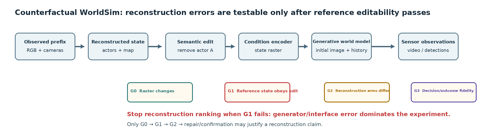
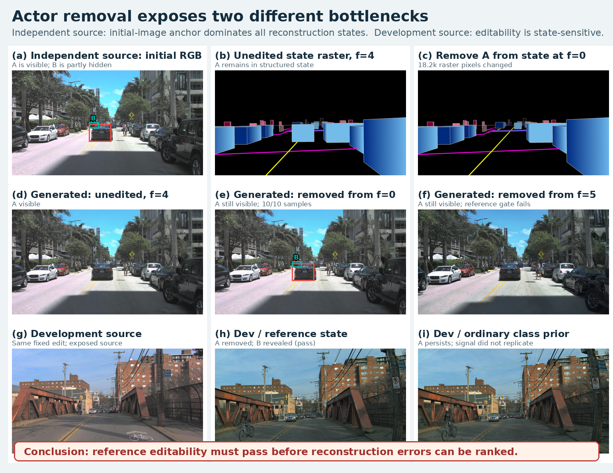
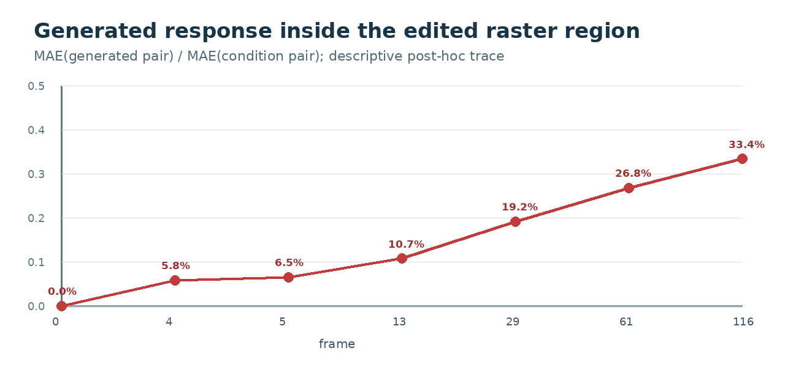
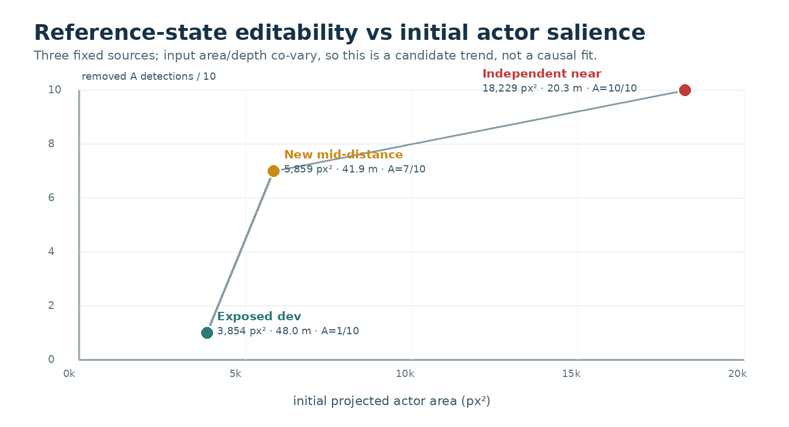

# V7.5 对象移除：重建误差比较前的 reference editability gate

任务：`WS-V75-ACTOR-REMOVAL-* / 20260921`。人工 verdict：`null`；`failure_ledger_delta:none`。

## 结论

对象移除没有确认“普通类别先验普遍破坏编辑性”。曝光开发源出现了状态敏感信号：reference 与 DVGT 基本移除 A，类别先验却让 A 多次残留。冻结的新来源中，reference、DVGT、类别先验三臂都完整保留 A，因此 reference gate 失败，不能排名重建。

一个额外且预先冻结的单段机制诊断把 A 从第 0 帧起移出所有结构化条件，同时保留同一初始 RGB。A 仍在 10/10 个后续采样点被检测并在审阅图中清楚可见。当前证据支持 **initial-image anchor dominates state edit**：生成器的初始图像锚定先于本源里的重建误差成为反事实瓶颈。

这改变了研究顺序：只有 reference/GT 状态本身能让生成观测遵循编辑，才有资格比较“哪种重建误差更重要”。reference 失败时继续挑重建臂，测到的是生成器/接口瓶颈。

## 设计与输入边界

- 开发发现只用两个既有曝光接近任务，按日志和后车 ID 排序取首个通过拓扑与真实 RGB 支持的对象对。事件明确声明为：生成帧 0–4 保留 A，帧 5 起删除 A；不是自然运动。
- 独立确认预先冻结 8 个未曝光 AV2 日志，每个只看 `+6.5s` 的 7.9 秒窗口。第 5 个日志首次通过，随即停止；没有替换来源、偏移、阈值、seed 或事件时间。
- 新来源只跑一次官方 DVGT-1：一个时刻、7 路截止前 RGB、严格官方权重，峰值 12.70GiB。reference 用 GT cuboid；DVGT 臂只替换 A 的初始平移，保留 GT 尺寸/朝向与相对运动；class-prior 使用固定 `3.9×1.6×1.56m`、ego 朝向和同一 DVGT 可见面距离。
- 初始 RGB、文本 embeddings、相机、地图、其他 actors、生成器、seed42 全部共享。未来真实 RGB 与 B 的 cuboid 只评价，不进入重建或生成。
- 每个三状态各跑 unedited/removed，固定相机 117 帧，共 6 段、702 帧、90 次前向。独立确认失败后没有启动闭环反馈。

## 架构与实际证据

图上半部是独立来源：结构化状态从 f=0 起不含 A，生成画面仍保留 A。下半部是曝光开发来源：同一类编辑在 reference 状态下有效，在普通类别先验下较差。两者合在一起说明状态敏感性依赖来源，不能由单例升级为重建普遍结论。

### 开发发现

| arm | unedited A/B | removed A/B | 其他匹配均值（removed） |
|---|---:|---:|---:|
| reference | 10 / 3 | **1 / 9** | 4.5 |
| DVGT metric | 10 / 3 | **1 / 8** | 4.8 |
| class prior | 10 / 8 | **4 / 4** | 4.3 |

reference gate 通过，但 DVGT 相对 reference 只有 1 个 A/B 决策不同，未形成“重建误差缺口”；类别先验有 8 个决策不同，却没有恢复 DVGT 决策。它只是一个状态可编辑性候选。

### 独立确认

| arm | unedited A/B | removed A/B | 中心误差 | 备注 |
|---|---:|---:|---:|---|
| reference | 10 / 10 | **10 / 10** | 0 | GT 状态也不服从移除 |
| DVGT metric | 10 / 10 | **10 / 10** | 0.380m | 1008 核心像素，面保留率 1.0 |
| class prior | 10 / 10 | **10 / 10** | 0.447m | GT 朝向差 0.68°，固定普通尺寸 |

reference LiDAR 读出有 45 个目标核心点，中心误差 0.261m；三状态的 raster gate 全部通过。编辑前对应条件逐像素完全相同；f=5 时 removed 条件相对 unedited 改变 reference 18,166、DVGT 18,598、class-prior 16,981 个像素。失败发生在“条件已改变→生成观测”的通路。

Faster R-CNN 对 A/B 的分配不是唯一证据：审阅图显示前景黑车 A 在三种 removed 画面中持续存在，B 也作为独立检测出现。独立来源不满足参考编辑，因此冻结确认门槛为 false，不能称类别先验问题复现。

### f=0 机制诊断

从 f=0 删除 A 后，A 仍为 10/10，B 为 10/10，冻结解释是 `initial_image_anchor_supported`。条件编辑区的生成响应比从 f=4 的 5.8%逐步上升到 f=116 的 33.4%，但 A 始终保留。该曲线只是描述生成对条件冲突的渐进响应，不代表线性因果强度或新的通过阈值。

### G1 搜索：中距离来源仍未通过，但形成显著性候选

在提交上述结论后，另立 `WS-V75-ACTOR-REMOVAL-G1-*`。来源窗口冻结下一批 8 个未曝光日志，只用输入侧条件寻找一个中远距离、小视觉占比的 A→B 对；第 5 个日志首次通过后停止。A 初始深度 41.88m、投影面积 5,859px²、遮住 B 的 85.4%，B 在三个后续真实帧有检测支持。

只跑 reference unedited/removed 两段。raster 在 f=5 改变 6,279 像素；生成评价为 unedited A=`10/10`、B=`8/10`，removed A=`7/10`、B=`10/10`。冻结 G1 要求 removed A≤2，因此失败，DVGT 未准入、0 次新重建调用。

三个固定来源呈现：3,854px² / 47.97m → A=`1/10`；5,859px² / 41.88m → A=`7/10`；18,229px² / 20.26m → A=`10/10`。它与 initial-image anchor 假设一致，但面积、距离、场景内容和演员运动同时变化，而且中间点是在看到两端后按输入范围寻找的。当前只登记 **visual-salience editability envelope 候选**，不声称因果、严格单调或阈值。

随后冻结下一批 8 个未曝光日志，只寻找 `1500–4500px² / 45–80m` 的远距小投影对象对。8/8 都没有满足同一遮挡拓扑与后续真实 B 支持，结果为 `no_qualified_source`，0 detector、0 重建、0 生成；未放宽面积、距离、时间或拓扑。这个空窗口是数据覆盖边界，不是模型通过。

## 工程失败与真实调用数

独立资格 `r1` 在 raster 前因 venv `ninja` 未进入 PATH 停止；`r2` 又因没有 source 仓库 `environment.sh`，误用旧 CUDA 与空扩展缓存而停止。两者 0 个 raster、0 次生成，不产生科学结论。`r3` 复用同一冻结 DVGT 输出并加载既有编译缓存，科学输入未变；没有重复 DVGT。

定义后新增：独立来源筛查与 G1 搜索各到第5/8日志停止、1 次 DVGT、独立确认6段、机制诊断1段、中距reference门控2段，共1,053个新生成帧、135次世界模型前向。开发发现另有6段、702帧，属于先前曝光来源。所有 GPU 运行单张RTX3090完成，无OOM。

## 对研究目标的推进

当前能回答的是：**重建误差是否重要，取决于生成器是否处在可由结构化状态控制的 envelope 内。** 开发源说明小的状态表示变化可能改变编辑遵循；独立源说明初始 RGB 锚定可以完全压过这些变化。尚不能回答哪一种重建误差普遍最重要，也没有闭环策略后果或多模型证据。

对象即时移除来源搜索到此关闭：一个曝光源 G1 通过、两个新源分别部分/完全失败、远距新窗口为空，无法独立确认一个可比较重建的来源。下一类实验改为**保持初始 RGB 一致的未来轨迹干预**，仍先跑 reference-only G1；只有通过 G0 与 G1 才比较 G2 重建状态。若未来轨迹同样不能控制，应把研究主问题转为可编辑生成状态接口，而不是继续扩大重建方法榜单。
