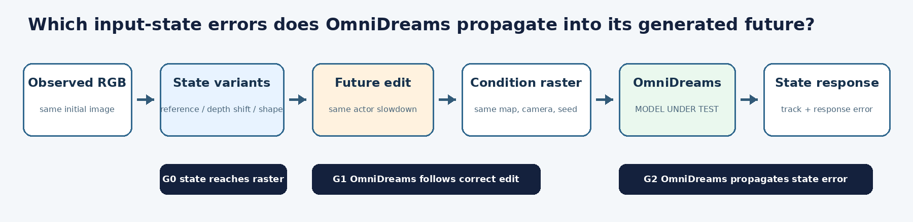
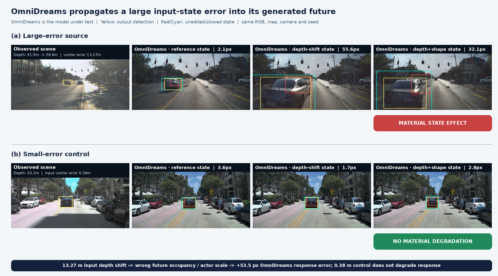
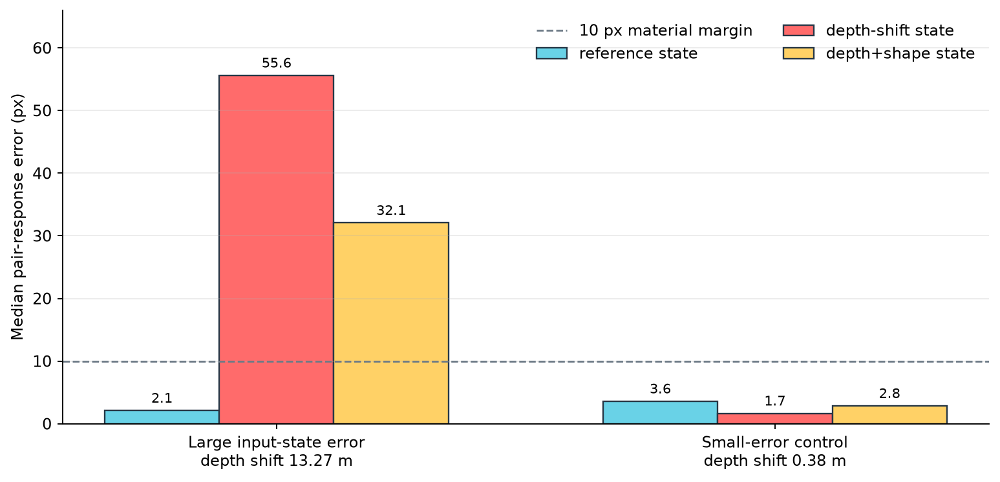

# V7.5 未来轨迹反事实：OmniDreams 会传播哪些输入状态误差

本轮被测模型是 **OmniDreams single-view 2B**。问题是：当输入给 OmniDreams 的结构化世界状态含有某类重建误差时，它会忽略、修正，还是把错误传播到生成未来？目标演员在 `f=0..4` 保持原状态，从 `f=5` 起按 `tau=4+0.5*(frame-4)` 沿自身原轨迹减速。所有 OmniDreams 配对使用同一初始 RGB、文本、地图、非目标演员、相机和 seed42；只改变输入状态及同一个未来编辑。

## 先问生成器是否服从正确状态

每个来源先只运行 reference 未编辑/减速配对。冻结后段帧 `45,61,85,109,116`，reference 必须满足：未编辑轨迹命中至少 `4/5`，减速轨迹命中至少 `4/5`，且减速输出检测中心相对原轨迹至少向编辑轨迹靠近 `5px`。reference 失败就终止该来源的重建比较。

- 大误差来源 `65387aee...`：未编辑 `5/5`、减速命中 `5/5`、方向偏好 `5/5`，G1 通过。
- 小误差独立对照 `47286726...`：未编辑 `5/5`、减速命中 `5/5`、方向偏好 `4/5`，G1 通过。

这与对象移除结果不同：连续未来轨迹编辑不会与初始 RGB 中的对象存在性直接冲突，因此可以进入“重建状态是否影响响应”的问题。

## OmniDreams 的三个输入状态臂

三个状态臂使用相同未来相对运动，再分别施加同一减速：

| 展示名称 | 内部记录名 | 输入 OmniDreams 的目标初态 | 明示额外信息 |
|---|---|---|---|
| reference state | `reference` | 原始 GT cuboid 与轨迹 | GT 状态，仅作上限诊断 |
| depth-shift state | `dvgt_metric` | 只把初始平移换成一次真实重建派生的距离 | 误差样本来自官方 DVGT-1 T=1；已知相机射线、GT 尺寸和朝向 |
| depth+shape state | `class_prior` | 同一距离，再换成固定 `3.9×1.6×1.56m` 与 ego 朝向 | 已知相机射线；普通类别尺寸/朝向 |

三臂都由 **同一个 OmniDreams** 生成。DVGT 不是此处的被测生成模型，只用于给 depth-shift state 提供一个现实来源的误差幅度；内部目录名保留是为了可追溯。实验回答的是：**OmniDreams 对正确状态、大深度偏移状态和深度+形状状态的同一未来编辑如何响应。** LiDAR 只用于独立参考与全局尺度诊断，不进入 OmniDreams 前向。

## 事前冻结的响应指标

同一状态臂的未编辑/减速生成做配对，后段每帧计算：

`pair response error = ||(检测中心_减速 - 检测中心_未编辑) - (状态投影_减速 - 状态投影_未编辑)||`。

同时报告响应增益、臂内轨迹命中和相对于 reference state 投影的位置误差。相对 reference state，任一错误状态输入使 OmniDreams 的响应误差中位数增加至少 `10px`，或减速轨迹成功数损失至少 `2/5`，才记为 material state effect。没有根据输出修改帧、阈值、seed、事件时刻或减速系数。

## 两源结果

| 来源 | 输入状态中心误差 | OmniDreams + reference | OmniDreams + depth shift | OmniDreams + depth+shape | 减速成功 ref / depth / depth+shape | 判定 |
|---|---:|---:|---:|---:|---:|---|
| 大误差来源 `65387aee...` | depth `13.27m`；depth+shape `13.53m` | `2.11px` | `55.61px` | `32.08px` | `5/5 / 2/5 / 3/5` | OmniDreams 传播两个错误状态 |
| 小误差对照 `47286726...` | depth `0.380m`；depth+shape `0.447m` | `3.59px` | `1.65px` | `2.84px` | `4/5 / 5/5 / 5/5` | OmniDreams 响应无 material degradation |

大误差来源的真实目标约在 `41.9m`，DVGT 派生状态约在 `28.6m`。普通背景 LiDAR 全局尺度为 `0.972`，尺度控制后的目标中心误差仍约 `14.01m`，因此不是一个普通全局尺度即可解释的差距。reference LiDAR 核心读出有 8 点、中心误差 `0.159m`、可见面保持率 `0.875`；DVGT 核心 266 像素、可见面保持率 `0.947`，参考与模型支持均通过冻结门槛。

错误输入状态把同一演员放得过近，后段条件中的演员尺度、占据位置和出视野时刻随之改变。OmniDreams 生成视频中车辆快速放大并逼近相机；depth-shift state 的响应增益由 reference state 的 `0.959` 降到 `0.716`，响应误差增加 `53.51px`。换成 depth+shape state 后仍增加 `29.97px`，说明 OmniDreams 没有用外观锚点自动修正这次主要的距离错误。

小误差独立源使用此前冻结、未按重建误差挑选的来源。相同 OmniDreams、减速编辑和指标下，两个错误状态输入的配对响应没有退化。这一保留的好案例排除了“任何状态差异都会被本指标判成坏”的解释，也说明当前结论针对足够大的、会改变未来可见性与占据的状态误差。

## 可以支持的主张

当前两源证据支持：在 cuboid→raster 输入接口中，OmniDreams 会把一个受可靠参考支持、普通全局尺度不能消除的约 `13m` 目标深度错误传播为明显错误的未来响应；约 `0.4m` 的对照误差没有造成相同退化。这是 OmniDreams 的状态敏感性与误差传播结论，不是 DVGT 准确率排行榜。

这比“几何误差越小越好”更具体：与反事实任务有关的是会改变未来占据、尺度、可见性或交互时序的状态误差。正确 reference 能稳定驱动编辑，是把责任定位到重建状态的必要前提。

## 尚不能支持的主张

- 只有一个大误差正例和一个小误差对照，不能估计普遍发生率、严格阈值或单调曲线。
- 两个错误状态臂共用同一距离样本，不是两个独立上游重建模型；本实验也不需要把它们宣称为两个模型。
- 当前是固定记录相机的状态反事实，不是策略反馈闭环；尚未证明碰撞、规划或策略排序发生可信变化。
- 误差样本使用已知射线和 oracle 尺寸/朝向读出，不能外推为 DVGT 官方端到端场景状态的准确率结论。
- 第一个资格运行因 `iopath` 环境缺失在模型前向前结束；r2 保持完全相同科学输入并完成唯一一次官方 DVGT 前向。它是工程恢复，不计科学重复，也不新增 failure 卡。

## 下一步停止规则

该固定窗口已经执行。下一批8日志按顺序在第6个找到首个输入合格演员：初始深度`49.55m`、面积`3047px²`，五个后段帧的原/减速投影中心相差`19.4–68.1px`，初帧真实检测IoU为`0.623`。但实际 condition raster 只在f45/f61改变`139/64`像素，f85/f109/f116为0，G0失败。按事前停止规则不换第7/8个日志，0次DVGT、0次生成。

因此当前结果保留为机制badcase，不声称prevalence，也不启动策略反馈。继续扩展前需要先解决或重新定义“几何轨迹可见但状态raster不承载演员”的接口覆盖问题，再冻结新的来源协议；不会扫描seed、减速系数、事件帧或阈值来维持结论。

人工 verdict：null；`failure_ledger_delta:none`。
