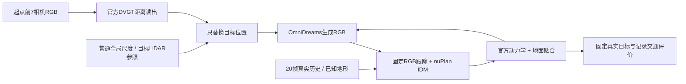
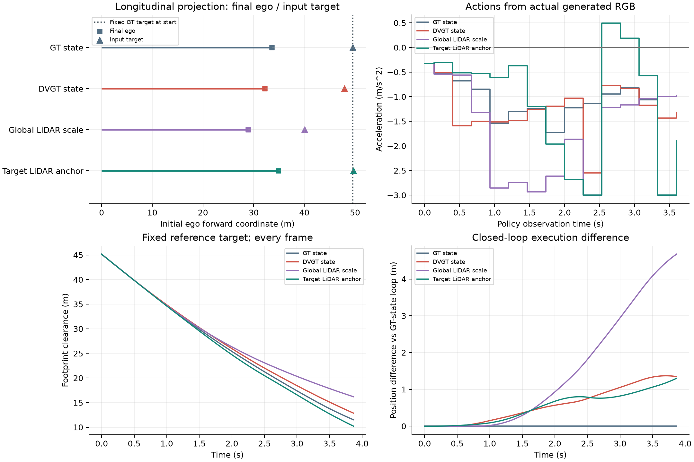
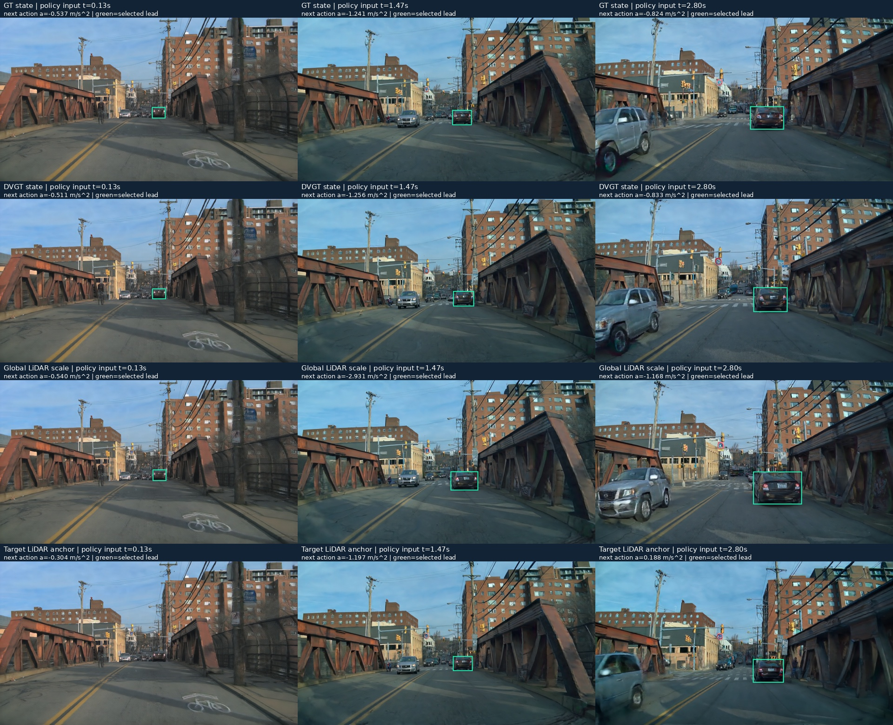
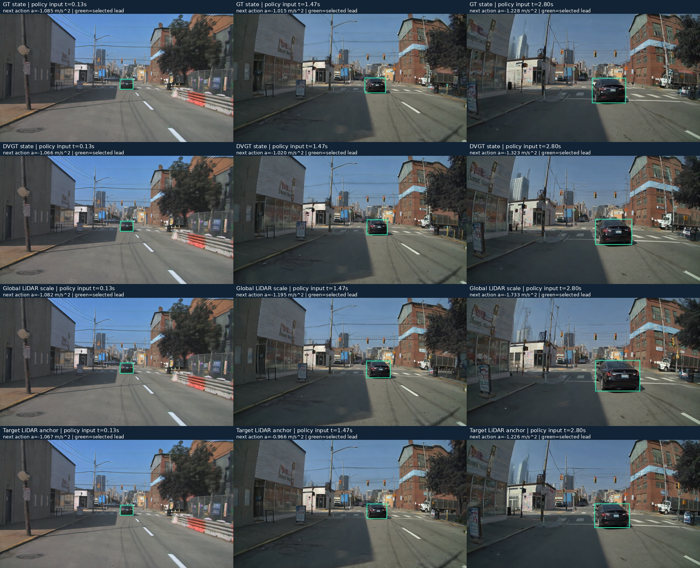
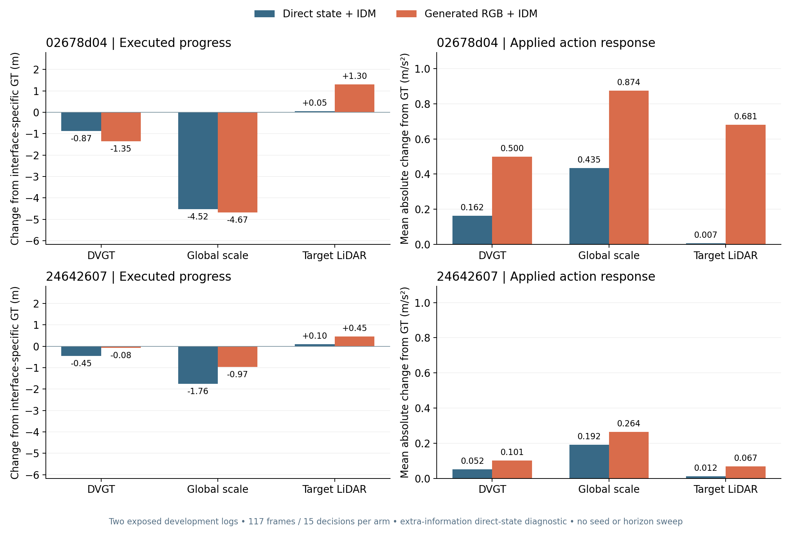
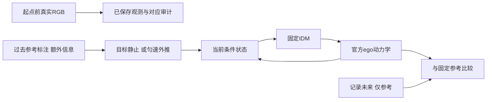
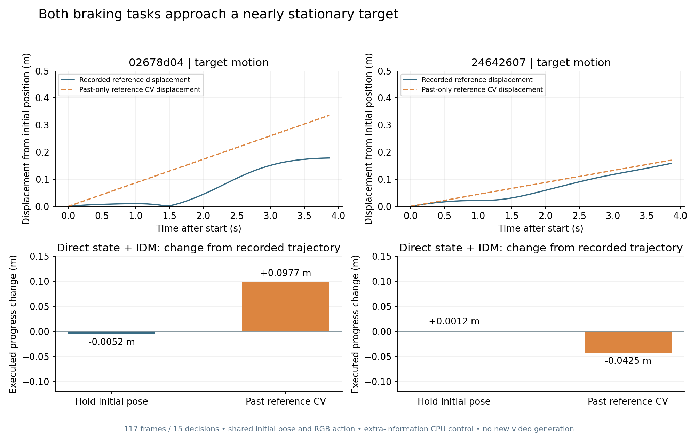

# 真实接近任务：四组生成反馈与普通控制

本轮已跑通有实际制动需求的接近任务，得到重建状态→生成RGB→动作→ego→下一段生成的完整反馈。四组各117帧、15次决策，全部无OOM、无参考重叠。自然DVGT输入产生约1.35m的执行差；更准确的目标LiDAR位置未同步恢复动作，因此尚不是稳定、可修复的驾驶badcase。

## 组件与实验对象

来源为已经暴露的AV2 `02678d04-cc9f-3148-9f95-1ba66347dff9`，日志起点后6.5秒，目标`94dede14-59da-4f09-b016-95f19596ac08`。目标近似静止，自车接近，需要普通制动。此前48窗口的筛查因“起点40m内前车”入口排除了它，原0合格终态保留。本轮是明确承接该事后发现的开发任务，不是独立新样本。

初始车辆位置只有一项变化；尺寸、朝向、其后相对运动、其他演员、地图、真实初帧、文字、seed42和普通策略均固定。各分支ego随后真实反馈，**不是固定相机视频或动作回放**。GT条件分支也是生成输出，不等于无误差的真实未来。

## 先修复普通基线的两个工程问题

1. 单地面平面不能描述桥面起伏。原平面在目标处预测z=1.419m，官方高程栅格为0.436m；目标GT框底部约0.336m。栅格与可查询的地图折线高程差中位约0.0052m，未发现整体坐标偏移。使用同一批检测框，距离误差中位由9.845降至1.190m，但加速度差中位变为0.913m/s²，暴露了原先的速度误差抵消。
2. 固定起点前20张真实RGB，约1秒，用原参数Kalman初始化运动。没有未来RGB、目标GT速度或阈值调整。真实基线15次前车判断全部正确，距离误差中位1.173m、加速度差中位0.255m/s²，最大欠制动1.622、最大额外制动0.129m/s²，通过原状态/动作要求。

地面读取依照AV2官方[GroundHeightLayer坐标契约](https://github.com/argoverse/av2-api/blob/main/src/av2/map/map_api.py)和[Sim2变换](https://github.com/argoverse/av2-api/blob/main/src/av2/geometry/sim2.py)，在现有高程样本间作普通双线性插值。地面是额外已知度量信息，不能声称纯视觉策略。ego贴地复用FlashDreams官方`GroundSnapper`，第三方源码未改；初始RGB对应姿态保持不变。

首次GT反馈又暴露关联错误：第92帧同一前车0.513m的有效匹配，被无约束Hungarian中的18.90m/10.74m无效配对挤掉；事后距离过滤使前车变成新ID，速度重新初始化。原动作+0.147m/s²、参考−2.139m/s²。将**同一10m距离门控移到分配之前**即可保留ID，不改距离阈值、噪声、seed或控制参数。真实输入35个已保存观测回放结果不变；同一旧生成观测的离线动作变为−1.064m/s²。随后重新执行完整反馈，不能把离线替换当作新闭环。

`20260920-r1`保留原失败；`20260920-association-r2`为工程修复。修复后GT反馈加速度差中位0.369m/s²、最大欠制动1.075、最大额外制动0.913m/s²；117帧最大路线横向偏差0.0195m，无重叠。旧失败不是世界模型或重建方法的科学失败。历史已发布数字保留其原实现版本，不追溯重写。

准备时一次时间戳检查在推理前失败：20Hz文件有纳秒抖动，恰好一秒区间只有19帧。改为取固定20个起点前capture，保留原断言源码；没有重复模型前向。正式15次真实基线输入均取请求时刻前最近capture，最大延迟约50ms，按其实际标定和时间评价。

## 重建输入与可靠参考

官方DVGT-1严格加载原权重，一次7视图512×512前向；模型只接起点前RGB。后续位置读出额外用标定及固定GT尺寸/朝向，沿已知射线读取距离。原始点图朝向审计仍不支持直接当作已知rig坐标，因此本轮是**真实DVGT距离的受控位置读出**，不是官方端到端场景重建系统排名。

| 输入 | 初始中心残余 m | 额外信息 |
|---|---:|---|
| GT条件 | 0 | 目标真值位置 |
| DVGT距离读出 | 1.672 | 标定、GT尺寸/朝向 |
| 普通全局LiDAR尺度 | 9.475 | 额外背景LiDAR及演员排除掩码；尺度0.823819 |
| 目标LiDAR参照 | 0.253 | 额外目标LiDAR和GT演员掩码 |

全局尺度使用29486个背景锚点；它使本目标更靠近自车、几何残余更大，不能自动称作修复。普通RGB框拟合中心误差10.337m保留为几何参照，没有增加第五个生成分支。

原扫描仅4个核心点，按既定6点要求拒绝，原结果未改。随后登记一次有限参考补证，增加之前两次已有扫描，所有点时间≤生成起点，不作GT平移补偿。三次扫描核心点20+18+4=42，目标中心变化0.0076m，目标LiDAR中心误差0.253m、同面保留率1.0，满足原要求。补证只改变LiDAR参照的信息量；DVGT与全局尺度输出原样保留。详见[补证协议](../autoresearch/worldsim_v75/approach/reconstruction/reference_supplement_protocol.json)。

## 四组实际反馈结果

| 条件 | 实际行进 m | 相对GT行进变化 m | 终点位置差 m | 平均绝对动作差 m/s² | 末端真实目标间距 m |
|---|---:|---:|---:|---:|---:|
| GT条件 | 33.591 | 0 | 0 | 0 | 11.522 |
| DVGT | 32.244 | −1.347 | 1.347 | 0.500 | 12.869 |
| 全局尺度 | 28.917 | −4.674 | 4.674 | 0.874 | 16.196 |
| 目标LiDAR | 34.891 | +1.300 | 1.300 | 0.681 | 10.222 |

动作差以同一时刻GT条件分支为参照，不等于相对最优驾驶的损失。GT/DVGT/尺度各15次制动，LiDAR分支13次；四组各117帧均无参考重叠。间距是虚拟ego与固定真实目标的二维足迹距离；全体演员最小间距另保存，不能把共享初始近邻距离当作独立安全结论。

这次有明确制动和执行响应，但不支持“中心残余降低就能恢复闭环”：LiDAR将残余从1.672降至0.253m，平均动作差却从0.500增至0.681m/s²，终点差仍约1.30m。不能称为可重复可修复的主badcase，也不能把多制动直接叫危险、把少行进直接叫碰撞收益。本轮只覆盖0–3.867秒，未把短时无碰撞升级为完成停车或长期安全。

## 研究决策与后续强控制

停止给本例追加seed、输入幅度、来源或时长。下一步在已冻结的四份条件状态上使用相同动力学与普通IDM做直接状态控制，分清无需生成即可解释的几何影响与生成RGB/状态读出额外引入的偏差。该控制直接接三维状态，属于额外信息的诊断，不与RGB闭环混成同预算排名；无需训练、新模型或新GPU生成。

当前已知：重建输入可以改变有真实制动需求的短时执行；几何参照改善未稳定恢复动作。尚未确认值得推进主方法的可重复、可恢复缺口，没有跨SOTA普遍性或false-safe结论。

## 资源、验证与资产

- 本轮共5个完整生成run（含工程修复前GT），585帧；最终比较4run、468帧/60决策。另1次DVGT前向、36次真实检测（35真实基线+1重建输入），旧5次检测仅复用。
- 编码峰值15.965GiB，生成峰值12.971GiB，DVGT峰值12.697GiB，无OOM；三个最终分支队列243.65秒。全部任务已结束，无训练、下载或关机控制。
- 全部视频解码、逐帧参考、因果反馈索引与GT原始场景保持检查通过。参考补证所有点有截止时间过滤，原生DVGT数组有限，权重严格加载，第三方源码未修改。新关联实现用真实0.513m反例和全部已保存输入验证。
- 当前原始根：`/root/autodl-tmp/runs/worldsim_v75/WS-V75-APPROACH-CLOSEDLOOP-01/20260920-association-r2/`；首轮、真实基线和所有npy/mp4/中间状态保留。轻量归档见[provenance](../autoresearch/worldsim_v75/approach/provenance.json)。人工verdict全部null，`failure_ledger_delta: none`，工程修复记录在本报告，不硬造新科学失败ID。
- 新实现：`raster_ground.py`、`raster_rgb_policy.py`、`qualify_raster_policy.py`、`qualify_approach_policy.py`、`replay_approach_association.py`、`supplement_approach_reference.py`、`run_approach_closed_loop.py`、`run_approach_queue.py`。既有桥接增加可选官方地面贴合，默认保持旧平地行为；评价/可视化增加明确run目录参数。

## 第二个接近任务：24642607

另一次[固定开发窗口](BRAKING_TASKS.md#后续有限开发窗口任务dev2)为6日志×3起点，18→2个记录减速窗口→1个合格可见前车任务。选择`24642607-2a51-384a-90a7-228067956d05 +6.5s`及目标`56569385-722e-4413-ba4d-068307bca2ab`，发生在读取本次重建误差之前。该日志曾用于早期其他任务，不称独立确认。采用原世界距离关联；有限IoU控制未被采纳。真实RGB与GT生成基线通过原要求后才开始读出，完整证据在[approach_dev2](../autoresearch/worldsim_v75/approach_dev2/)。

官方DVGT-1一次七视图前向，输入均≤起点，252个核心模型像素。中心残余0.974m；32514个背景LiDAR锚点给出0.927791尺度，目标残余反而增为3.493m；普通框拟合为2.253m，均保留。原单扫描参考0.344m但仅5点，按原6点规则拒绝。另登记一次事后补证，复用上一任务的固定3扫描规则：25+25+5=55点，所有点≤起点，目标中心变化0.0094m，不作GT运动补偿；参考残余0.275m、同面保留1.0，通过原可靠性标准。原5点拒绝不覆盖，未增加DVGT输入或重排模型结果。

| 条件 | 中心残余 m | RGB行进 m | RGB进度变化 m | RGB平均动作差 m/s² | 末端真实目标间距 m | 直接状态进度变化 m |
|---|---:|---:|---:|---:|---:|---:|
| GT | 0 | 28.122 | 0 | 0 | 6.981 | 0 |
| DVGT | 0.974 | 28.039 | −0.083 | 0.101 | 7.064 | −0.452 |
| 全局尺度 | 3.493 | 27.152 | −0.971 | 0.264 | 7.951 | −1.757 |
| 目标LiDAR | 0.275 | 28.568 | +0.446 | 0.067 | 6.535 | +0.101 |

四组各117帧/15决策、seed42，均有15次制动、无固定参考重叠。直接状态控制的GT行进27.395m，额外读取当前条件状态，不和RGB混成同信息排名。四组旧命令回放共468帧相机矩阵与边界状态差为0、60次动作映射完全一致，再完成四组468帧CPU状态反馈。

这个好案例不能删掉：接近1m的自然位置残余只对应0.083m进度差。目标LiDAR令平均动作差0.101→0.067m/s²，但绝对进度差0.083→0.446m，因此不能将一个指标改善升级成一致恢复。普通控制还表明全局尺度在本例的直接状态影响比生成RGB影响更大，不支持额外放大的统一叙事。

截至这两个制动开发任务，已有8组936帧真正生成反馈、120次决策和配套直接状态控制；尚无严重、可重复且可恢复的自然重建驾驶badcase。降低“单目标初始中心平移修复”作为主方法入口的优先级，关闭这两个任务的追加平移/尺度/关联/seed/时长搜索。没有证据排除所有重建状态误差，但不能靠扩大同类样本筛选维持该具体主张。

新知识是：**重建中心误差的改善，既不保证动作与执行同时恢复，误差较大也不保证任务明显受损。** 运动和路径占用等联合任务状态仍是开放问题；单帧点图或跟踪器速度不能自动称为原生重建模型的运动输出。后续须先检查时间观测和官方时序接口是否提供可验证的运动状态，再决定是否值得做新干预，不预设生成记忆或新求解器。

本任务资源：36次真实检测（35基线+1初始框），1次DVGT，4组468帧生成；编码峰值15.965GiB、生成12.971GiB、DVGT12.697GiB，全部无OOM。三组误差队列241.08秒，CPU直接状态控制8.21秒。原始根`/root/autodl-tmp/runs/worldsim_v75/WS-V75-APPROACH-CLOSEDLOOP-02/20260920-r1/`，全部终态与视频保留。新任务接口复用原代码，仅增加显式run/task参数；第三方源码未修改。`failure_ledger_delta: none`，人工verdict全部null。两任务交互审阅页为`outputs/V75_Multiscene_Closed_Loop/index.html`，主图有PNG/SVG/PDF。

## 时间状态审计：近静止任务的范围边界

`WS-V75-TEMPORAL-STATE-AUDIT-01 / 20260920-r1`只审计上述两个任务，不追加来源、模型、seed或时长。先冻结[协议](../autoresearch/worldsim_v75/temporal_state_audit/protocol.json)，再检查已保存20个过去capture和起点capture，运行普通静止/匀速的CPU反馈；完整[结果](../autoresearch/worldsim_v75/temporal_state_audit/result.json)和所有观测、缺失与轨迹均保留。

核查了一手实现：[DVGT-1 forward](https://github.com/wzzheng/DVGT/blob/51cf3f6d11fdff8bc7e2bbe1a88f71665ccb2236/dvgt/models/architectures/dvgt1.py)返回时序点图、置信度和ego位姿，没有对象身份、对象速度或未来轨迹输出；[官方输入要求](https://github.com/wzzheng/DVGT/blob/51cf3f6d11fdff8bc7e2bbe1a88f71665ccb2236/README.md)是固定视角顺序的2Hz序列。任何对象速度都需要额外对应和读出算法，不能直接把单帧差分包装成原生模型输出。[OmniDreams协议](https://github.com/NVIDIA/flashdreams/blob/bc711d6f95693d73693e6b5fac75749cc6fcf1d7/integrations_v2/omnidreams/impl/grpc/protos/video_model.proto)则接收外部DynamicActor trajectory；实际渲染路径按时间查询cuboid。已有运行的是本地底层pipeline，不因此冒称新跑了gRPC服务。

逐帧检查旧四组条件：各目标中心差均为恒定平移（浮点误差低于1e-10m），朝向、尺寸、时间索引和其他演员完全相同。**原来四组保留了目标的记录未来轨迹，只比较位置偏移；没有实际读出DVGT对象运动。** 两日志均能列出请求时刻−1/−0.5/0秒、每时刻7个相机且实际capture≤请求时刻的合法输入，清单保留每相机延迟。图像存在不等于运动可观测性通过，本轮未运行时序DVGT。

| 日志 | 过去参考拟合速度 m/s | 未来3.867s最大参考位移 m | 静止控制进度差 m | 过去参考CV进度差 m | 可用对应观测 |
|---|---:|---:|---:|---:|---:|
| 02678d04 | 0.0869 | 0.1787 | −0.00515 | +0.09766 | 0/21 |
| 24642607 | 0.0442 | 0.1589 | +0.00119 | −0.04249 | 21/21 |

这里目标接近静止，厘米级标注变化不被当作精确真实运动。普通CV速度仅由过去一秒参考标注最小二乘得到；未来参考不参与拟合。两控制都共享GT起点位置、尺寸与朝向，其他演员保留记录未来，属于额外信息的运动隔离诊断；GT起点可能由前后标注插值，明确不是纯因果重建排名。静止控制冻结目标完整姿态，CV固定初始朝向并外推中心。

六组各117帧/15次决策使用相同初始RGB动作、nuPlan IDM和官方动力学：两组234帧精确复现此前GT直接状态基线（逐帧状态最大差0），另四组468帧为新普通控制，均无固定参考重叠。平均绝对动作差：静止为0.00140/0.00469m/s²，过去参考CV为0.01652/0.00722m/s²。没有新生成RGB，因此不把CPU控制升级为世界模型闭环恢复。

第一任务0/21是**策略管线经过检测与地面接触过滤后的可用对应观测**，不是原始检测器召回率。第二任务21/21对应且ID相同，但接触点最小二乘速度0.523m/s，与参考速度向量误差0.480m/s；固定前后半段拟合差2.362m/s，交错子序列差0.393m/s。接触点随视角变化，不等于刚体中心；此结果只说明当前简单视觉读出不能支持精确对象速度归因，未证明DVGT失效，也未给模型合成错误速度。

**关闭这两例上的追加运动干预。** 普通静止解释已足以保持执行结果，不能靠人为增大速度制造问题。后续若研究时间状态，必须先有实际运动并影响跟车任务的对象，再核查合法过去输入的对象对应、普通匀速解释与误差来源；不把当前缺口扩大为所有运动重建不可行，也不因此重开中心平移扫描。

CPU用时5.91秒；0次新检测、重建或生成，CUDA未初始化。审计脚本为`scripts/worldsim_v75/audit_temporal_state.py`，真实过去RGB审阅图和PNG/SVG/PDF已加入同一双任务报告。原始根`/root/autodl-tmp/runs/worldsim_v75/WS-V75-TEMPORAL-STATE-AUDIT-01/20260920-r1/`，`failure_ledger_delta: none`，人工verdict仍null。
