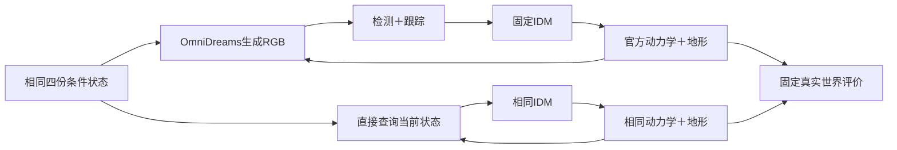
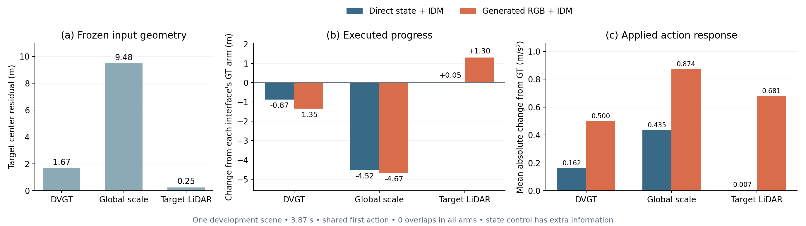
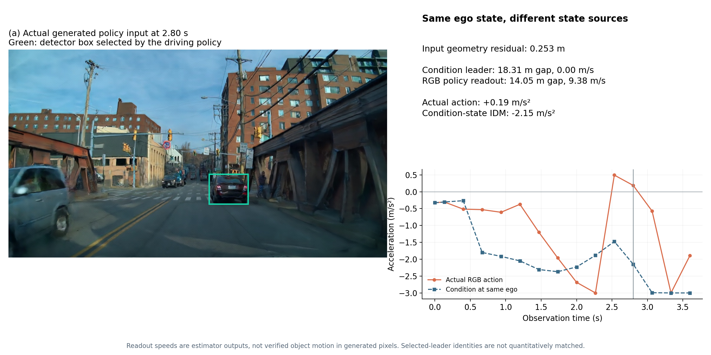

# 接近任务强控制：几何响应与生成观测接口

同一四份冻结状态、相同普通IDM与动力学下，全局尺度组的进度差在直接状态控制中为−4.524m，在已有生成RGB反馈中为−4.674m。目标LiDAR组的直接状态进度差仅+0.051m，RGB反馈却为+1.300m。**本例不能用大尺度减速证明生成模型独有缺陷，也不能用中心误差变小替代任务恢复。**

这是一个已暴露开发场景的强控制，既没有新增独立样本，也没有确认跨方法普遍性。两种信息接口的差值包含感知、跟踪和闭环轨迹改变，不是已分离出的纯生成器因果效应。

## 输入、组件与控制

任务`WS-V75-APPROACH-STATE-CONTROL-01 / 20260920-r1`，来源为[上一轮反馈](APPROACH_CLOSED_LOOP.md)的`20260920-association-r2`。先写[协议](../autoresearch/worldsim_v75/approach_state_control/protocol.json)，再执行四组CPU控制。直接状态反馈各117帧、15次决策，范围0–3.867秒。没有生成器、检测器调用或参数搜索。

为匹配真实初始RGB，四组保留相同的第一段已保存动作。从第4帧后的决策开始读取本分支的条件状态，之后ego真实反馈；不是回放旧动作来冒充新控制。前车查询沿用40m范围和路线足迹，速度用当前与前一条件位置的后向差分，没有未来状态预读。采用相同nuPlan IDM、路线转向、执行器映射、5帧首段/8帧后续、官方`integrate_vehicle`与`GroundSnapper`，第三方源码未修改。

直接状态额外获得当前演员位置、尺寸、朝向和后向速度；已知路线、地形和非反应式交通与原设置一致。不能与单前视RGB策略混成同信息排名。

## 精确复现后再比较

先用四组已保存的60次动作重放原轨迹，468帧相机矩阵的最大绝对差均为0，所有决策边界的ego位置、朝向与速度差也为0。将路线/执行器映射提取成共享函数，全部60次旧策略输出的加速度、转向和命令逐项一致。新控制才随后执行。见[验证结果](../autoresearch/worldsim_v75/approach_state_control/replay_verification.json)。

| 条件 | 中心残余 m | 状态控制进度变化 m | RGB反馈进度变化 m | 状态控制平均动作差 m/s² | RGB平均动作差 m/s² |
|---|---:|---:|---:|---:|---:|
| GT | 0 | 0 | 0 | 0 | 0 |
| DVGT | 1.672 | −0.871 | −1.347 | 0.162 | 0.500 |
| 全局LiDAR尺度 | 9.475 | −4.524 | −4.674 | 0.435 | 0.874 |
| 目标LiDAR参照 | 0.253 | +0.051 | +1.300 | 0.007 | 0.681 |

各列以**本信息接口自己的GT分支**为参照；直接状态GT行进32.975m，生成RGB的GT行进33.591m。动作差是15次决策的平均绝对差。直接状态四组均无固定参考重叠，末端真实目标间距12.138/13.009/16.662/12.087m。短时无重叠不等于完成停车或长期安全，更多制动也不自动等于任务改善。

## 剩余信号与可归因范围

在已有生成分支的**同一当前ego**上，另作60次单步状态控制查询；这是离线动作比较，不是新的生成闭环。除共享起步外，RGB动作相对各自条件状态IDM的平均绝对差依次为0.522/0.317/0.814/1.102m/s²。GT条件自身也有观测/策略误差。

目标LiDAR组第84帧（2.80秒）是一个清楚的系统反例：条件前车距离18.314m、速度0；策略选中框的读出为14.055m、9.381m/s。实际动作+0.188m/s²，同一ego下条件状态IDM为−2.149m/s²，而固定真实参考查询为−2.197m/s²。此刻几何对动作的差只有0.049m/s²，RGB状态读出的动作差为2.337m/s²。

图中绿色框来自当时策略选择，画面未经合成修饰。速度是跟踪器估计，**不是已验证的生成对象真实运动**；选中对象身份未作真值级匹配。已有记录显示该分支第76帧选择ID由3变13，第100帧为2、第108帧又为13。它提示普通关联与速度初始化可能参与问题，不能直接宣布“世界模型使静止前车运动”。只看输入中心残余，无法解释这项状态/动作差。

## 研究决策

本轮新增知识是：**自然重建误差的执行影响，有一部分普通几何控制就能产生；位置更准确仍可能因生成观测—状态估计接口而产生更大的动作差。** 尚未得到可重复且可恢复的重建失效，也不因此启动新几何主方法。

下一项只做一个成熟普通时序关联控制，先在已有真实输入和生成观测上回放，保持检测、地面、Kalman参数、IDM和动作时间表固定，不引入GT演员到策略。如果普通关联就能恢复状态/动作，应承认现有策略接口解释了差距；只有真实基线通过、离线改善成立后才做一次实际反馈验证。若不能改善则关闭这条控制，不展开阈值/seed/时长搜索，不用离线动作变化替代闭环收益。

这不是返回局部几何或长时放大诊断，检验对象是已实际执行的制动错误与最强普通解释。完整主张仍需要具体问题的可恢复性和独立任务确认；本场景继续只作开发。

## 资产与资源

原始目录：`/root/autodl-tmp/runs/worldsim_v75/WS-V75-APPROACH-STATE-CONTROL-01/20260920-r1/`。完整四组状态、动作、轨迹、60次离线查询及协议已归档到[证据目录](../autoresearch/worldsim_v75/approach_state_control/)。本轮CUDA显式禁用、未初始化，4线程，执行8.85秒；4组新增反馈468帧，另468帧动作回放验证。没有模型推理、训练或电源操作。

`human_verdict: null`；`failure_ledger_delta: none`。当前发现尚混合感知/关联与生成影响，暂不硬造新的科学失败卡。主脚本`run_approach_state_control.py`，绘图`build_state_control_review.py`；历史生成结果和V7.4边界均保持原样。
