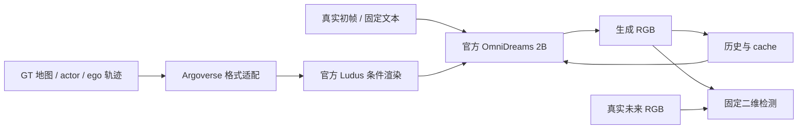
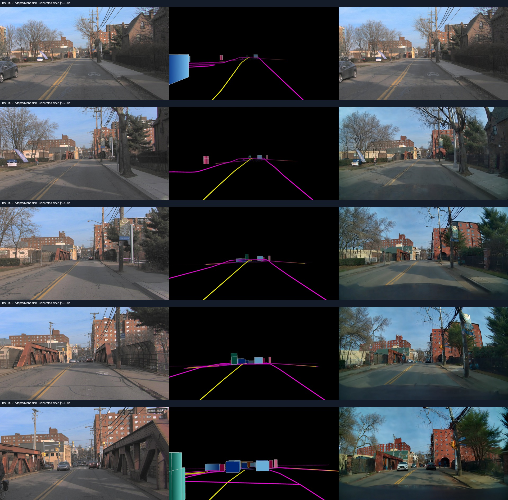
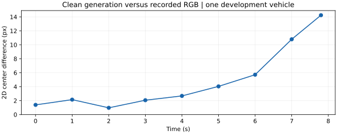

# V7.5 Argoverse 输入桥接与真实未来参照

task/run：`WS-V75-AV2-BRIDGE-01 / 20260920-r1`。使用已经曝光的 Argoverse 2 val 日志 `02678d04-cc9f-3148-9f95-1ba66347dff9`，仅作工程开发，不能称作新的独立确认。当前工作方向见 [RESEARCH_STATUS](../RESEARCH_STATUS.md)。

## 输入及工程控制

官方源码中名为 `AV2` 的加载器要求 `object_fused.parquet` 等结构，不能直接读取 Argoverse Sensor 的 feather/json。这里显式构建原版 Ludus 的地图和 cuboid 池，没有修改第三方源码，也没有把自建适配器称作官方 Argoverse 支持。

原始前中相机为 1550×2048。宽度保持不变，按目标宽高比中央裁剪，再等比缩放到 1280×704；RGB 与相机投影共享变换，计入 resize 像素中心约定。Argoverse 官方说明图像已去畸变，故使用针孔标定，不再次应用原始畸变参数。[官方数据说明](https://argoverse.github.io/user-guide/datasets/sensor.html)

237 个生成时刻按 30Hz 固定。原始相机为 20Hz，其中79帧与生成时刻精确重合；视频预览可用最近参考帧，量化只用精确重合时刻。ego 与 actor 在世界坐标插值：平移线性、旋转 Slerp；大于150ms的标注缺口分段，禁止外推。48个轨迹段进入条件。未来标注与地图属于额外参考信息，当前 clean 是 oracle 条件工程基线，不是纯视觉重建输出。

针孔模型拟合为 renderer 的五阶角度多项式，全可见域最大径向误差0.0034px。独立已知方块检查拦住了一个 RDF/FLU 接口错误：C++入口内部执行FLU→RDF，适配器须提供world-to-FLU。修正后3处实际渲染框与独立针孔边界的最大差为1.61px，才启动生成。初次失败的检查及日志保留在原始目录；这是适配工程错误，不是模型失败。

语义限制：双线简化为单种线条 primitive；可行驶区域轮廓作为路边界代理；交通灯、交通标志、杆件等未由当前地图提供；相机视场也不同于官方原生样例。图像结构变化可能含这些因素，不能据此归因自然重建误差。

## 执行与测量

单张RTX3090完成seed42的237帧clean；含模型加载123.24秒，PyTorch峰值分配12.81GiB，200ms整卡采样峰值17.41GiB。没有OOM，没有训练或策略反馈。生成与对比视频都完整解码237帧。

在查看生成视频前，以“从第0帧连续完整可见、框至少16×12px、覆盖至第150帧”选择唯一车辆 `94dede14-59da-4f09-b016-95f19596ac08`。实际真实视频中目标是前方右侧车辆；它只是几何筛选后的工程测量目标，不是按偏差大小挑出的badcase。

评价沿用已固定的官方 FasterRCNN ResNet50 FPN v2 COCO 权重：car类、分数≥0.25、与参考投影关联IoU≥0.3。真实初帧±4px平移的中心残差为−1.43px／−0.24px，通过2px校准。第0、30、60、90、120、150、180、210、234帧的真实和生成检测均9/9匹配；未调整阈值挽救结果。

真实/生成框中心差的中位数2.68px、均值4.89px、末帧14.24px。它是相同时间的二维描述性差异，不是米制3D真值误差，也没有人工条件偏置，故不能称为“重建误差放大”。生成建筑和车辆外观有可见变化；未测量其决策后果。

## 复现与边界

原始目录：`/root/autodl-tmp/runs/worldsim_v75/WS-V75-AV2-BRIDGE-01/20260920-r1`。包含输入manifest、scene、逐帧投影、条件/参考、未压缩生成、时间/资源记录、完整视频、评价协议与检查失败原件。[轻量证据](../autoresearch/worldsim_v75/av2_bridge/)

代码：`scripts/worldsim_v75/prepare_argoverse.py`、`render_argoverse.py`、`run_prepared.py`、`review_argoverse.py`。它们拒绝覆盖终态结果；OOM立即停止，不自动换配置。技术图与本地HTML由 `build_bridge_report.py` 从实际证据构建。

这个结果支持“已有完整真实日志能接入当前生成与二维评价接口”。尚未支持自然重建误差→条件→生成偏差，更没有独立多日志或闭环结论。failure_ledger_refs：V75-F01、V74-H2-F20、V74-H2-F21、V74-H2-F22；failure_ledger_delta：none；人工verdict：null。
