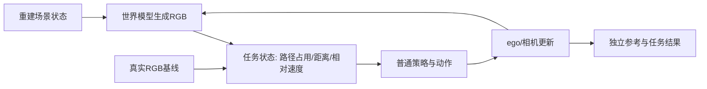
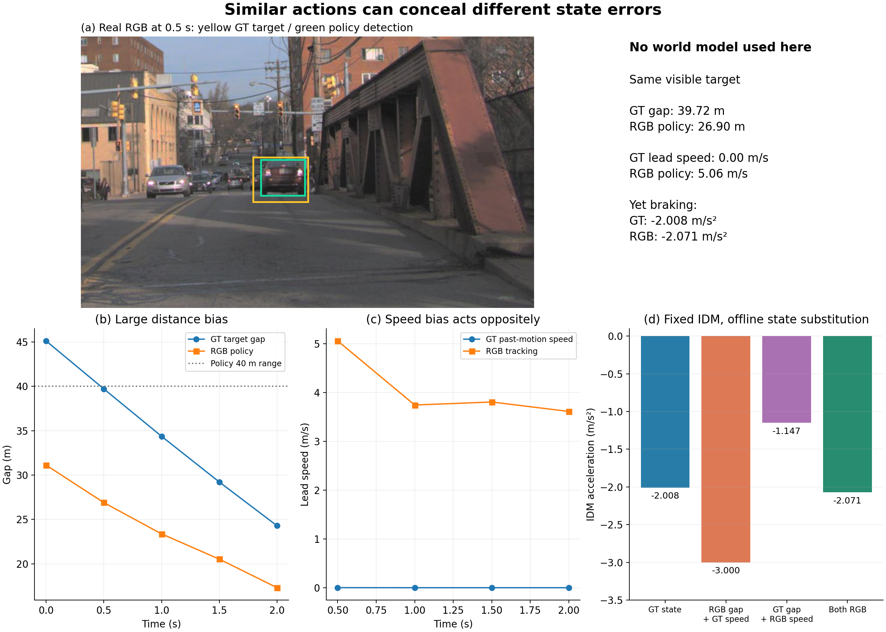

# 制动任务入口与真实状态基线

本轮将资源转向闭环仿真。继承[四组实际生成反馈](FOLLOWING_CLOSED_LOOP.md)的小幅响应，按记录中的制动需求选择任务，不再追加“长时间放大”。本轮没有新增合格生成任务，也没有新增世界模型 badcase。

## 组件与信息流

前轮已经运行生成→动作→ego→下一段生成的实际反馈。本轮只对真实RGB→状态→策略这段进行任务资格检查；GT车辆只进入选择、参考和明确标注的离线诊断，不输入真实RGB策略。

## 固定窗口与完整结果

`WS-V75-BRAKING-TASKS-01 / 20260920-r1` 在读取减速指标前冻结本地完整AV2日志按名称排序的前12条，每条起点0.5/2.5/4.5/6.5秒，共48窗口。具体名单、UTC和完整门槛见[protocol](../autoresearch/worldsim_v75/braking_tasks/protocol.json)。这些均为开发资源，不作独立确认。

记录速度使用向后0.5秒位移在当前车头方向的投影。起始速度≥2m/s且2秒下降≥1m/s，才准备237帧标准输入桥接。任务检查0/0.5/1/1.5/2秒，要求起点的路径前车至少存在3次、所有有前车时刻完整投影入图、初始框≥48×32像素，且至少2次普通IDM加速度≤−0.5m/s²，同时相对无前车IDM减少≥0.5m/s²。与原策略相同的作用距离为40m。

结果：48→9个记录减速窗口→0个原定任务合格；9窗口来自6条日志。8个没有匹配的前车制动需求；唯一出现4/5次前车制动需求的`02678d04 +6.5s`，初始目标在45.124m外，没有起点的40m内前车，因此被排除。它随后在0.5秒进入39.717m，是真实存在的接近任务；入口限制不能解释为场景缺乏物理任务。

不修改原终态、不改门槛重算、不新增来源补位。完整分母和桥接路径见[task_sources](../autoresearch/worldsim_v75/braking_tasks/task_sources.json)。无前车时的`fully_visible=true`为逻辑空集检查结果，不是有可見前车的证据；须结合`leaders`和`target_times`读取。

## 一次明确事后的入口诊断

另登记`WS-V75-BRAKING-INTERFACE-AUDIT-01 / 20260920-r1`，仅诊断上述首个已有制动窗口。选例依赖已知筛查结果，因此明确为事后工程诊断，不能冒称原协议入组成功或独立确认。保留原0合格结果。

使用未修改的官方缓存FasterRCNN、单前视角地面接触点、普通Kalman和官方nuPlan IDM；实际输入5张真实RGB及已知ego、相机、路线、地图平面，不生成、不重建。逐时刻框、感知状态和实际动作均保存。

- 作用范围内前车判断4/5；初始图像已经检出同一目标，但被估入31.126m，因此和GT的40m范围判断不同，不是漏检。
- 正确匹配的4次距离绝对误差中位9.844640m，超过既有3m真实状态要求。
- 5次加速度绝对差中位0.301575m/s²；最大额外制动0.377042m/s²、最大欠制动0。这是记录轨迹上的策略读出，不是自主执行或安全收益。
- 0.5秒GT距离39.716824m、RGB策略26.900866m；GT前车速度0、RGB跟踪5.059m/s。二者动作却为−2.008298与−2.071122m/s²。

## 普通强控制：同一个IDM离线替换状态

使用已保存的同一ego速度和相同IDM参数，只组合GT/RGB距离、GT/RGB前车速度，精确重现原动作。四个有GT前车时刻均检查两端与原结果误差小于1e−8。这项替换额外使用GT，不是同预算方法或真实闭环改善。

| 0.5秒状态组合 | 加速度 m/s² |
|---|---:|
| GT距离＋GT速度 | −2.008298 |
| RGB距离＋GT速度 | −3.000000 |
| GT距离＋RGB速度 | −1.147295 |
| RGB距离＋RGB速度 | −2.071122 |

距离偏小会增加制动、前车速度偏大会减少制动，在此例部分抵消；部分时刻还触及−3m/s²上限。动作接近不能证明状态估计正确，单看距离误差也不能给策略危害排序。这是**当前真实RGB基线的边界**，不是生成世界模型的新失效。尚未用输入替换证明距离偏差具体来自哪个组件，不把原因擅自归于地面拟合或检测器。

## 决策与下一步边界

本轮0次DVGT、0次世界模型生成，没有训练、seed扩展、扰动放大或模型下载。单卡实际5次检测用时3.35秒、PyTorch峰值0.623GiB，无OOM；所有调用结束。未启动生成的原因是当前真实输入状态基线不合格，不是显存不足。

下一步应围绕实际任务的输入适用性和普通状态读出，解决已有接近任务的基线问题，再进入生成状态对照。检查路径占用、相对距离/速度及进入路径时机的联合影响。保留原窗口关闭，不利用更极端来源、时长或阈值救结论；GT度量输入仅作控制，不能替代RGB策略悄悄进入生成分支。

目前没有严重、可重复的生成闭环badcase，没有有效主方法，也没有跨SOTA普遍性结论。新增知识是：**任务相关状态误差会通过控制律相互抵消，闭环评测必须区分状态正确性与动作相似性。** 此知识的实证范围为一例真实RGB普通跟车基线。

## 复现与资产

- 远端原始根：`/root/autodl-tmp/runs/worldsim_v75/WS-V75-BRAKING-TASKS-01/20260920-r1/`。9份桥接目录和所有真实输入保留；轻量证据不替代原始资产。
- 脚本：`scripts/worldsim_v75/screen_braking_tasks.py`、`audit_braking_interface.py`、`build_braking_review.py`。筛查/真实策略均拒绝重跑终态；`--state-control`只生成单独离线控制结果，不覆盖原始策略结果。
- 官方代码与权重沿用[反馈报告](FOLLOWING_CLOSED_LOOP.md)，第三方源码未修改；CPU筛查显式隐藏GPU，真实策略使用V75环境和一张RTX3090。
- [真实策略result](../autoresearch/worldsim_v75/braking_tasks/interface-audit/result.json)、[单次诊断协议](../autoresearch/worldsim_v75/braking_tasks/interface-audit/protocol.json)、[状态替换](../autoresearch/worldsim_v75/braking_tasks/interface-audit/state_control_result.json)。本地审阅页`outputs/V75_Braking_Task_Research/index.html`。
- `failure_ledger_refs: [V74-H2-F22]`；`failure_ledger_delta: none`；`human_verdict: null`。没有新卡；原F22是历史任务适用性边界，未恢复其旧策略为有效基线。

## 后续有限开发窗口：任务DEV2

原48窗口的0合格终态保持不变。`WS-V75-BRAKING-DEV2-01 / 20260920-r1`在看减速或模型误差之前，冻结本地完整日志中未参加原12日志筛查的字典序前6条：20bcd747、20dd185d、214e388e、24642607、27c03d98、29a00842。每条固定2.5/4.5/6.5秒，18窗口。2.5秒起保证20张真实历史；允许前车在前2秒才进入原40m作用范围，但要求初帧可见且框≥48×32、同目标至少3/5次为路线前车、至少2次匹配的普通制动需求。该规则来自已知接近任务入口教训，在本轮数据度量之前冻结，不改写旧协议。

18窗口→2个记录减速窗口→1个任务几何合格：`24642607 +6.5s`，目标`56569385-722e-4413-ba4d-068307bca2ab`，5/5次前车、4/5次制动需求，初始框约81.6×61.3px；记录速度9.612→7.727m/s。全部排除与固定来源见[DEV2筛查](../autoresearch/worldsim_v75/approach_dev2/screen/result.json)。此日志早已用于V7.5其他研究，只是新的任务窗口，**不是独立确认日志**。

采用原世界坐标关联，未采用失败的IoU控制。已知官方高程、固定20张历史、检测器、Kalman和IDM均不调参。`WS-V75-APPROACH-BASELINE-02`的35次真实检测中，15次正式前车判断全部正确；距离误差中位1.255m、动作差中位0.221m/s²，最大欠制动0.298、最大额外制动1.112m/s²，通过原真实基线。峰值0.623GiB、9.83秒，无OOM。

随后`WS-V75-APPROACH-CLOSEDLOOP-02`的GT条件117帧/15次真实反馈通过：动作差中位0.268m/s²、最大欠制动1.401、最大额外制动1.034；逐帧最大横向偏差0.186m，无参考重叠，行进28.122m。生成峰值12.971GiB，70.99秒；另输入编码峰值15.965GiB，7.12秒。它随后才进入自然重建读出与四组反馈，见[接近任务报告的第二任务](APPROACH_CLOSED_LOOP.md#第二个接近任务24642607)。没有因重建误差大小筛选入组。

原始任务筛查根`/root/autodl-tmp/runs/worldsim_v75/WS-V75-BRAKING-DEV2-01/20260920-r1/`；真实基线根`/root/autodl-tmp/runs/worldsim_v75/WS-V75-APPROACH-BASELINE-02/20260920-r1/`。无追加日志或起点，无新失败卡，人工verdict为null。

## 同一固定来源的真实运动跟车资格

在[时间状态审计](APPROACH_CLOSED_LOOP.md#时间状态审计近静止任务的范围边界)发现两个已验证目标均近静止后，登记`WS-V75-MOVING-FOLLOWING-SCREEN-01 / 20260920-r1`。复用DEV2的六日志及2.5/4.5/6.5秒三个起点；没有扩展来源、起点或检查模型误差。[新协议](../autoresearch/worldsim_v75/moving_following_screen/protocol.json)先冻结，再执行全部18窗口；旧制动筛查结果不变。

新问题是普通前车跟随中的运动状态，因此不再要求日志ego已发生减速。仍沿用初始ego速度≥2m/s、路线及40m范围、前车至少3/5次持续出现、初始框48×32等定义，增加过去参考速度及沿ego朝向分量均≥1m/s、前两秒位移≥2m、完整117帧目标参考、三个过去时刻32×24可见框、至少两次前车令普通IDM相对自由行驶减加速度≥0.5m/s²。条件都在查看本轮任务度量前固定。最多取每日志第一个合格起点、前两个日志；真实RGB基线失败后不替补。

| 首个排除原因 | 窗口数 | 证据边界 |
|---|---:|---|
| ego初始速度不足2m/s | 3 | 20bcd747三个固定起点 |
| 40m/当前路线内没有前车 | 13 | 不代表画面中没有车辆 |
| 前车持续性不足 | 1 | 24642607 +4.5s，前车仅2/5次出现 |
| 持续前车近静止 | 1 | 24642607 +6.5s，过去参考速度0.044m/s，前两秒位移0.059m |
| 合格真实运动任务 | **0** | 未进入后续视觉观测或动作相关性检查 |

[完整结果](../autoresearch/worldsim_v75/moving_following_screen/result.json)保留18行、参考前车、首个排除原因、实际读到的度量及未执行项。未执行的视觉/动作检查不能填成不通过。准备了15个场景输入，其中13个新准备、2个复用；没有重新运行任何旧生成任务。所有原始场景与准备日志保留在run目录，通过[资产入口](../autoresearch/worldsim_v75/moving_following_screen/provenance.json)定位。

**该有限窗口关闭，零准入是数据/任务覆盖缺口，不是运动重建或世界模型的负结果。** 不修改阈值、补选来源或添加合成速度。运动状态对生成闭环的重要性仍未被检验；也不能把更多排除数量称为新的科学失败发现。

CPU用时124.36秒，0次新检测、重建、生成或训练，CUDA未初始化。新脚本`scripts/worldsim_v75/screen_moving_following.py`，原始根`/root/autodl-tmp/runs/worldsim_v75/WS-V75-MOVING-FOLLOWING-SCREEN-01/20260920-r1/`。架构与完整表格已并入`outputs/V75_Multiscene_Closed_Loop/index.html`，不新建状态文档。`failure_ledger_delta: none`、`human_verdict: null`。
