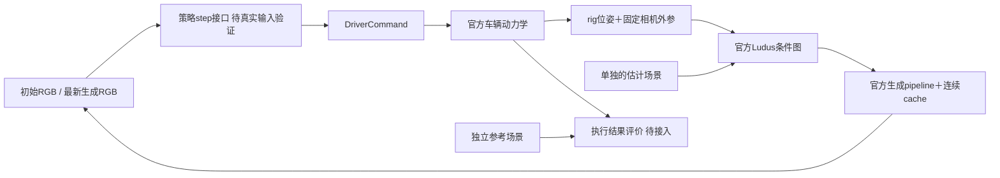
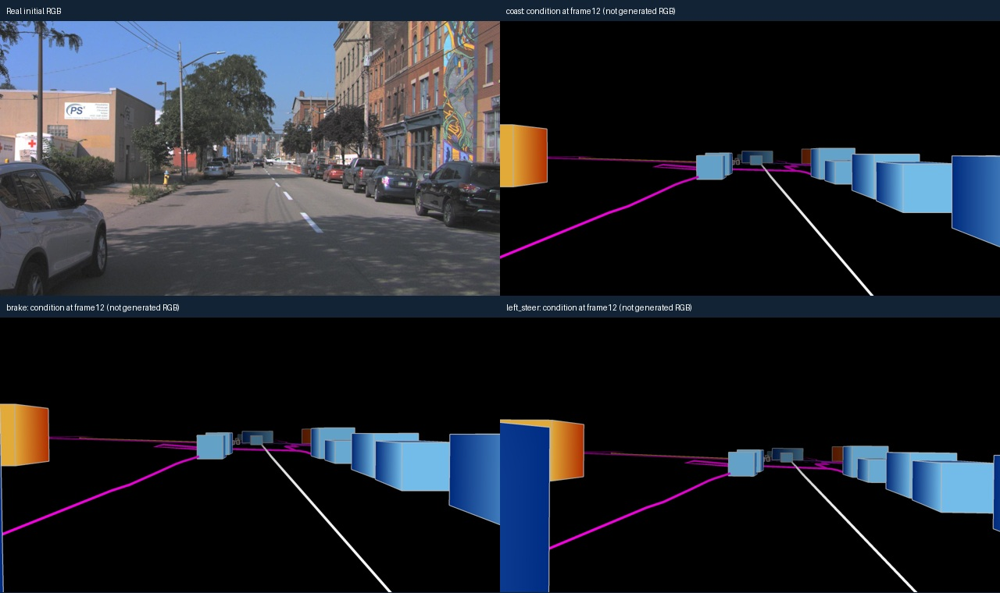

# V7.5 闭环接口：动作是否真的改变下一段输入

`WS-V75-CLOSEDLOOP-CONTRACT-01 / 20260920-r1`。本轮是工程契约检查，不是已完成的自动驾驶策略闭环。人工verdict：null；failure_ledger_delta：none。

## Architecture components

已实际执行部分为DriverCommand→动力学→相机→Ludus。`closed_loop_bridge.py`提供顺序`run_feedback`接口，策略仅收到当前RGB、当前ego状态和时间，保存每段动作及输入/输出；其正式策略反馈生成尚未执行。每段生成完成之后才采样下一条策略动作，没有预取未来条件。参考actors不进入策略参数。

## 本轮执行与结果

复用已曝光的银色轿车开发场景，条件使用既有DVGT读出场景；独立真实场景保持原文件/内容不变。先共享5帧coast前缀，再分别给8帧coast、全制动、直接左转向0.2指令。指令不是图像策略输出，不能算作感知或驾驶结果。

| 分支相对coast | 最后相机平移变化 | 最后条件图变化像素 | 分支末速度 |
|---|---:|---:|---:|
| 制动 | 0.179m | 157758 | 9.284m/s |
| 左转向 | 0.212m | 174646 | 10.698m/s |

coast末速度10.698m/s；初速度10.978m/s，只用截至初始RGB时刻的最后两个真实ego姿态估计。39个条件帧、1.45秒、PyTorch峰值0.063GiB，无OOM。

验证通过：三分支前5帧相机与条件完全相同；第0帧相机与真实初帧对齐，不在t0之前推进动力学；13帧索引、时间戳连续且与actor时间范围一致；制动降低速度；两种指令确实改变后续相机/条件；参考世界和其他条件场景组件未改动。

## 边界与后续执行契约

- 复用官方Interactive Drive的积分器与默认VehicleConfig，第三方源码未修改。当前平地、非交互交通，无地形贴合或碰撞反馈；默认车辆尺寸、参考点与动力学尚未匹配具体AV2车辆。因此只能证明接口连通，不能证明驾驶物理基线正确。
- 基础相机裁剪/标定沿用AV2桥接，逻辑模型视图名不代表相机原生训练域。生成相机遵循仍需要任务基线验证。
- `run_feedback`复用底层官方`generate/finalize`与同一cache，但本轮只运行39帧raster，世界模型生成调用0次。完整策略调用顺序与正式生成的联合验证尚未完成。
- 下一阶段先验证真实输入下的跟车/制动策略，再执行GT生成闭环，之后才接自然重建误差/普通尺度/参考修复对照。工程手动动作、真实输入回放和正式生成反馈三者分开计数。
- 任何OOM或接口失败立即停，不降配置自动重试；不研究长时间放大，不恢复旧TransFuser域失败基线。

原始证据：`/root/autodl-tmp/runs/worldsim_v75/WS-V75-CLOSEDLOOP-CONTRACT-01/20260920-r1/`；[协议](../autoresearch/worldsim_v75/closed_loop_contract/protocol.json)、[结果](../autoresearch/worldsim_v75/closed_loop_contract/result.json)。代码：`scripts/worldsim_v75/closed_loop_bridge.py`、`audit_closed_loop_contract.py`。当前任务定义见[PROBLEM](PROBLEM.md)。
