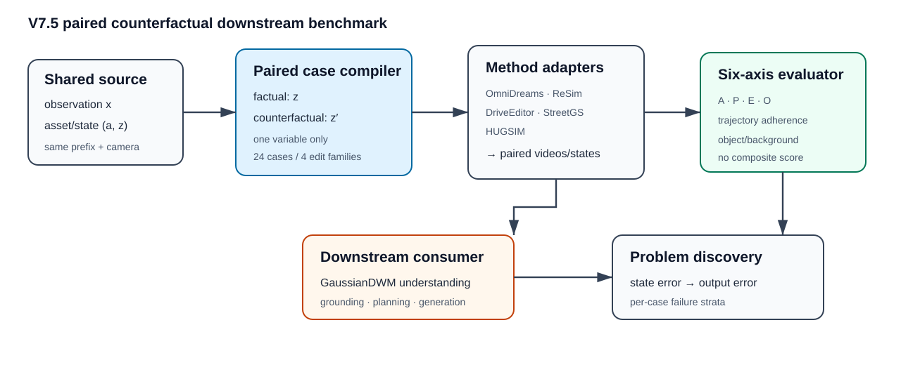

# V7.5 下游反事实 benchmark 准备

## 结论

V7.5 调整为：**在高斯重建状态上施加反事实干预，并以编辑遵循、物理合理性、环境不变性及下游响应为核心发现问题。** 第一阶段不是做大而全的 leaderboard，而是冻结 24 个 paired edits（四类各 6 个），逐模型运行并保留六个独立维度，不合成总分。

这六个系统并非同一种模型。统一的是 case、输出和评价合同，而不是强行统一它们不存在的输入能力：

| 系统 | 在本 bench 中的角色 | 允许的原生/适配入口 | 禁止的等价替换 |
|---|---|---|---|
| OmniDreams | 轨迹/结构化条件生成器 | ego 条件原生；非 ego 结构化条件为 V7.5 适配 | 不把适配接口写成论文原生对象编辑能力 |
| ReSim | ego action world model | ego 速度与横向轨迹 | 不把 ego `fut_traj` 当非 ego actor 编辑 |
| DriveEditor | 非 ego 对象视频编辑器 | reposition/insert/delete，逐帧 3D box 可表达运动 | 不在单 24GB GPU 上伪称官方配置可运行 |
| GaussianDWM | 下游 understanding/generation consumer | 在 paired 编辑输出上做 grounding、planning 或 future generation | CVPR 公共版没有 4D edit API，不作为编辑器计分 |
| Street Gaussians | 显式高斯重建/组合基线 | actor 刚体轨迹、移除、重组；复用历史证据 | 历史 checkpoint 已退役，不把旧图当本轮新推理 |
| HUGSIM | 高斯闭环参考模拟器 | ego/actor 更新、插入及闭环 outcome | 没有对齐导出场景时不启动空跑 |

该边界来自各官方发布：ReSim 公共接口是 future ego trajectory；DriveEditor 官方推理强调对象编辑且声明单卡需要超过 32GB；GaussianDWM CVPR release 明确只有 QA/world generation、没有 4D edit；Street Gaussians 提供 reconstruction/rendering；HUGSIM 提供闭环场景与 actor 更新。官方入口见 [ReSim](https://github.com/OpenDriveLab/ReSim)、[DriveEditor](https://github.com/yvanliang/DriveEditor)、[GaussianDWM](https://github.com/dtc111111/GaussianDWM)、[Street Gaussians](https://github.com/zju3dv/street_gaussians)、[HUGSIM](https://github.com/hyzhou404/HUGSIM) 与 [OmniDreams/FlashDreams](https://github.com/nv-tlabs/omni-dreams)。

## Architecture components

数据流是：同一事实观测与重建状态 `(x,a,z)` 进入 paired case compiler；只改变一个变量得到 `z′`；各方法 adapter 输出事实/反事实视频或状态；六轴 evaluator 与 GaussianDWM 下游 consumer 分别回答“改动是否成立”和“改动是否改变下游理解/规划”。

## Pilot case 合同

`scripts/build_worldsim_v75_downstream_bench.py` 从现有三个 nuScenes DriveStudio 10Hz 场景的实例轨迹做 CPU 筛查，生成 24 个**候选**，不是自动通过资格：

- actor slowdown/acceleration：6 个，其中 3 个 ego、3 个 non-ego；
- actor lateral relocation/lane change：6 个，其中 3 个 ego、3 个 non-ego；
- actor removal：6 个 non-ego；
- actor insertion：6 个 non-ego。

每个 case 都记录 factual/counterfactual 控制、目标实体、branch frame、共享前缀、预期 outcome 与不变范围。当前状态为 `proposed_cpu_only`，还必须通过目标可见、道路有效、无初始碰撞和编辑在像素/状态层可辨认的 gate；`human_verdict` 保持 `null`。

三个来源只够做工程 pilot 和问题发现，不够支持发生率、泛化或模型排名。后续若扩展数据，应新增冻结来源而不是在这三个场景内继续堆更多高度相关 case。

## 六个维度

评价协议在 `configs/worldsim_v75_downstream_bench/evaluation_protocol.json`。本轮报告固定：

1. Adherence：干预有没有执行；
2. Physics：运动、尺度、接触和遮挡是否合理；
3. Environment preservation：背景、相机和非目标对象是否保持；
4. Outcome：paired 最终状态是否按干预逻辑分叉；
5. Trajectory adherence：ADE/FDE、中心/yaw 或轨迹差；
6. Object/background preservation：资产身份、目标外区域与移除后的背景是否保持。

A/P/E 同时允许 single 与 paired 证据，O 只接受 paired。缺失值保持 missing，不写成 0；unsupported 不是模型失败；pilot 不输出 composite/overall score。

## GPU-free 准备结果

本轮完成：

- 官方源码冻结：新建 ReSim sparse checkout、DriveEditor、GaussianDWM、Street Gaussians 浅克隆；复用已有 FlashDreams 与 HUGSIM checkout；
- 统一 model registry：记录源码 revision、角色、能力矩阵、环境/权重/数据路径和资源边界；
- case builder：从实例元数据筛持续 vehicle track，生成 24 个 paired 候选；
- preflight：只检查 source/environment/weights/data/prior evidence，不调用 GPU；
- run planner：按固定顺序生成每模型可执行 case，当前明确 `execution_enabled=false`；
- result schema/evaluator：六维独立校验与均值汇总，拒绝 composite score；
- 单元测试：覆盖 24-case 平衡、单变量合同、能力分层与无总分汇总。

Street Gaussians 的历史结论保留为 `prior_evidence_reusable`：既有 matched reconstruction/actor composition 结果可用于预期与 adapter 设计，但 checkpoint 已在存储退役中释放，所以新的 paired render 需要恢复 checkpoint 或重训，不能把历史 evidence 冒充本轮推理。

实际 CPU preflight 结果如下；这里的“缺权重”是 fail-closed 状态，不会触发下载或 GPU 调用：

| 系统 | 当前 readiness | 已确认边界 |
|---|---|---|
| OmniDreams | `ready_for_gpu_preflight` | source、环境、2B 权重和 pilot 数据均在位 |
| ReSim | `source_only_missing_weights` | source 与数据在位；独立环境、公开 expert-action 权重待准备 |
| DriveEditor | `source_only_missing_weights` | source 在位；demo/model/独立环境待准备，且单 3090 不满足官方显存要求 |
| GaussianDWM | `source_only_missing_weights` | source 在位；模型、Gaussian 输入和独立环境待准备，只进入 consumer 流 |
| Street Gaussians | `prior_evidence_reusable` | DriveStudio 环境与数据在位；旧 checkpoint 已退役 |
| HUGSIM | `source_only_missing_weights` | source、环境和旧闭环输入在位；缺 benchmark 对齐的导出重建 |

生成物位于 `docs/autoresearch/worldsim_v75/downstream_bench/`：`cases.json`、`preflight.json` 和 `run-plan.json`。planner 把 GaussianDWM 的 24 个 case 明确记为 `consumer_only`（生成数 0、消费数 24），避免把下游推理混入编辑器成功率。

## 开卡后的顺序与停止规则

固定顺序为 OmniDreams → ReSim → DriveEditor → GaussianDWM → Street Gaussians → HUGSIM。GaussianDWM 的时序位置是先完成公共包/QA/world inference smoke，再消费已有 producer 的 paired outputs；其编辑维度记为 consumer-only。

每个模型按以下规则推进：

1. 先通过 source、environment、weights、data、case qualification 五个 gate；
2. 先跑 1 个 paired smoke，再跑该模型合法的 frozen cases；
3. OOM、官方单机资源要求不满足、输入接口需要伪造或输出合同缺失时立即停止，不自动降分辨率或换任务；
4. 任何 proxy/adapter 结果与原生结果分栏；
5. 先报告 per-case 六维失败，再决定是否值得补数据或研究机制。

当前 GPU-free 阶段不执行模型推理、不开训练、不恢复旧队列。
