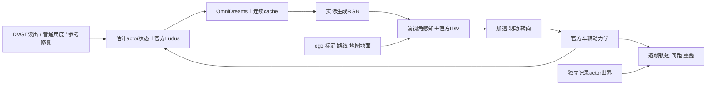
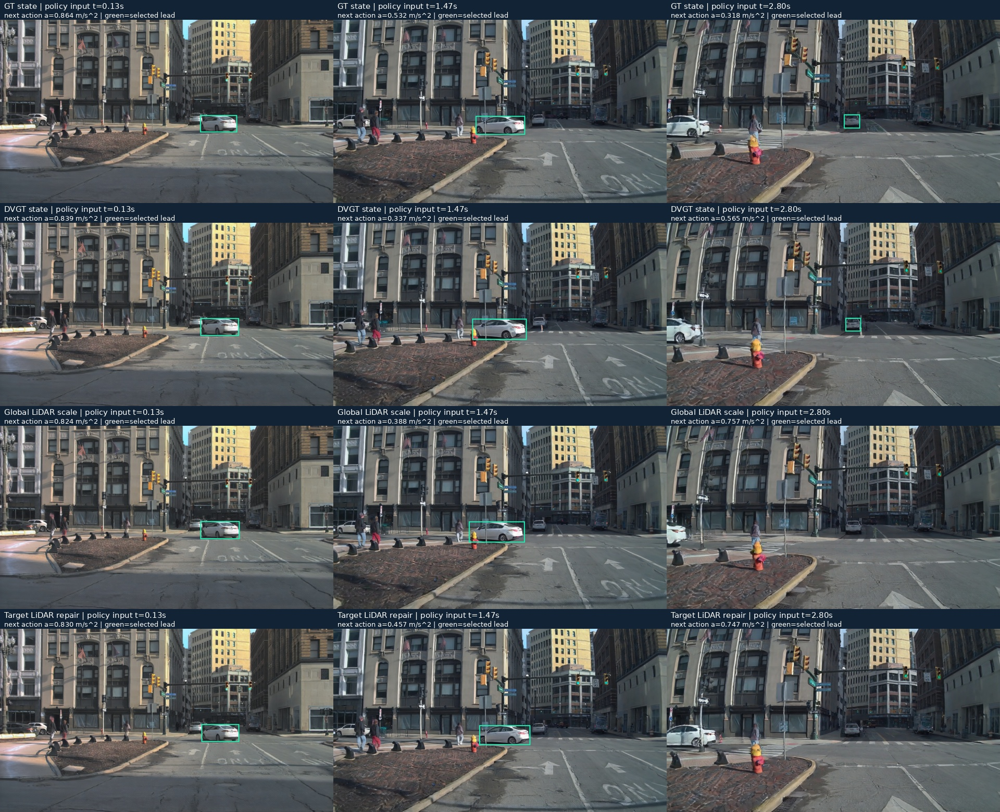
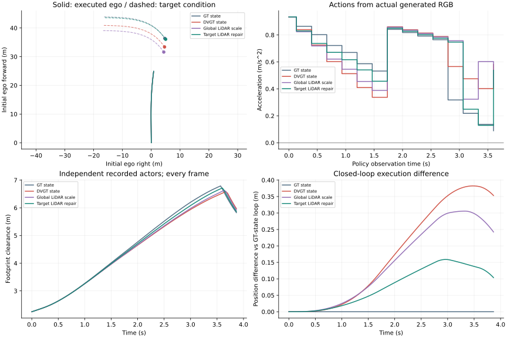

# V7.5：首个真实RGB策略反馈闭环

**已接通并执行重建状态→生成RGB→策略→动作→相机→下一段生成。** 本例自然DVGT读出使终点相对GT条件偏移0.353m，目标LiDAR修复后0.104m；四组均没有制动或参考重叠事件，因此支持有限、可部分恢复的闭环响应，尚非有严重任务危害的badcase。

人工verdict：null；failure_ledger_refs：V74-H2-F22、V75-F01；failure_ledger_delta：none。运行状态只见[RESEARCH_STATUS](../RESEARCH_STATUS.md)。

## Architecture components

第一条策略输入是真实初帧；之后每次只读取上一段生成的最后一帧，动作执行后才渲染下一段条件。官方pipeline的cache不重置。参考actors不传入RGB策略；在线oracle仅作评价，不回写动作、状态或随机性。

## 任务、来源与真实输入基线

`WS-V75-FOLLOWING-BASELINE-01`的两个run分别为`20260920-r1`和`20260920-natural4`。先复用两条可见性开发日志：一条没有路径内前车，一条40m内前车只持续2/5时刻，均不够承担固定跟车任务。随后固定已有的四条自然读出开发日志，没有按DVGT误差或生成输出排序；该四条窗口不补位。均为已曝光开发资源，不是独立确认。

| 日志前缀 | 路径任务 / 相机支持 | 真实策略结果 |
|---|---|---|
| 05fa5048 | 无持续初始前车 | 不运行策略 |
| 0bae3b5e | 白车转向离开路径，前视角可见 | 前车判断4/5正确，距离绝对误差中位0.749m，加速度差中位0.015m/s²；选中 |
| 0c3bad78 | GT路径前车的投影在五时刻均完全落在1280px图像右侧之外 | 原始结果为0/5；归因是单前视角输入不可观测，不是检测器失败 |
| 0fb7276f | 前视角可见前车 | 4/5正确，距离绝对误差中位0.442m，加速度差中位0.004m/s²；保留，未补跑生成 |

完整来源分母：6条已有日志→3条持续路径前车任务→2条真实前视角基线合格→按冻结顺序选择第一条→4组实际反馈生成。未通过项和原始结果全部保留。[观测支持审计](../autoresearch/worldsim_v75/following/baseline/source_observability_audit.json)是在读出后补充的归因，不改门限或选中任务。

控制器为缓存的官方FasterRCNN R50 FPN v2 COCO检测＋标定射线/地图地面接触点＋固定常速度Kalman跟踪＋官方nuPlan IDM＋普通路线追踪。不是端到端驾驶SOTA。IDM沿用官方配置：目标速度10m/s、最小间隔1m、时距1.5s、最大加速1m/s²、最大减速3m/s²，感知范围40m。参数未因本轮结果调整。

已知相机、ego状态、记录路线、地图地面提供额外信息。策略不读取GT车辆位置/尺寸/速度；已知地图地面不是纯RGB输入。初速度由初始时刻之前的真实ego姿态估计。真实策略检查窗口0–2s，后续4s反事实视角没有真实像素GT。

## 冻结的四组闭环

`WS-V75-FOLLOWING-CLOSEDLOOP-01 / 20260920-r1`；日志`0bae3b5e-417d-3b03-abaa-806b433233b8`，目标`d3d66fcc-6a28-4f86-9be4-6d1f012f726a`，seed42。每组117帧（0–3.867s）、30fps、704×1280、15次策略决策；四组共468生成帧、60次决策，其中56次读取生成RGB。

只改变初始目标world平移，偏置贯穿其整条条件轨迹。初帧/编码/文本、其他actors、地图、GT目标尺寸/朝向/未来位移及策略均共享；ego轨迹由各组策略实际执行产生。自然读出使用官方DVGT距离＋已知相机射线＋GT尺寸/朝向，不是原生点图坐标精度或纯视觉端到端重建。普通全局尺度和目标LiDAR修复均增加真实度量信息。

GT生成基线先通过：在线IDM加速度相对同ego状态oracle差中位0.038m/s²，横向路线偏差最大0.129m；逐帧117/117参考检查无重叠，最小间距2.246m。然后运行另外三组。评价不是仅查chunk边界。

| 条件 | 初始中心残余(m) | 执行进度(m) | 终点相对GT条件差(m) | 平均绝对加速度差(m/s²) | 制动决策 | 重叠帧 |
|---|---:|---:|---:|---:|---:|---:|
| GT | 0 | 25.014 | 0 | 0 | 0/15 | 0/117 |
| 自然DVGT | 2.965 | 24.659 | 0.353 | 0.140 | 0/15 | 0/117 |
| 普通全局LiDAR尺度 | 4.769 | 24.770 | 0.242 | 0.136 | 0/15 | 0/117 |
| 目标LiDAR修复 | 0.417 | 24.910 | 0.104 | 0.085 | 0/15 | 0/117 |

## 这轮知道了什么

自然误差通过真实反馈改变了加速和执行进度；修复使终点及平均动作更接近GT条件。**这些是相对GT条件的恢复，不是已证明的驾驶质量提升。** 四组均持续加速，没有制动或参考重叠。共同最小间距出现在相同初始场景，不能拿相同最小值证明一般安全性相同。

普通全局尺度的3D中心残余更大，闭环终点差反而较小；本例不支持按中心误差范数直接给任务影响排序。2.8s附近下一辆远车接近固定40m感知边界，部分组暂未被选作前车，随后进入；动作差还受到普通感知范围和跟踪速度的影响，不能称作生成历史放大。

图中BEV实线是实际ego轨迹，虚线是输入条件中的目标轨迹，不能当作从生成视频测得的3D目标状态。生成相机是否精确遵循请求轨迹仍未独立确认；本轮测量的是当前传感器接口和策略组成的有限闭环系统，不报告新的生成米制几何准确率。

## 验证、资源与限制

- 四视频和四格对比均完整解码117帧；四组生成初帧完全相同。60次决策的时间戳、上一段末帧索引、后续条件帧索引通过因果顺序审计。
- 四组逐帧参考均无重叠，路线偏差合格；参考场景不变，非目标条件场景组件逐项一致。无训练、下载或关机任务。
- 每组含加载约72.57–73.70秒；PyTorch峰值12.972GiB。真实策略基线15次检测3.40秒、0.623GiB。三组后续队列含逐帧审计248.43秒；无OOM。
- 车辆是官方demo默认4.8×2m的虚拟ego，采用平地动力学；不是已标定的真实AV2车辆。参考traffic不对ego反应，信号灯/行人决策与完整道路规则未纳入跟车控制器。因此不能报告完整驾驶安全、规划SOTA或普遍重建失败。
- 准备时修复了两个工程问题：五时刻RGB路径错误；路线端点截断把远处车辆误计入40m范围。修复发生于策略/生成之前，旧错误结果保留，没有调科学门限。

代码入口为`scripts/worldsim_v75/prepare_following_task.py`、`evaluate_following_baseline.py`、`run_following_closed_loop.py`、`assess_following_closed_loop.py`及`build_following_review.py`。官方FlashDreams版本沿用`bc711d6f95693d73693e6b5fac75749cc6fcf1d7`；nuPlan IDM为`ce3c323af01c0d7ec5672f7832ef53f9c679aab0`，第三方源码未修改。

原始模型输出、逐段条件、每次策略记录与逐帧评价位于上述两个task的`/root/autodl-tmp/runs/worldsim_v75/`目录。[轻量证据](../autoresearch/worldsim_v75/following/)不是原始视频/数组备份。

本例保留为“小幅可恢复闭环响应”，不追加seed、扰动或更长窗口把它升级成事故。当前研究定义继续见[PROBLEM](PROBLEM.md)：后续任务应先由真实交通的跟车/制动需求定义，寻找哪些状态关系具有实际决策意义，不按模型误差大小选场景。
