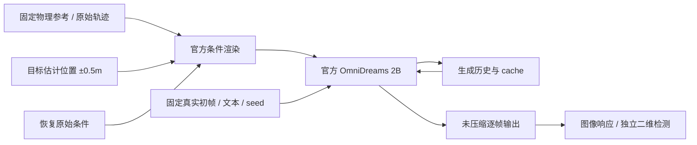
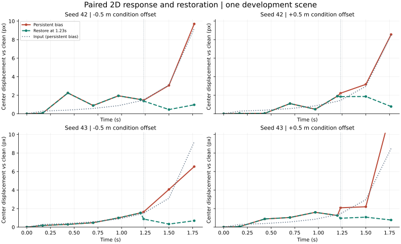
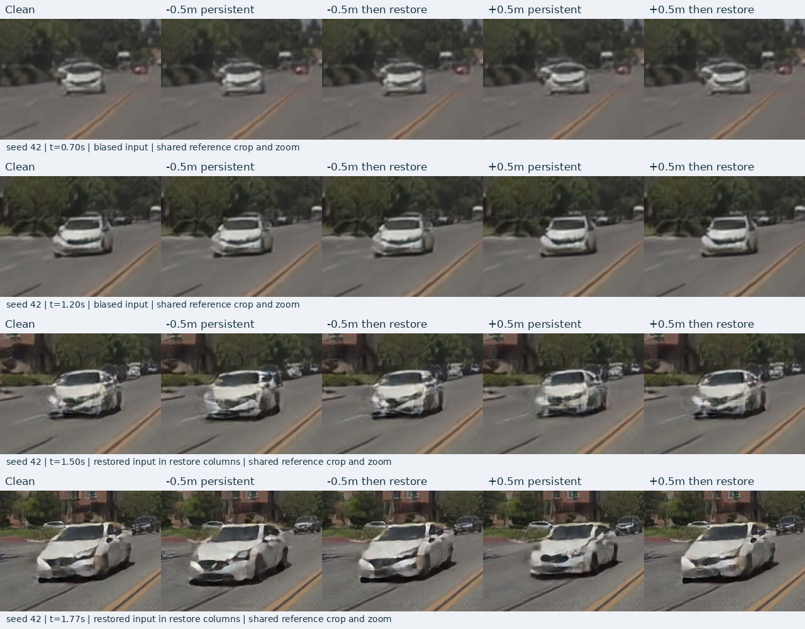
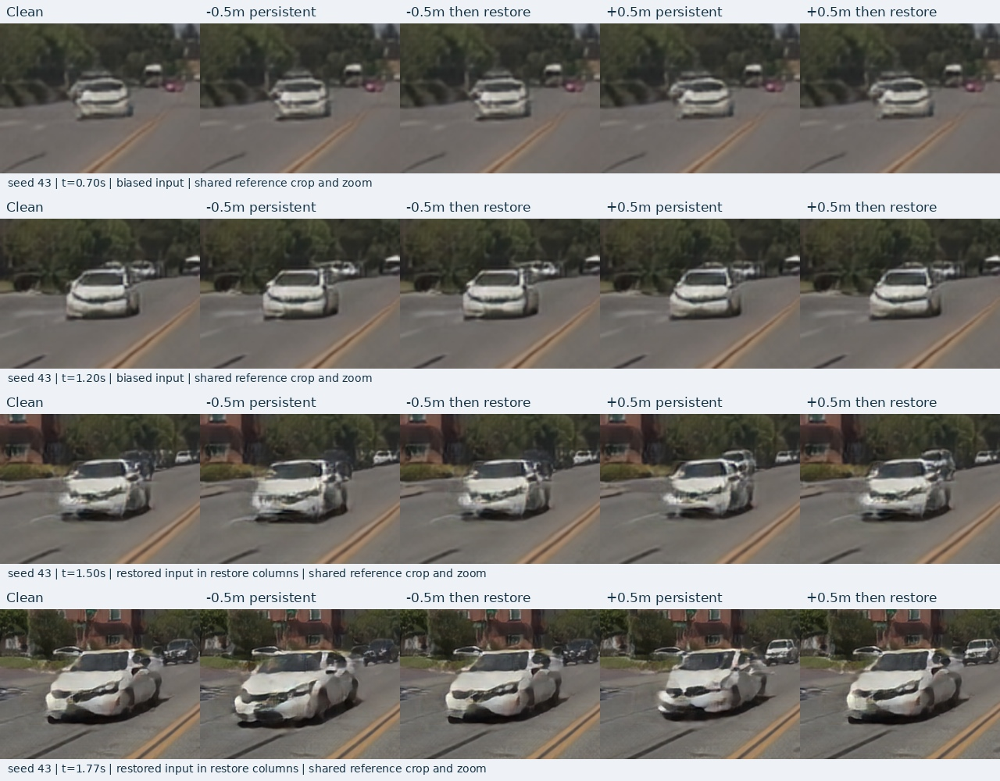

# V7.5 首轮定位偏置与恢复实验

task/run：`WS-V75-LOCALIZE-01 / 20260920-r1`。本报告维护协议与证据；当前执行状态见 [RESEARCH_STATUS](../RESEARCH_STATUS.md)，总研究问题见 [PROBLEM](PROBLEM.md)。本轮是单场景工程开发与人工条件敏感性诊断，不是自然重建误差或策略反馈实验。



## 输入与预先固定的比较

物理参考世界始终不变；仅对条件表示中的目标完整 world-frame 轨迹沿初始 ego 前向平移±0.5m。其他actor、地图、相机、时间、初帧、文本与同seed随机流保持不变。共2个seed（42/43）×5种条件，704×1280、237帧、30fps。

| 条件 | 帧0–4 | 帧5–36 | 帧37–236 |
|---|---|---|---|
| clean | 原始 | 原始 | 原始 |
| negative / positive persistent | 原始 | ±0.5m | ±0.5m |
| negative / positive restore | 原始 | ±0.5m | 原始 |

恢复点为第37帧（1.233s）；目标评价窗口预先限定到第53帧（1.767s），之后只保留整幅图像响应，不把目标离开视野后的画面差异称作目标位置错误。恢复用的是原始记录条件，属于诊断参照，不是同信息预算下已提出的修复方法。

## 目标筛选与输入审计

目标为公开场景的轨迹81，迎面白车。筛选程序只读取原始RGB、标定、actor轨迹与ego轨迹；已有clean生成用于工程运行验证，不用于挑选偏置失败。

初始尺寸≥16×12像素、深度3–80m的候选共13个。要求持续在画面内至3.37s时，只有轨迹99满足几何筛选，但它的下半车体被植被遮挡，按真实RGB排除。偏置生成之前将最小可见期改为1.767s，保留恢复后17帧；罩车16的可见期不足，轨迹93则被罩车遮挡，初次口头对象识别经精确投影框核对纠正。排除99后，最终按初始投影面积规则选定81；未通过的候选保留在原始记录。

官方动态actor接口会重建整个障碍物集合。本轮定位原始场景池中唯一与轨迹81的时间戳、位置序列相符的条目，只替换它的translation切片；地图、朝向、尺寸、颜色及其他actor张量保留。仍使用官方renderer和场景更新函数，没有修改第三方源码。

- 零偏置重渲染237帧与已有clean条件逐像素相同。
- ±0.5m干预在评价窗口内的所有改变像素均位于预先指定的目标联合投影框加16px边界内，框外改变为0。
- 帧5–36的投影中心移动均值仅约0.63px／0.61px（负／正）。因此评价器精度是关键限制；不能将像素差直接换算成米制放大率。

## 评价与证据边界

每个输出保存编码前uint8图像及MP4；图像响应比较直接读取前者。固定ROI由三个输入投影框的并集加16px边界定义，报告ROI与框外的平均绝对RGB差；这只是图像敏感性，不是几何误差。

独立评价器使用官方Torchvision FasterRCNN ResNet50 FPN v2 COCO权重，在CPU执行；car类别、置信度0.25、关联IoU≥0.3及9个时间点在查看偏置画面前固定。先对真实初帧±4px已知平移做校准，中心残差要求≤2px；再要求clean的9帧中至少6帧匹配。若未通过，不调整阈值挽救本轮定位结论。检测框只用于二维相对响应，没有真实未来RGB，不能作为米制真实状态误差。

同seed条件间的前5帧必须完全一致；同号persistent/restore的前37帧也须一致。即使恢复后图像仍不同，仍需区分条件编码cache、生成历史及解码cache；此实验没有单独隔离这些组件，不能归因为某一种“历史放大机制”。

## 原始记录与复现

原始记录根目录：`/root/autodl-tmp/runs/worldsim_v75/WS-V75-LOCALIZE-01/20260920-r1`。

- `protocol.json`、`target_candidates.json`、`target_projections.json`：选择规则、排除、冻结时间及参考投影。
- `condition_audit.json`、`input_locality_audit.json`：零干预与局部性核验。
- `queue.json`、逐任务退出码与日志：有限队列实际进度；锁用于防重复启动，不能仅凭锁文件判断进程存活。
- `rollouts/`：每种条件的原始帧、MP4、耗时、图像响应及检测结果。
- `source/`：执行输入与生成程序快照；评价器校准及其协议另存于根目录。

```bash
cd /root/autodl-tmp/motion_proj
source scripts/worldsim_v75/environment.sh
python scripts/worldsim_v75/run_localization_queue.py
```

队列拒绝覆盖已有记录；上述命令仅用于首次启动，不能对当前run重复执行。任一任务失败或OOM立即停止，保留原始日志，不自动改变设置或重试。

人工verdict：null。failure_ledger_refs：V75-F01、V74-H2-F20、V74-H2-F21、V74-H2-F22；登记口径是不把人工扰动下的图像变化预先认定为科学失败。


## 完整执行结果

10/10项完成，300个生成段、每项237帧，全部有限值检查与视频解码通过，均无OOM。整卡每秒采样峰值17.41GiB。仍然只有1场景、1目标、2个seed，不能把300段或逐帧数量当作独立样本。

真实初帧±4px平移校准的检测中心残差为+0.103px／−0.470px。每个clean和干预条件的匹配数量见轻量结果，未删除检测缺失。恢复前共享的原始输出前缀逐像素一致，保证比较没有在干预开始前出现差异。

恢复窗口37–53帧的配对结果如下。二维框指标使用第37、45、53帧，与相同seed的clean比较；像素指标使用该窗口全部17帧。二者的分母不同。这里的“距离”是2D框中心相对clean的差异，不是相对未来真值的错误。

| seed | 条件偏置 | 持续偏置框中心差 | 恢复组框中心差 | ROI像素MAE（持续→恢复，0–255） |
|---|---|---:|---:|---:|
| 42 | −0.5m | 4.74px | 0.93px | 11.02 → 3.97 |
| 42 | +0.5m | 4.65px | 1.50px | 9.90 → 3.96 |
| 43 | −0.5m | 4.09px | 0.63px | 10.20 → 4.34 |
| 43 | +0.5m | 5.63px | 0.93px | 9.73 → 4.57 |

4组比较中有4组在恢复正确条件后，检测框中心比持续偏置更接近clean。输入投影本身的普通透视响应作为描述性几何参照，不能用像素/米比值声称“放大”。该参照采用投影框的中心，与输入局部性审计中的角点投影均值口径分开。

目前只证实人工条件误差能够传到生成画面，并检验其短期可恢复性。恢复使用原始记录条件；不是一个已证明同信息预算优势的修复方法。没有自然重建误差样本、真实未来RGB或策略反馈，因此没有完成科学badcase或闭环危害准入。

轻量结果见 [localization](../autoresearch/worldsim_v75/localization/)；原始根目录保留 `comparison-seed42/43.jpg`、同名MP4和全部未压缩帧。固定时间裁剪在同一帧的五条件间完全共享，未按生成车辆重新居中。

failure_ledger_delta：none；本轮没有把可恢复的条件响应登记成新的科学失败。人工verdict保持null。






