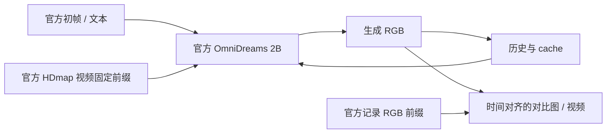
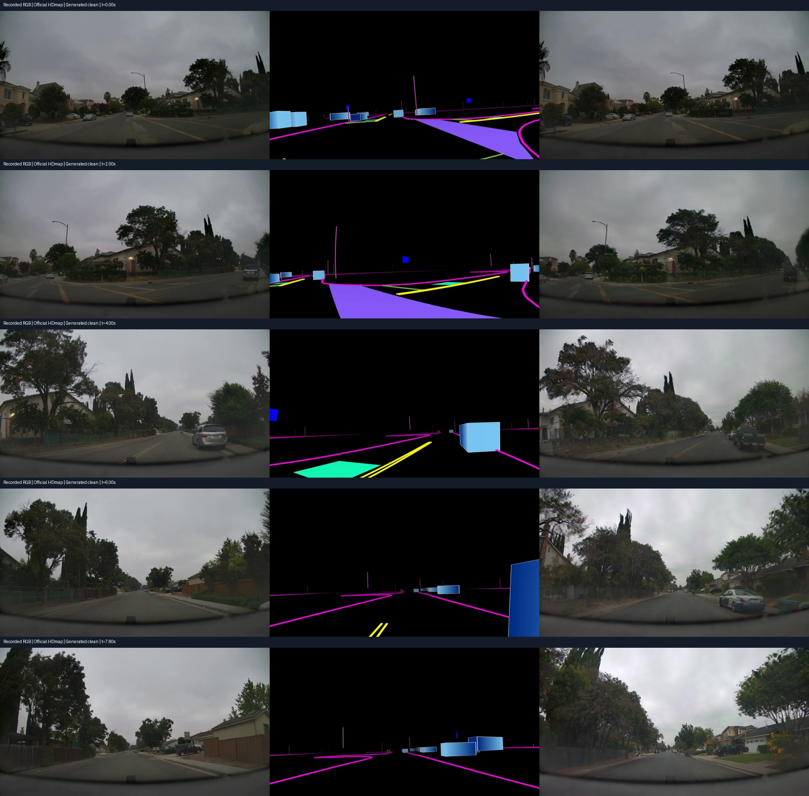
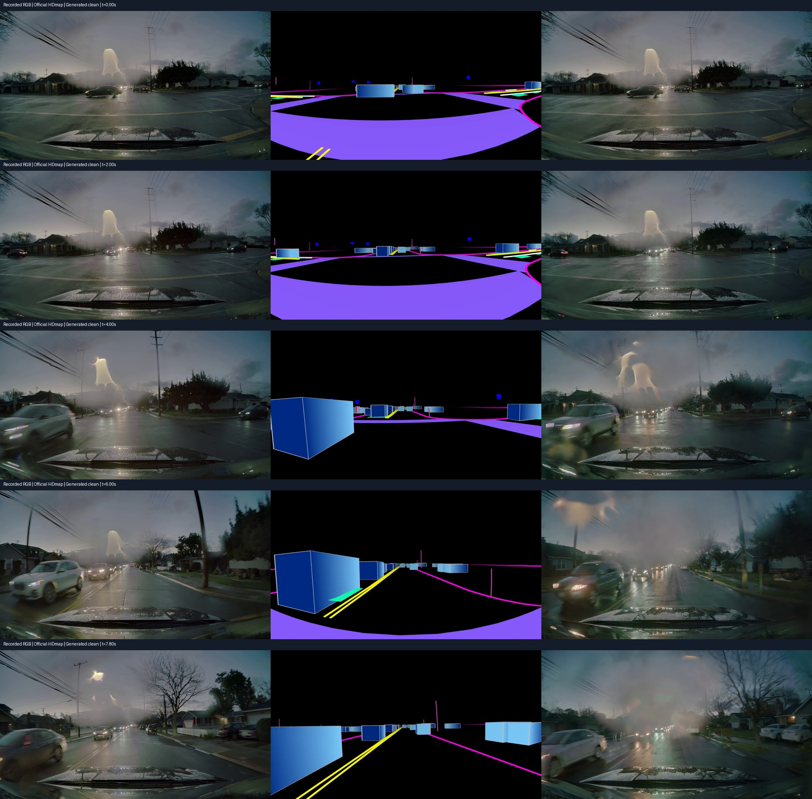
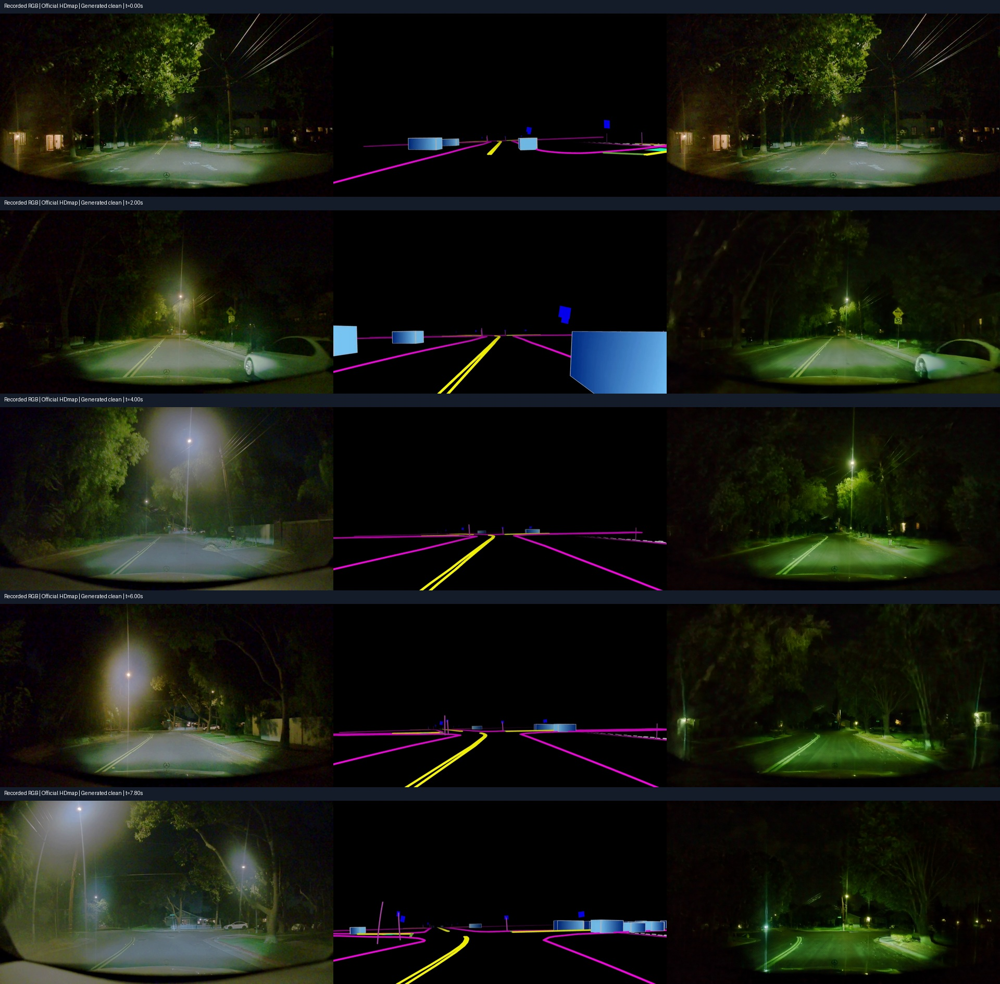

# V7.5 官方原生样例的多场景 clean 基线

task/run：来源冻结 `WS-V75-COHORT-01 / 20260920-r1`；原生基线 `WS-V75-NATIVE-COHORT-01 / 20260920-r1`。当前阶段见 [RESEARCH_STATUS](../RESEARCH_STATUS.md)。本页是本轮固定输入与工程结果，不是badcase清单。

## 来源与划分

公开 `nvidia/omni-dreams-scenes` 只有一个UUID的默认、雨、雪三种版本，排除已曝光默认场景后没有新的独立UUID，不能组成3+3队列。实际清单保留在 [来源证据](../autoresearch/worldsim_v75/cohort/)，没有把天气变化算成跨场景。

另一个仓库 `nvidia/omni-dreams-samples` 的元数据列出32个单视图样例。初次使用现有HF登录下载小文本返回403；用户完成该仓库授权后，同一登录成功下载。它与可公开下载的scenes不是同一个仓库。固定revision为 `c6ee700be8aaaee833aa6b46fba0c0f9961b101b`。

在查看这些生成输出之前，按UUID字典序冻结以下角色，不按画面或误差更换样例：

| UUID | 本轮角色 |
|---|---|
| 23599139-948f-4681-b7f4-74794113086d | 开发1 |
| 2375ecb8-c232-11ee-8685-00044baf694d | 开发2 |
| 237a3c21-9c03-4d06-aab9-6c2ff407f660 | 开发3 |
| 23848571-4646-4e6c-af57-bbb56a44c874 | 保留，未读取视频 |
| 239560dc-33d1-11ef-9720-00044bcbccac | 保留，未读取视频 |
| 239802f4-2ba7-11ec-b6e6-00044bf65f0e | 保留，未读取视频 |

这是本研究中的曝光划分；是否与预训练数据重叠未知，不能据此声称训练分布外泛化或无训练重叠的测试集。

## 固定前缀及对齐

原始RGB视频长约80–100秒，本轮预先固定前237帧、30Hz。完整下载传输较慢，保留下载残片后改用通过合法HF授权取得的CDN地址，按HTTP Range读取所需前缀；没有修改UUID、起点或长度，也没有把全部原始视频标为已下载。

三例分别保存完整237帧的参考RGB和条件数组、官方初帧与文本。所有RGB/条件使用官方共用 `flashdreams.infra.runner_io.resize_rgb_image` 的 `INTER_AREA` 到704×1280，不裁剪。三例PNG初帧与各自RGB第0帧在共同预处理后逐像素相同，差异均0；RGB与HDmap的237个PTS逐帧一致。记录实际视频元数据，不依文件名推断帧数。

输入通过显式调用底层官方pipeline执行，规避 [V75-F01](../research_failures/entries/V75-F01.md) 的batch输入绑定缺失；不是宣布存在一个已验证的官方batch CLI路径。第三方源码保持不变。文本/图像编码器先独立计算并释放，随后加载生成器，官方权重、调度器与历史配置不变。

## 结果与可视化

三例均完成seed42、single-view 2B、237帧clean，全部无OOM；生成与三列对比视频均完整解码。每例PyTorch生成峰值分配约12.81GiB。具体耗时及检查分母见 [逐例轻量结果](../autoresearch/worldsim_v75/native_cohort/)，整卡17.41GiB峰值来自先前及 [Argoverse桥接](AV2_BRIDGE.md) 的采样，不冒充本组三例新的整卡测量。

各图左为官方记录RGB，中为官方提供的HDmap，右为本轮生成；取0、2、4、6、7.8秒，三列同一时间，不按生成对象重新居中。可见外观/结构差异作为后续测量候选，未被升级为自然重建误差、历史放大或事故证据。

## 对下一阶段的实际意义

原生多场景生成和参考RGB时间对齐已经可运行。但是samples只提供RGB、HDmap、初帧和文本，没有同例可编辑的三维地图、actor轨迹或标定文件。因此可以做原生条件基线与图像状态测量，不能将对raster的任意修改冒充合法三维定位干预。

自然重建状态→条件→生成的链条仍需补齐。Argoverse桥接提供了可核验三维状态的开发入口，但其额外GT信息、相机域与地图语义差异单独保留；不与原生同信息预算结果混排名。当前没有新增偏置实验、保留集确认、训练或策略反馈。

原始目录：`/root/autodl-tmp/runs/worldsim_v75/WS-V75-NATIVE-COHORT-01/20260920-r1`；源目录：`/root/autodl-tmp/runs/worldsim_v75/WS-V75-COHORT-01/20260920-r1`。程序为 `catalog_samples.py`、`prepare_samples.py`、`run_prepared.py`、`review_samples.py` 和 `build_native_report.py`；终态文件拒绝覆盖，OOM立即停止。

failure_ledger_refs：V75-F01、V74-H2-F20、V74-H2-F21、V74-H2-F22；failure_ledger_delta：none；人工verdict：null。三条clean基线不是三个已确认科学badcase。
