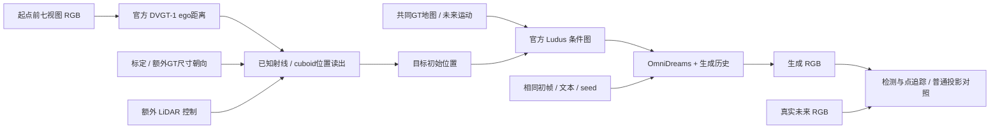
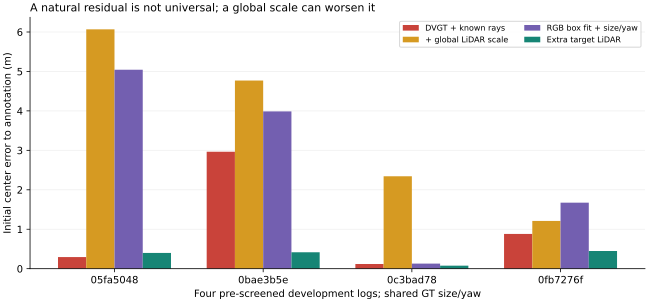
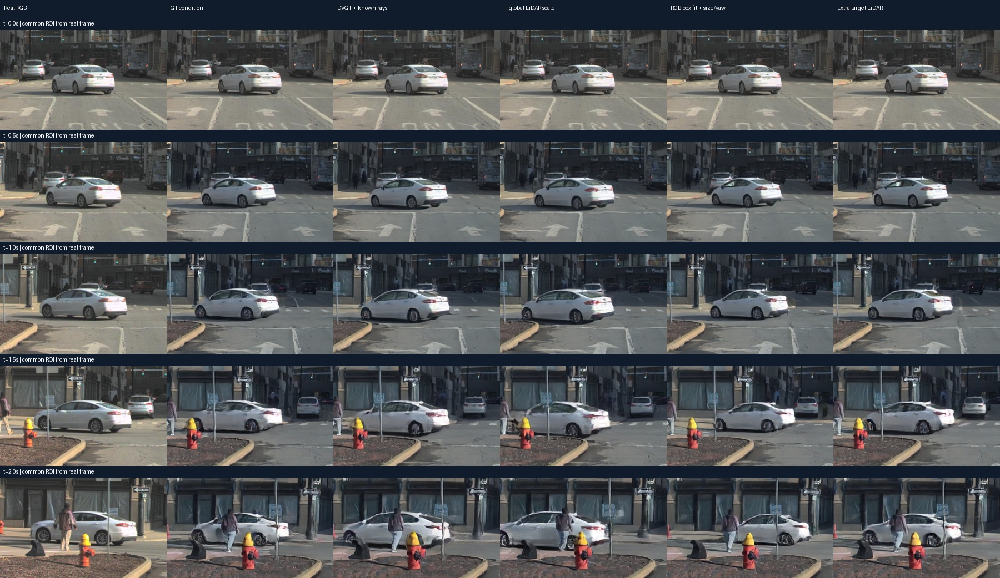
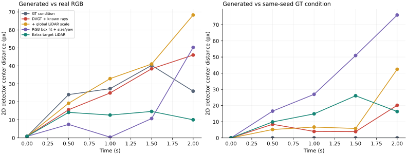
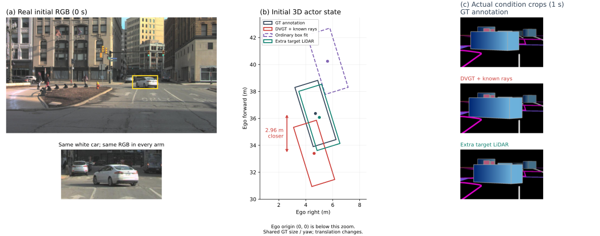
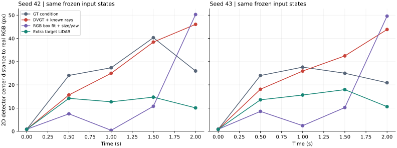
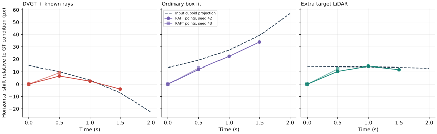
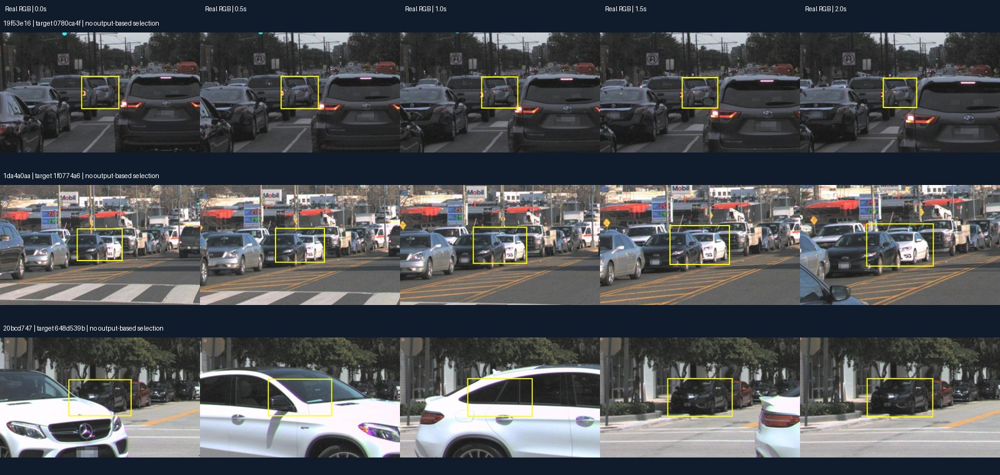

# V7.5 自然初始位置读出与生成响应

本轮把真实重建模型的距离输出接入了三维actor条件，但仍是带额外几何先验的条件化诊断。四条开发日志中保留了良好与残余案例；生成比较只针对其中一个发现候选，不能称为普遍失效或闭环危害。当前执行状态只见 [RESEARCH_STATUS](../RESEARCH_STATUS.md)。

## 来源与排除

旧桥接日志`02678d04`的目标距相机约110m，在DVGT网络输入中约11×7像素。中央区域只有28个网络像素，起点前落在目标上的LiDAR为0，因此没有为该目标运行因果生成。二维可见且可检测，并不自动满足米制位置读出的参考要求。

随后在查看重建输出前冻结八条本地完整Argoverse val日志：按UUID字典序、排除旧桥接日志，起点固定为首RGB之后至少0.5秒的第一帧。要求车辆在0、0.5、1、1.5、2秒完整投影可见，初始框至少48×32px、深度5–60m，中央60%区域有至少6个目标LiDAR点。

八条中六条通过几何/参考支持；实际RGB显示`04994d08`与`185d3943`初选目标被前车明显遮挡，未替换目标，也未运行其重建。剩下四条按相同读出执行。筛查图、排除原因及全部分母保留在[轻量证据](../autoresearch/worldsim_v75/natural_state/)。这是开发筛查，既往曝光与预训练重叠均未排除；原生samples的三个保留视频没有读取。

## 坐标与信息预算

DVGT-1使用官方仓库`51cf3f6d`、完整权重严格加载、原版crop预处理、单时刻七环视、BF16；模型只收到起点前RGB，不收到标注、标定或LiDAR。官方训练/评价配置的`gt_scale_factor=0.1`用于恢复米制单位。[官方实现](https://github.com/wzzheng/DVGT/tree/51cf3f6d11fdff8bc7e2bbe1a88f71665ccb2236)

原始点图朝向不能直接当作已知rig朝向。旧目标的直接投影残差很大，各相机PnP不能用一个共同刚体变换解释；这些失败记录没有删掉。后续结果明确属于**DVGT的ego距离＋已知相机射线**控制：按官方ego原点距离，在已知相机像素射线上求对应位置，再读出actor中心，不报告未经配准的原生点图坐标准确率。

actor读出固定使用真实初帧检测框中央60%、标注尺寸与朝向。普通框拟合仅用同一检测框和同一几何先验；距离读出使用拟合框的可见面，稳健估计沿同一中心方向的位置。把真实目标LiDAR传入相同读出器，要求至少6点、中心误差≤0.5m以及可见面保持率≥0.8，作为独立参考可靠性检查。模型中央有效点至少20，不按误差大小删点。

全局尺度控制使用目标及其他actor之外的背景LiDAR，按所有视图的深度比中位数估计一个scalar。它增加了度量锚点和标注排除mask，单列报告。LiDAR以`sweep timestamp + offset_ns`逐点限制在起点前，不能只因文件起点早于cutoff就使用整个扫描；原始数据已经按扫起点完成ego运动补偿。[官方时间/坐标契约](https://github.com/argoverse/av2-api/blob/main/src/av2/structures/sweep.py)

## 四条开发读出

单位：相对标注中心的欧氏误差，m。

| 日志 | DVGT距离＋已知射线 | 额外全局LiDAR尺度 | 普通框拟合 | 额外目标LiDAR读出 |
|---|---:|---:|---:|---:|
| 05fa5048 | 0.295 | 6.067 | 5.042 | 0.399 |
| 0bae3b5e | 2.965 | 4.769 | 3.986 | 0.417 |
| 0c3bad78 | 0.119 | 2.343 | 0.129 | 0.077 |
| 0fb7276f | 0.881 | 1.210 | 1.674 | 0.448 |

这张表不支持“DVGT普遍严重失效”。两条低残余案例保留。全局尺度在四个目标上都变差，不能把该控制引入的退化算作模型原始错误；同样不能隐藏这一强控制的实际结果。`0bae3b5e`的2.965m残余明显大于该读出器用真实点时的0.417m残余，因此选作后续发现案例。选择发生在读出之后，不伪称独立确认。

## 五组生成比较

同一白车、seed42、237帧、704×1280、30Hz。GT条件、DVGT读出、额外全局尺度、普通框拟合、额外目标LiDAR五组共用初始RGB、文本、ego轨迹、地图、其他actors、目标尺寸/朝向与未来位移；只用各读出的初始位置替代目标中心，整条轨迹保持同一world-frame偏移。它检验初始定位误差，不是完整自然重建轨迹，也不是策略反馈。

真实初帧±4px平移的检测残差为−0.18px与−1.25px，预定0、0.5、1、1.5、2秒五帧均匹配。量化固定在这五个精确重合时刻；完整视频的参考预览允许20Hz最近帧，不把预览重复帧当成真值样本。改变后的条件在前61帧全部通过目标框并集范围检查，其余场景组件保持一致。

五组各237帧全部完成、无OOM，生成及并排视频全部解码通过，五组检测均5/5匹配。单张3090的PyTorch峰值分配12.81GiB，含加载约124–125秒/组；这是当前配置的进程内峰值，不冒称整卡峰值。四例DVGT前向峰值12.70GiB。

| 条件 | 初始3D中心残余(m) | 与真实RGB中心差均值(px) | 与同seed GT条件生成差均值(px) |
|---|---:|---:|---:|
| GT条件 | 0 | 23.71 | 0 |
| DVGT距离读出 | 2.965 | 25.19 | 7.30 |
| 额外全局尺度 | 4.769 | 32.48 | 12.03 |
| 普通框拟合 | 3.986 | 13.97 | 34.09 |
| 额外目标LiDAR | 0.417 | 10.50 | 13.43 |

额外目标LiDAR相对DVGT读出的二维误差，在四个非初始时刻均下降；均值25.19→10.50px。第2秒分别为46.06→10.07px。但DVGT相对GT条件只在部分时刻更差，其五帧均值差仅1.48px；GT条件自身已有明显二维偏差。普通框拟合虽然三维残余比DVGT更大，二维均值仍改善至13.97px，且末帧50.29px又比DVGT差。这些良好/不利时刻和强控制均保留。

实际图像复核显示第2秒有行人遮挡车辆，生成车辆的形状和背景也会随条件变化。因此匹配成功不等于该时刻具有可靠的米制状态测量，末帧检测中心还包含外观和遮挡敏感性。该帧保留在原定分母和图中，不靠单个末帧证明几何漂移或安全后果。

**新增知识：真实距离残余已能通过明确状态接口改变生成观测，额外观测修复存在单seed改善信号；三维中心更准并不单调对应生成图像更接近记录。** 这仍是待复核的候选链条，不能升级为历史放大、普遍failure或更强几何必然改善闭环。几何oracle与生成基线的差距、普通框拟合的收益必须一起解释；不因某个指标更接近预期而删掉它。

## 固定 seed43 复核

在读取第二个seed结果前冻结四组：GT条件、DVGT距离读出、普通框拟合、额外目标LiDAR。完全复用seed42的条件数组、编码、初始RGB、文本、目标与五个评价时刻；只改变随机seed。没有重新选目标、改变偏移或增加事后阈值。额外全局尺度的发现结果保留，不再重复这一已知变差控制。

新增四组各237帧完整生成与解码，20/20次预定检测匹配，四组首帧原始数组完全相同；含加载约123–124秒/组，PyTorch峰值12.81GiB，无OOM。

| Seed | GT条件二维均值(px) | DVGT读出(px) | 普通框拟合(px) | 额外目标LiDAR(px) |
|---|---:|---:|---:|---:|
| 42 | 23.71 | 25.19 | 13.97 | 10.50 |
| 43 | 19.68 | 24.24 | 14.33 | 11.71 |

额外目标LiDAR分别比DVGT均值低14.69、12.53px，在每个seed的四个非初始时刻均更低。普通框拟合分别低11.22、9.91px，均改善3/4非初始时刻；其三维残余更大的事实不变。GT条件分别只低1.48、4.56px，改善1/4与2/4非初始时刻。三个对比均报告，不能只选修复方向。

**阶段判断：同一发现案例的位置条件响应和额外观测修复信号可重复；三维中心更准不单调对应生成二维中心更准，也没有可靠证据把全部生成偏差归因于重建。** 两个seed不是两个场景，仍未完成跨来源确认。第2秒的遮挡限制保留，不用它单独证明三维状态或闭环危害。不追加seed44或更大误差。后续应先建立可靠的生成状态观测和普通投影响应对照，再在有限新来源窗口确认；当前不具备以“普遍误差放大”为前提启动方法训练的依据。

图中黄色框对应真实初帧白车；BEV按实际三维cuboid投影，DVGT沿ego前向更近2.963m，完整三维中心残余2.965m。右侧显示固定1秒的实际填充cuboid/地图条件裁剪；该显示时刻在读取seed43结果前指定，量化仍为全部五帧。这是actor初始化误差，不是phantom或首回波图。

[全部对比](../autoresearch/worldsim_v75/natural_state/replication/replication_result.json)与[冻结协议](../autoresearch/worldsim_v75/natural_state/replication/protocol.json)保留逐时刻值、全部分母、首帧一致性和信息预算边界；人工verdict仍为null。

## 独立点观测与普通投影控制

复用已有九条视频（真实＋两seed各四组），只新增一次固定RAFT观察器。按真实初帧检测框中央60%选62个Shi–Tomasi点；初始对应对齐后，以0.5秒间隔双向光流追踪，不使用未来框、不重新选点或平滑。直接复用仓库RAFT封装与已有官方C_T_SKHT_V2权重、FP32、原始704×1280、12次更新。官方输入为RGB归一化到[-1,1]，输出单位为px，见[Torchvision契约](https://docs.pytorch.org/vision/stable/auto_examples/others/plot_optical_flow.html)。

±4px初帧平移校准的中位残差0.020/0.024px，62点均保留。该校准只证明局部平移的数值行为，不保证未来语义对应。固定前后向误差≤2px、至少8个且≥25%初始点共同保留；本例须至少16/62点。两个seed在五个时刻的共同支持分别为62/30/30/29/8与62/22/13/10/0。完整两秒的独立均值不成立，缺失保留为空，不缩短主窗口或降低门槛。

在可测非初始时刻，普通输入投影与生成点的横向响应同号、幅度相近。例如seed42的DVGT相对GT条件：

| 时刻(s) | 条件cuboid投影横移(px) | RAFT点横移(px) |
|---|---:|---:|
| 0.5 | +10.15 | +6.61 |
| 1.0 | +3.26 | +2.44 |
| 1.5 | −7.06 | −4.01 |

框中心与纹理点不是同一观测对象，不能把该差或比值叫作历史放大。额外LiDAR与普通框拟合的全部对比见[观测结果](../autoresearch/worldsim_v75/natural_state/observation/result.json)。三维误差范数还丢弃了方向与透视：初始2.965m的DVGT和0.417m的LiDAR读出，投影框中心分别右移14.92与14.15px；三维误差排序不应被直接当作图像影响排序。

**新增边界：可重复检测收益不等于稳定三维状态改善；本例的已测响应没有显示超出普通投影的额外机制，完整两秒又缺少独立观测支持。** 它保留为条件敏感性与改善空间示例，不晋级主论文badcase、额外放大或闭环危害；不继续为本例换追踪阈值、seed、窗口或幅度。此次观察器约13.89秒、PyTorch峰值2.56GiB、无OOM、无新增生成。

## 四条新来源的有限窗口

从80条本地完整AV2日志中，按UUID序审计13条的既有文档提及记录，冻结4条此前未被文档提及的日志；这不保证无既往曝光或无预训练重叠。沿用原起点、几何、参考与首个合格UUID规则，一条无几何合格目标，三条进入五个真实时刻的可观测性复核，均因遮挡或轮廓混叠未通过。完整分母4→3→0，重建/生成均0次，无替换、扩池或新阈值。

该窗口按停止规则关闭，是来源/可观测性限制，不能算模型失败。固定UUID首选不保证得到适于运动测量的干净目标；后续新的前瞻协议应先构造可见候选集再锁目标，不能事后补位救本批结果。若重用这四条日志，须明确二次开发角色，不能再作独立确认。

[来源冻结](../autoresearch/worldsim_v75/natural_state/observation/confirmation_protocol.json)、[逐日志复核](../autoresearch/worldsim_v75/natural_state/observation/confirmation_visual_review.json)保留。

## 复现与边界

- `WS-V75-NATURAL-01/20260920-r1`：旧目标的坐标和参考排除。
- `WS-V75-NATURAL-SOURCES-01/20260920-r1`：八日志冻结、六初选、四次重建与读出；逐case原始输入和点图保留。
- `WS-V75-NATURAL-ROLLOUT-01/20260920-r1`：一个发现案例的五组生成及独立检测。
- `WS-V75-NATURAL-ROLLOUT-01/20260920-seed43`：同一输入的四组有限随机性复核；`repeat_natural_rollouts.py`执行，`summarize_natural_replication.py`汇总。
- `WS-V75-OBSERVATION-01/20260920-r1`：固定光流观察器、共同支持与普通投影对照；不增加生成。
- `WS-V75-CONFIRM-SOURCES-01/20260920-r1`：四日志来源窗口与15个真实时刻，0个目标通过可观测性，无模型推理。

原始目录均在`/root/autodl-tmp/runs/worldsim_v75/`。主要脚本为`prepare_natural.py`、`infer_natural.py`、`readout_natural.py`、`screen_natural_sources.py`、`run_natural_readouts.py`、`run_natural_rollouts.py`、`evaluate_natural_rollout.py`与`review_natural_rollouts.py`。本地HTML及科学图由`build_natural_report.py`从这些结果构建，不生成或补画实验内容。

未训练、未改第三方源码、未使用保留样例。没有把模型几何误差直接换算为生成三维状态误差或碰撞。额外目标LiDAR是信息增加的修复参照，不能称同预算方法优势。failure_ledger_refs：V75-F01、V74-H2-F20、V74-H2-F21、V74-H2-F22；failure_ledger_delta：none；人工verdict：null。

后续独立冻结的开发窗口与完整正反结果见[可见性前置窗口](VISIBLE_COHORT.md)。定位诊断收口，当前任务导向定义见[PROBLEM](PROBLEM.md)。
