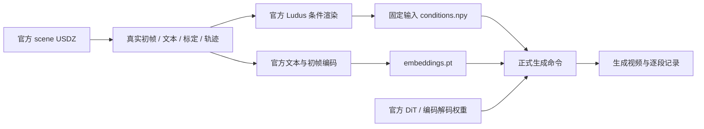

# V7.5 正式生成前的准备与复现

task/run：`WS-V75-PREFLIGHT-01 / 20260920-r1`。此文维护输入契约与命令；当前状态只见 [RESEARCH_STATUS](../RESEARCH_STATUS.md)。实验协议见 [PROBLEM](PROBLEM.md)。



本轮准备工作止于条件渲染、输入编码、权重加载与 cache 初始化。图中“正式生成命令→生成视频”需要后续显式执行；没有把条件图当生成结果。

## 资产与边界

| 资产 | 来源及本地位置 |
|---|---|
| 官方源码 | `/root/autodl-tmp/external/worldsim_v75/flashdreams`；固定 `bc711d6f95693d73693e6b5fac75749cc6fcf1d7`，不改第三方实现 |
| DiT | HF `nvidia/omni-dreams-models`；`/root/autodl-tmp/models/worldsim_v75/omni-dreams-models/single_view/2b_res720p_30fps_i2v_hdmap_distilled.pt` |
| 场景 | 公开 `nvidia/omni-dreams-scenes` 的 `0d404ff7-2b66-498c-b047-1ed8cded60d4` 默认天气；只有一个真实初帧，没有真实未来 RGB 序列 |
| 文本编码器 | 魔搭 `nv-community/Cosmos-Reason1-7B`；`/root/autodl-tmp/models/worldsim_v75/Cosmos-Reason1-7B-modelscope` |
| LightVAE / LightTAE | `lightx2v/Autoencoders`；资产根目录 `lightvaew2_1.pth`、`lighttaew2_1.pth` |

文本编码器与官方 pin `3210bec0495fdc7a8d3dbb8d58da5711eab4b423` 的配置、tokenizer配置、预处理配置、权重索引逐项 JSON 相等；四个权重分片尺寸相等。这是来源与结构核对，尚不是全部权重数值相等证明；保留镜像来源标记。

`omni-dreams-scenes` 与曾返回403的 `omni-dreams-samples` 是两个仓库。前者已足以做当前单场景工程开发；不能把一个场景或天气变体作为多日志独立确认。

## 输入契约

- RGB：`camera_front_wide_120fov` 的真实 `frames/.../1201111.jpeg`；由官方 loader resize 至704×1280，保留原包。
- 官方 bundle 的轨迹起点为1090710µs，比RGB早110401µs。本轮在RGB时间取位姿，后续30fps按平移线性插值和SO(3) Slerp处理，禁止外推。
- 首段5帧，此后每段8帧；准备30段共237帧（视频时长7.9秒，首末帧时间差7.866667秒）。这是约8秒的原生完整chunk窗口，不能声称恰好240帧。
- 场景、地图与actor保持原始记录；当前没有注入重建错误，没有策略反馈。
- 编码输出：text `[1,1,512,100352]`，image `[1,1,1,16,88,160]`；FP/BF16格式按官方配置。逐个运行一次性编码器并释放，使用官方 `initialize_cache_from_embeddings` 接口；没有改分辨率、历史窗口、调度器或量化权重。
- 不使用 [V75-F01](../research_failures/entries/V75-F01.md) 中缺输入绑定的batch wrapper。正式命令直接传入指定条件数组、embedding和相机。

## 运行

环境：`/root/autodl-tmp/envs/worldsim-v75`，Python3.12.14、torch2.12.1+cu130。安装清单来自官方 `uv.lock` 的 `uv export --frozen --package flashdreams-omnidreams --no-hashes`；Python3.12使用官方UI依赖的预编译wheel。锁定的cuBLAS13.8.0.4和protobuf7.36.2与PyTorch/grpcio-tools声明不兼容，实际修正为cuBLAS13.1.1.3、protobuf6.33.6，并通过 `uv pip check`。版本记录见证据目录。

CUDA编译器13.0.88单独位于 `worldsim-v75-tools` 的 `nvidia/cu13`，不改变全局CUDA。CUDA runtime包的 `libcudart.so.13` 增加同目录 `libcudart.so` 符号链接；运行脚本补上独立编译工具与运行时的头文件路径，官方Ludus扩展原样编译。

本版本应用入口是 `flashdreams-run-v2`；其 `interactive-drive-omnidreams --help` 已通过。旧 `flashdreams-run --no-instantiate` 不适用于这个V2应用；本轮通过直接配置序列化完成不实例化检查。

```bash
cd /root/autodl-tmp/motion_proj
source scripts/worldsim_v75/environment.sh
python scripts/worldsim_v75/prepare.py scene
python scripts/worldsim_v75/prepare.py render
python scripts/worldsim_v75/prepare.py embeddings
python scripts/worldsim_v75/prepare.py weights
python scripts/worldsim_v75/run_baseline.py --blocks 30
```

最后一条不带 `--execute`，只验证输入与待执行参数。`embeddings` 有一次文本编码与一次初帧编码；`weights` 做完整pipeline权重加载与cache初始化。这些不等于DiT生成或完整显存峰值测试。

正式开始时先显式运行一段，检查实际生成与显存；通过后才运行完整基线。输出存在时拒绝覆盖，所有路径和seed入结果JSON。

```bash
python scripts/worldsim_v75/run_baseline.py --execute --blocks 1 --seed 42 \
  --output /root/autodl-tmp/runs/worldsim_v75/WS-V75-PREFLIGHT-01/20260920-r1/first-block-seed42.mp4
```

只有一段输出验证后，才使用 `--blocks 30` 和新的输出路径。此处提供命令，不表示已经执行。

## 证据归属

轻量结果在 [preflight](../autoresearch/worldsim_v75/preflight/)；原始条件数组、embedding、图像和日志在 `/root/autodl-tmp/runs/worldsim_v75/WS-V75-PREFLIGHT-01/20260920-r1`。接口证据在 [qualification](../autoresearch/worldsim_v75/qualification/)；完整下载日志另在 `WS-V75-QUALIFY-01/20260920-r1`。

failure_ledger_refs：V74-H2-F20、V74-H2-F21、V74-H2-F22、V75-F01。接口审计新增V75-F01属于工程问题；本预检不预设科学失败。人工 verdict：null。

本次实测：官方renderer完成237帧；文本/初帧编码峰值分配显存15.96GiB；主模型权重和cache初始化8.61GiB。正式DiT生成前向为0。上述数值不是完整生成的峰值或显存保证。
