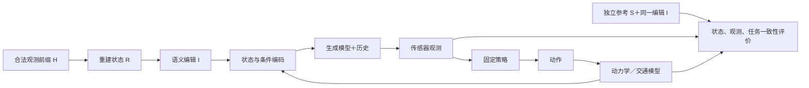

# V7.5：支撑可信反事实仿真的重建状态

**What reconstruction state is needed to make counterfactual generative simulation faithful?**

好的 WorldSim，应在声明的场景、干预和策略范围内，忠实呈现干预后的世界及其后果：执行指定干预，保留不受影响的世界事实，产生符合可见性与动力学约束的观测，并使策略评测结论与可信参考一致。对输入无法确定的事实，评价应保留不确定性。

这是研究定义，不是已经成立的重建必要性结论。当前状态只写在 [RESEARCH_STATUS](../RESEARCH_STATUS.md)。旧[定位协议](protocols/PROBLEM_20260920_INITIAL.md)和[闭环误差协议](protocols/PROBLEM_20260920_CLOSED_LOOP.md)保留；新定义不追认旧实验通过新标准。

## 先分清世界被编辑，还是世界被估错

设真实/参考初态为 S，合法观测前缀为 H，重建为 R(H)，明确干预为 I。

- **场景编辑**：参考世界也按同一语义变为 I(S)。移走 A 后，评价中的 A 也应移走；原日志未来不再是编辑后的唯一真值。
- **重建误差**：固定同一个 I(S)，比较 I(R(H))、普通修复和明示额外信息的参考状态。不能把参考一起移到错误估计位置来消除误差。
- **生成误差**：输入状态和相机请求正确，但生成的可观测关系不遵循它们；先排除接口与读出问题。
- **闭环响应**：策略因世界变化而改变动作本身是正常响应。应检查响应及后果是否符合编辑后的参考，不奖励与未编辑日志轨迹接近。

## 输入、状态与评价的组件



重建、生成器和动力学负责的状态变化必须明确。当前官方单视图 2B 适配使用初帧、文本、cuboid/地图 raster 和生成历史；已检查实现为 `run_approach_closed_loop.py`、`closed_loop_bridge.py` 与 `render_argoverse.py`。若两种重建经编码后的全部输入相同，不能声称输出差异证明模型利用了隐藏表面。接入新状态通道须另立接口实验。

## 重建比较前必须先过 reference editability gate

```text
合法编辑确实进入 raster
        ↓ G0
参考/GT 状态下，生成观测服从同一编辑
        ↓ G1
不同重建状态产生可区分且可解释的输入
        ↓ G2
错误、普通控制和修复在新来源复现
        ↓ G3
有可信参考的策略后果评价
```

G1 失败时，实验首先测到的是生成器或接口对状态编辑不敏感，不能继续按输出优劣排名重建。G1 通过后，重建误差才有机会成为下游瓶颈；这不是把生成器失败排除在 WorldSim 之外，而是先定位哪个组件限制了反事实保真度。

2026-09-21 的对象移除实验给出直接反例：曝光开发源中，reference 状态能移除 A，而普通类别先验使 A 残留；但在冻结的新来源中，reference、DVGT 和类别先验三臂都保留 A。即使从第 0 帧状态起完全删除 A，初始 RGB 中的 A 仍在全部 10 个后续采样点出现。因此“类别先验破坏编辑性”未获独立确认；新来源支持的是 initial-image anchor 压过结构化状态编辑。详见[对象移除报告](ACTOR_REMOVAL_COUNTERFACTUAL.md)。

随后新增的中距 reference-only 门控中，A 从 unedited 的10/10降到 removed 的7/10，但仍未通过 G1。三个固定来源的初始投影面积/深度与残留从 `3854px²/47.97m→1/10`、`5859px²/41.88m→7/10` 到 `18229px²/20.26m→10/10`，形成视觉显著性候选。来源差异仍是混杂因素，不能称因果曲线。

为补远距独立来源而冻结的下一批8日志没有一个满足同一遮挡与真实支持门槛；不继续放宽筛查。即时删除被关闭为当前数据/接口下的重建比较入口，后续改测与初始图像一致的未来轨迹干预。

## 五项质量分别报告，不合成一个总分

| 质量轴 | 要回答的问题 | 不能用什么替代 |
|---|---|---|
| Replay fidelity | 未编辑且相同动作/相机下，是否复现有真实观测支持的状态与输出？ | 好看的视频；不同动作的未来强行逐像素对齐 |
| Intervention fidelity | 指定存在性、位置或轨迹是否落实，并保持身份与尺寸约束？ | 只看条件文件已被改过 |
| Unaffected-fact preservation | 未受干预因果影响的世界事实是否保留？ | 要求所有其他像素或演员轨迹不变 |
| World/visibility consistency | 同一世界在新视角、遮挡与显露后是否一致？ | 把无观测支持的隐藏纹理当唯一真值 |
| Decision/outcome fidelity | 同一策略在仿真与可信参考中的事件、效用和相对优劣是否一致？ | 碰撞越少、进度越多、越像原日志就越好 |

**策略效用与仿真保真度是两种量。** 差策略在参考世界碰撞，仿真却让它通过，即使碰撞率下降，仿真也可能更不可信。碰撞、进度、规则和舒适性分别记录，再评估仿真与参考的偏差，识别 false-safe 与 false-unsafe。策略排序需要多个合格策略及可信参考，现有单一 IDM 不能提供这一证据。

“不变”指不受影响的世界事实。移动 A 后，B 的可见性、其他车的制动、阴影和遮挡可以改变；固定其他演员的实验只能说明非反应式交通。未知隐藏内容评价几何/语义约束或合理结果范围，不惩罚所有不同的合理补全。

## 可验证的反事实范围

对事前声明的场景分布、编辑类型、输入预算、窗口与策略集合，分别报告五项证据、覆盖率和不可判定比例。所需各项在相应参考下通过，才称为已验证的 counterfactual envelope。缺真值不算通过，也不算模型失败。

编辑幅度不是统一距离：横移米数、移除对象和改变遮挡关系分开报告。遮挡切换可以不连续，不要求质量平滑下降或严格单调。有限离散点只支持这些点，不证明其间或更远处全部可靠。一次配对 seed 仅控制随机性，不能估计正确未来的完整分布。

## 重建价值的可证伪主张

在同一编辑后参考世界、相同合法观测预算、生成器/策略/动力学下，某种可传入的重建状态改善了**事前指定的反事实状态或可见性错误**；普通强控制后仍有差距，修复能恢复，并在新固定来源复现。进一步改善相对于可信参考的闭环事件/效用偏差，才支持闭环仿真价值。

不预设复杂几何、更强 SOTA 或隐藏背景重建必然有效。普通框已足够则采用普通解；编码后无差异则此接口无法检验该性质；仅有未知内容的不同合理猜测则不能建立确定性错误主张。

第一轮按[评价与有限实验协议](COUNTERFACTUAL_EVALUATION.md)实施一个可验证编辑任务，不同时开展移除、横移、新视角曲线和多策略榜单。不再追加旧制动候选的 seed、时长、尺度或跟踪参数搜索。单卡 OOM 即停，无训练或自动关机。

## 一手依据与边界

- [NuRec 与 Li Auto 工程报告](https://docs.nvidia.com/nurec/best-practices/scaling-neural-reconstruction.html)分别评价传感器、感知和闭环一致性，发布决策重视闭环复现。生产实践不能证明任意反事实正确，本项目两个开发任务也不能证明“重建已经成熟”。
- [OmniDreams 官方介绍](https://research.nvidia.com/publication/2026-06_nvidia-omnidreams-real-time-generative-world-model-closed-loop-autonomous)说明结构化状态、动作条件和生成历史通路。迁移接口分工，不把正确条件等同正确输出。
- [World-in-World](https://arxiv.org/abs/2510.18135)支持视觉质量不足以评价智能体任务价值；任务成功本身仍不等于真实反事实一致，本项目需另建参考。
- [固定官方实现](https://github.com/NVIDIA/flashdreams/tree/bc711d6f95693d73693e6b5fac75749cc6fcf1d7/apps/interactive_drive)作为实际接口依据；未运行完整 NuRec、AlpaSim 或多策略榜单，就不用其名义报告结果。

人工 verdict：null。
