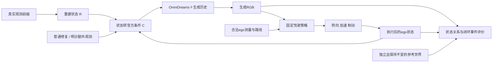

# V7.5：哪些重建误差会改变生成世界模型的状态？

**Which reconstruction errors matter to the generative world model state?**

这里的“matter”由闭环任务定义：在相同真实世界与驾驶任务下，重建误差是否改变生成观测中的障碍物存在、相对位置、运动或可通行关系，继而改变驾驶动作和执行结果；普通修复能否恢复这些结果。**不要求误差随时间放大，也不以证明放大作为接入闭环的前提。**

本次调整遵循2026-09-20用户要求。初始定位/恢复协议保留于[历史协议](protocols/PROBLEM_20260920_INITIAL.md)，对应实验不追加seed、时间窗口、扰动幅度或更细观察器。运行状态只见[RESEARCH_STATUS](../RESEARCH_STATUS.md)。

## 输入、生成状态与反馈

区分真实参考世界、重建/估计状态和生成画面呈现的状态。只改重建及其条件，不能把参考车辆一起平移。策略只看约定的传感器输入、ego状态和路线，不能读取评价用的GT障碍物。ego因动作改变，参考actors保持独立的记录轨迹，第一轮限定非交互交通。

公开OmniDreams的通路是 **R→C(R)→W**。当前单视图2B使用初帧、文本、逐帧cuboid/地图raster和生成历史；没有改变初帧或条件的细表面误差不会通过此接口进入模型。研究对象限定于可表达的场景状态，不把未暴露的phantom表面当作干预。

“生成状态”首先是任务相关的可观测状态，不把内部latent直接称作真实世界：车是否存在、与ego/行驶路径的关系是否改变、何时进入路径、是否保持运动身份。像素距离和3D中心范数用于解释变化，不能替代任务结果。

## 第一轮只接通一个有用的闭环任务

优先前车跟随/制动这一条任务链，不同时铺转弯、路口、多策略、多生成器。使用成熟普通控制器或输入契约适配的现有驾驶策略；先在真实观测下验证它能识别影响行驶的车辆并输出合理动作。单视图不假装具备缺失的多摄像头或LiDAR。相机裁剪、标定、时间戳、速度、路线和更新频率显式绑定。

官方Interactive Drive已有command→动力学→相机位姿→Ludus→生成chunk，默认command来自人工输入；键盘demo不是自动驾驶策略证据。复用该通路建立无UI、顺序执行接口，每段输出交给策略后才构造下一段条件，保留官方生成cache。先检查动作确实改变下一段相机/条件、时间无错位；工程控制指令测试不计作科学闭环结果。

真实输入基线通过后，固定一个开发任务、seed42、一个短任务窗口，比较GT场景状态、实际DVGT读出、普通校正、额外参考修复。必须保留普通全局尺度控制；LiDAR/GT信息单列，不能叫同预算优势。初始RGB、策略、路线、其他actors及随机性配对一致。GT生成也经过同一策略，不能直接用日志动作作优势基线。

同时保存：

1. 生成画面中的任务状态及其与条件状态的关系；相机遵循不可靠时不伪造米制恢复。
2. 策略何时改变跟车/制动动作，保存实际输入帧与决策记录。
3. 真正执行后的ego轨迹、制动时刻、速度/进度与独立参考间距或重叠；不能用全程不动换少碰撞作为改善。

日志动作回放、真实输入策略检查、GT条件生成闭环分开报告。离开日志轨迹后没有真实RGB，不能拿原日志像素当反事实GT。地图/actor几何可约束事件，不能提供反事实摄影真值。

## 按任务意义判断误差

第一种误差沿用已有自然定位读出，但区分纵向距离与横向路径占用关系，不再按3D范数找最大的目标。来源和目标先由真实任务定义；已曝光日志只作开发。只有任务证据支持才扩展漏物体、尺寸/朝向、轨迹身份或地图边界。

| 结果 | 决策 |
|---|---|
| 图像/几何改变，策略与任务无实质变化 | 保留该任务下影响小的案例 |
| 动作改变且独立参考下任务变差，普通修复恢复 | 优化这个具体状态误差，先用有效普通解 |
| 普通控制基本消除差距 | 不宣称复杂生成记忆或新几何机制必要 |
| GT生成或真实输入策略自身不合格 | 修明确接口错误或记域/策略限制，不归咎重建 |
| 只在未验证相机/检测器失败时出现信号 | 保留不可判定，不改阈值维护结论 |

不追加长时放大、历史清空、seed/阈值扫描或多backbone研究。单卡OOM立即停止，不自动降配置或重试；没有训练与关机任务。完整链条出现有效解后，再冻结未曝光任务有限确认，不等所有归因完成才推动修复。

## 连续性与主图

V7.4的[F20](../research_failures/entries/V74-H2-F20.md)、[F21](../research_failures/entries/V74-H2-F21.md)、[F22](../research_failures/entries/V74-H2-F22.md)表明局部重建或感知误差不自动等于驾驶危害，策略真输入基线必须合格。V7.5已有[定位响应](LOCALIZATION.md)、[自然读出正反案例](NATURAL_STATE.md)、[可见性窗口](VISIBLE_COHORT.md)，没有建立普遍失效或闭环危害。

主图目标：**真实任务RGB＋被改动状态 → 实际生成画面的任务关系 → 策略动作 → 参考世界的执行轨迹/事件**，配GT、自然误差、普通修复同场景对照。先有真实反馈结果，再画因果主图；不画虚构事故或用局部像素图替代闭环证据。

## 一手实现依据

- [官方Interactive Drive](https://github.com/NVIDIA/flashdreams/tree/bc711d6f95693d73693e6b5fac75749cc6fcf1d7/apps/interactive_drive)：`core.py` ModelLoop、`control.py`、`simulation/ego_vehicle_kinematics.py`。
- [官方gRPC协议](https://github.com/NVIDIA/flashdreams/blob/bc711d6f95693d73693e6b5fac75749cc6fcf1d7/integrations_v2/omnidreams/impl/grpc/protos/video_model.proto)：session、rig trajectory、dynamic actors与逐chunk图像输出。
- [OmniDreams论文](https://arxiv.org/html/2606.03159v1)与[模型卡](https://huggingface.co/nvidia/omni-dreams-models)：当前公开配置不自动代表另训的reconstruction fixer或多视图系统。

这是研究定义，尚非科学结论；人工verdict：null。
