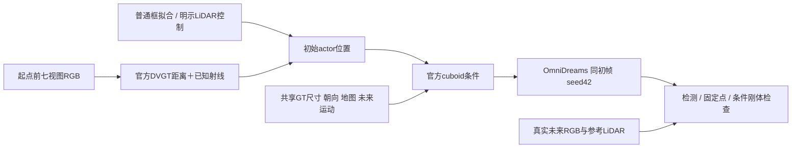
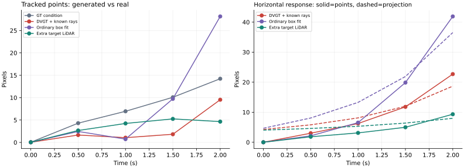
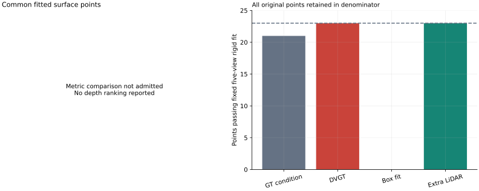

# V7.5 可见性前置开发窗口

本轮没有确认一致退化且可修复的自然生成 badcase。目标在重建前锁定，模型良好表现、参考不可靠和观察器失败均保留。人工 verdict：null；failure_ledger_delta：none。当前方向只见 [研究状态](../RESEARCH_STATUS.md)。

## 分母与输入

`WS-V75-VISIBLE-DEV-01 / 20260920-r1` 冻结4条本地完整、未在既有项目文档提及的日志；这仍是开发资源，文档未提及不保证从未曝光，预训练重叠未知。按几何可见性、参考支持和初始投影面积排序，每日志最多检查6目标；五个真实时刻通过后，每日志选择首个合格目标，最多前两日志。在读取DVGT结果前保存选择。

| 日志前缀 | 几何候选 | 真实观测结果 |
|---|---:|---|
| 214e388e | 0 | 无候选 |
| 24642607 | 1 | 银色停放轿车，23/23初始点在五时刻保留 |
| 29a00842 | 6 | 前两候选遮挡，第三个黑色行驶车辆通过，20/20点；其余排除原因保留 |
| 2c652f9e | 1 | 被横穿车辆遮挡 |

完整分母：4日志→8几何候选→2真实可测目标→2次官方DVGT→1参考合格目标→4组实际生成。完整UUID、截图、排序和时间戳见[轻量证据](../autoresearch/worldsim_v75/visible_cohort/)。未重新打开上一轮4→3→0窗口。

## 两个读出，保留尺度改善

单位为初始车辆中心残余米。DVGT通过官方距离＋已知相机射线＋GT尺寸/朝向读出，不是原生点图坐标准确率或纯视觉端到端系统。

| 目标 | DVGT | 全局LiDAR定尺度 | 普通框拟合 | 额外目标LiDAR | 生成 |
|---|---:|---:|---:|---:|---|
| 银色轿车 | 3.423 | 1.083 | 11.702 | 0.206 | 四组 |
| 黑色车辆 | 2.755 | 0.110 | 6.175 | 0.663 | 参考超过预定0.5m，不运行，不补位 |

本轮两例全局尺度都有帮助。四组生成冻结为GT、DVGT、普通框、目标LiDAR，没有全局尺度生成组，不能声称普通定尺度无法解释生成差距。所有含LiDAR控制提供额外度量观测。

## 实际生成结果

`WS-V75-VISIBLE-ROLLOUT-01 / 20260920-r1`：银色轿车、seed42、四组各237帧、704×1280、30fps。改变目标初始world平移并贯穿轨迹，共享真实初帧、文本、GT未来运动及其他场景成分。主观察时刻为0、0.5、1、1.5、2秒，不追加seed/窗口/阈值。

| 条件 | 检测匹配 | 检测中心完整均值(px) | 共同点二维均值(px) | 联合刚体条件通过点 |
|---|---:|---:|---:|---:|
| GT | 5/5 | 5.24 | 7.12 | 21/23 |
| DVGT | 5/5 | 3.78 | 2.82 | 23/23 |
| 普通框 | 4/5 | null | 8.22 | 0/23 |
| 目标LiDAR | 5/5 | 1.74 | 3.37 | 23/23 |

LiDAR改善检测中心，但共同点指标未同步改善；小差异不解释成显著恶化。DVGT残余没有造成统一可见退化，GT条件也不是生成质量最优。普通框生成出现外观失真，但不能据此推导事故或全体重建模型失败。

追加的三角测量协议在生成启动后、读取生成影像/结果前冻结，不能称整轮预注册。真实轿车2秒移动0.034m，相对相机基线21.69m；23/23点通过，8个3px内LiDAR邻近关联的深度差中位0.268m。固定拟合需五时刻追踪、正深度、视差≥2°、重投影中位≤2px且最大≤4px。邻近LiDAR不等于特征点精确真值。

四组共同合格点为0，三维距离与排名全部null；不删除普通框组来恢复排名。0/23指联合条件未通过，不能统一解释为物理非刚体。**拟合使用请求相机轨迹，生成相机是否遵循请求尚未独立确认，因此这是条件刚体诊断，不是已测出的实际米制车辆状态。**

## 执行、资产与边界

- 四个视频和并排视频均完整解码237帧；条件绑定检查覆盖前61帧，目标并集外像素变化为0；所有非目标场景成分相同。
- 每组含加载约122.79–123.90秒，PyTorch峰值12.806GiB；四组队列含编码、评价和制图673.85秒。追加RAFT分析6.00秒、2.56GiB。无OOM。
- 官方FlashDreams `bc711d6f95693d73693e6b5fac75749cc6fcf1d7`；官方DVGT `51cf3f6d11fdff8bc7e2bbe1a88f71665ccb2236`，第三方源码未修改。
- 原始输入、模型读出、条件、视频和逐点结果：`/root/autodl-tmp/runs/worldsim_v75/WS-V75-VISIBLE-DEV-01/20260920-r1/`。局部脚本入口为 `scripts/worldsim_v75/prepare_visible_sources.py` 到 `assess_visible_rollouts.py`。
- 本轮为条件读出诊断，没有策略反馈或跨模型普遍性结论。定位/放大追查在此收口；研究闭环任务不以继续证明局部放大为前置条件。
