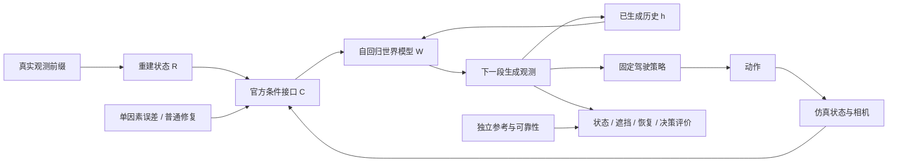

> 历史协议：本页保留2026-09-20方向调整前定义，不是当前任务指令。当前定义见[PROBLEM](../PROBLEM.md)。

# V7.5：重建状态误差如何影响生成式闭环仿真

研究起点：2026-09-20。本页定义问题、接口与实验边界；运行状态只见 [RESEARCH_STATUS](../../RESEARCH_STATUS.md)。

## 问题

**在相同可用观测下，哪些重建状态误差会经由生成模型的真实条件接口，造成可重复、可修复的世界状态偏差，并进一步改变闭环仿真的决策？**

英文工作题目：**Reconstruction State Errors in Generative Closed-Loop Simulation**。

“误差放大”是其中一个待检验假设，不写进既定结论。反馈既可能放大，也可能衰减或纠正初始误差；持续输入错误条件导致持续错误，也不等于自回归放大。

V7.4 的连续性在于：已经看到局部重建几何可以改变感知定位，但没有获得普遍 phantom→严重驾驶危害的证据；普通删除也解释了一部分恢复。V7.5 把评价对象推进到动作条件生成器维护的世界状态，不重新维护旧 first-return claim。继承 [F20](../../research_failures/entries/V74-H2-F20.md)、[F21](../../research_failures/entries/V74-H2-F21.md)、[F22](../../research_failures/entries/V74-H2-F22.md) 的否定边界。

## Architecture components

先锁定动作做生成敏感性实验；该阶段是 action-conditioned autoregressive rollout，尚不是 policy feedback closed loop。通过后才开放策略→状态→条件的反馈边。

## 必须先分清的三个对象

1. **物理参考状态**：世界真实是什么。人工干预中保持不变。
2. **估计/重建状态**：模型认为世界是什么。这里施加定位误差。
3. **生成图像中的状态**：用独立评价观察生成器到底呈现了什么。

只把 actor 在 simulator、条件和参考中一起平移，是正确的场景编辑，不是 reconstruction failure。只修改条件而参考不变，是输入估计误差的敏感性诊断；它本身也不证明模型不够鲁棒，更不证明某种自然重建误差普遍存在。

## 官方接口审计与主线选择

| 对象 | 一手资料支持的定位 | 本轮用途 |
|---|---|---|
| OmniDreams | RGB 初帧、文本、逐帧世界场景 raster、生成历史；公开主权重为 single-view 2B | 唯一首轮生成主线 |
| Xiaomi JWM | WorldRec 的场景状态渲染为额外 RGB prior，WorldGen 为此单独训练 | 最近的任务/方法竞争；本轮未核实可下载的完整 JWM 实现与权重 |
| GeoWAM | 预测未来几何并驱动动作头 | 相关 geometry-action 工作，不能替代生成式传感器仿真器 |
| NuRec / 既有 SplatAD | 重建式传感器参考 | 有效观测范围内作参照；不是反事实真实世界 GT |

OmniDreams 的公开输入不是点云/网格。需显式写成 **R→C(R)→W**：车辆位置、尺寸、朝向、地图边界可通过 cuboid / polyline 条件进入；如果某种表面误差没有改变 C，也没有改变初始 RGB，那么在相同随机性下它不能通过此接口影响 W。禁止把没有暴露给生成器的 phantom surface 当成已施加的干预。

第一批只研究 **actor localization**。尺寸、静态结构、遮挡 support 保留在候选表中，按首轮证据决定是否需要；不立即铺四种干预、四个 backbone。若公开接口只支持粗场景状态，结论就限制为这种状态；只有验证自然 reconstruction→state readout 的链条，才升级为重建问题。

## 有限首轮

### P0：官方基线与测量先过关

- 使用官方原生初帧、文本、轨迹、条件和相机，不先用 nuScenes 自制条件绕开域差异。
- 首先跑 1 个公开 scene 的短序列与相同输入重复；用于工程开发，不能作为独立确认。取得合法样例权限后，按 UUID 字典序预留 3 个开发、3 个未查看输出的确认 scene；先检查输入完整性和目标可见性，记录所有排除原因。
- 有真实未来图像的 logged-action 片段用于校准评价器；单目生成视频不直接承诺可靠的米制 3D 中心误差。先评价可靠可见目标的投影、轨迹连续性、可见/遮挡事件；米制结果需独立标定与可验证的深度来源。
- 真实/参考输入下不可靠的目标保留分母，但不纳入几何因果准入。不能用同一个重建模型同时生成错误与裁定错误。

### P1：定位敏感性与条件恢复

在 3 个开发 scene 各固定 1 个干净可见 actor，固定 seed 42/43、8 秒、官方 704×1280 和调度器。只做沿初始 ego 前向的 ±0.5m 位移，整个 actor track 使用相同 world-frame 偏置，避免人为引入速度跳变。

| 条件 | 状态输入 | 目的 |
|---|---|---|
| clean | 始终原始状态 | 正常基线 |
| negative / positive persistent | 在第一个生成 chunk 后持续 ±0.5m 偏移 | 直接条件响应 |
| negative / positive restore | 第一个生成 chunk 后连续 4 chunks 偏移，再恢复原状态 | 观察历史是否残留，恢复是否奏效 |

共 3×2×5＝30 个 discovery rollouts。先跑单 scene 两 seed 的 10 项，有实际信号再补满。符号、幅度、时长、目标选择在查看生成结果前固定。±1m 仅作为预注册的单个诊断 fallback：若 ±0.5m 在条件图中已可分辨却无稳定结果，不无限放大到非自然范围。

额外一次 seed42 的 clean 重复检查实现确定性；若不确定，报告重复噪声并加入配对重复，不把随机波动当成误差影响。条件重渲染必须保留原地图、其他 actors、初帧、caption、轨迹、时间戳和随机流；用同一官方 renderer 保存干预前后输入图和差分。

### P2：只对真实信号做强控制

- **直接几何响应**：条件改变多少、图像投影改变多少，先排除透视放大；不能用像素偏差除以米制输入误差称“放大率”。
- **恢复与历史**：恢复正确条件后的残余相对 clean 的配对差；对比相同条件下不带受污染历史的分支。必须正确恢复 encoder、DiT KV、decoder cache 和 RNG，不能只清空其中一个状态。
- **单步/真历史诊断**：有真实记录的情况下，以真实历史进行对照，明示额外观测信息；不能把反复 reset/teacher forcing 的任务变化称为同信息方法优势。
- **普通修复**：已有合法观测上的轨迹平滑、刚体一致性、普通 box fitting / alignment 先做；GT state 只作 oracle 上界。
- **自然误差**：再检查 DVGT-1 与一个已有明显定位残余的官方重建模型；冻结状态提取与尺度协议。V7.4 的局部距离误差不是现成的 box-center 偏移，更不能直接搬成生成条件误差。

### P3：反馈与独立确认

只有生成状态出现稳定、可恢复的偏差，才接相机契约兼容的固定策略。先验证真实输入策略基线，再比较同一参考世界上的 clean / biased / repaired。固定动作与反馈动作分开报告；记录 action divergence、轨迹与事件时间，分析偏差是持续、衰减还是增加。

新 scene 上确认后才能声称跨场景；换第二个生成器后才能讨论跨模型。单视图公开权重不能冒充论文多视图设置。偏离真实轨迹后无真实像素 GT：几何/地图一致性是约束性证据，NuRec 是 reference simulator；事故/false-safe 需要独立参考事件，不能由内部 simulator 自己判对。

## 判据与停止规则

一个问题值得进入方法开发，至少同时满足：自然会发生；明确条件通路；超过评价噪声且具有任务意义；在额外观测或普通修复下存在恢复空间；未曝光日志仍重复。

- 30项有限定位实验无稳定影响：降低该变量优先级，只允许预注册 fallback；不扩大筛选、阈值或扰动来制造失败。
- 条件恢复后误差立即消失：承认主要是条件准确性问题，不主张历史放大。
- 普通校正/平滑已解释收益：采用该强控制，不立复杂 memory / reconstruction 机制必要性。
- 只在人工大偏移或接口不一致时出现：关闭自然重建缺口表述。
- 缺权重、基线或参考：记工程/访问/数据限制，不记科学否定。
- 找到一个确实能改善目标任务的解，及时整理 problem–method–evidence；不追加无限诊断。

## 论文价值边界与拟产出

“几何有用”“重建锚定生成”“视频逼真不等于动作正确”“自回归会累积误差”都有前作，不能单独作为 novelty。潜在贡献需要落在：**发现自然重建中具体且可优化的敏感状态误差，并用有效的重建/状态修复改善真实生成闭环**。不预先许诺 Closed-Loop-Aware Reconstruction 是主方法。

主图采用同一 actor 的 **真实 RGB / 条件与误差 → clean、biased、restored 的生成时间序列 → 状态偏差和恢复曲线 → 通过准入后的策略反馈结果**。每行标输入来源、时间与 seed；保留改善和无影响场景。当前只能产出接口/实验图，不画虚构的生成结果或事故。

## 一手来源（2026-09-20 核实）

- [OmniDreams 官方论文 §2、§6、§8](https://arxiv.org/html/2606.03159v1)：世界场景条件、闭环接口，以及另行 post-train 的 reconstruction fixer；公开默认权重不能自动视为 fixer。
- [官方模型卡](https://huggingface.co/nvidia/omni-dreams-models)：single-view checkpoints 和输入；[FlashDreams](https://github.com/NVIDIA/flashdreams) 实际源码审计固定在 `bc711d6f95693d73693e6b5fac75749cc6fcf1d7`。
- [FlashDreams OmniDreams 文档](https://flashdreams.org/main/models/omnidreams.html)：约48GB最低显存说明，不是双24GB必然可运行的保证。
- [Xiaomi JWM §3.3](https://arxiv.org/html/2605.18137v5)：渲染先验条件与对应训练；不把宣传中的稳定性直接当成本项目测量结果。
- [GeoWAM](https://arxiv.org/abs/2608.23486)：未来几何预测与动作头。
- [Validate the Dream](https://arxiv.org/abs/2607.07196)：视觉质量与动作遵循可排序相反，V7.5需有更具体的重建变量与有效解。
- [World-in-World](https://world-in-world.github.io/)：闭环具身效用评价已存在。
- [GIM-World](https://arxiv.org/abs/2606.02436)：geometry-aware memory 已有竞争，不能仅以“增加几何记忆”立题。

以上定义为待检验研究协议，不是已发现科学 badcase 的报告。人工 verdict：null。
