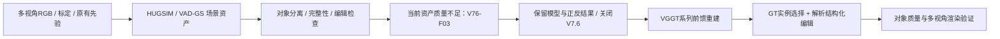

# V7.6 收口：保留 Gaussian baseline，后续重建改用 VGGT 系列

task：`WS-V76-CLOSEOUT-20260926`。日期：2026-09-26。用户明确关闭V7.6；failure为[V76-F03](../research_failures/entries/V76-F03.md)。当前执行状态只见[RESEARCH_STATUS](../RESEARCH_STATUS.md)。

当前HUGSIM和VAD-GS两批资产的对象级质量尚不足以直接支撑目标高保真反事实编辑。停止逐场景Gaussian资产接editor及对象级修补，保留已有结果作为baseline/failure evidence。后续重建基座使用VGGT系列，首个候选为冻结VGGT-Ω。

## Architecture components

## 最终原始结果与未完成范围

| 记录 | 分母 | PSNR ↑ | SSIM ↑ | LPIPS ↓ | 解释 |
|---|---:|---:|---:|---:|---|
| P0R1 30k 官方时间test | 75 | 25.2378 | 0.8028 | 0.1717 | 相机0–4，RGB不参与梯度训练；初始化先验仍可能使用候选帧 |
| P0R1 30k Camera5外推 | 61 | 8.1893 | 0.4871 | 0.4901 | 全路未见相机方向，独立于官方时间test |
| P0R1 30k 观察序列 | 305 | 26.5981 | 0.8497 | 0.1538 | 含230训练与75留出视图，仅重建控制 |

以上来自已存在的JSON；本次未启动新推理。30k训练、官方时间test、Camera5外推已完成。旧文档09:18的“继续30k”是历史过程，不再是当前待办。305视图对应五相机×61时刻、6秒观察序列，不是10秒外推。

30k横移队列于2026-09-26 13:46（Asia/Singapore）以返回码1退出，原始断言为 `actor 7 world transform changed during camera edit`。未完成该横移检查，不再为旧路线继续排查或修补。4k几何门禁通过的证据保留，但不能推广为30k已通过。该工程错误与对象质量不足分别记录，不作单因素因果归因。

HUGSIM r9历史输出覆盖7场景、24个10秒case；原训练checkpoint曾按先前授权退役。2026-09-26另有重新取得的HUGSIM官方release资产，来源和完成状态保留在原manifest，不等同于恢复原7场景训练状态。V76-F02的同场景动态输入未过完整门禁，不能声称完成了严格同场景方法比较。

## 保留与恢复入口

本次不删除、移动或覆盖大型资产。轻量副本见[收口证据目录](../autoresearch/worldsim_v76/closeout_20260926/)，远端清单见其中 `retention_inventory.json`。

| 证据 | 远端保留位置 |
|---|---|
| P0R1原始配置、训练日志、4k/8k/16k/30k权重、指标及视频 | `/root/autodl-tmp/runs/v76_ego_view/VADGS-P0R1-000/` |
| 原始失败队列状态 | 上述目录 `pipeline_state.json`；另存 `CLOSED_BY_USER.json`，不改写原结果 |
| 错误初始化的P0控制 | `/root/autodl-tmp/runs/v76_ego_view/VADGS-P0-000/` |
| 同场景身份失败与原始sidecar | [V76-F02](../research_failures/entries/V76-F02.md)及[先验报告](MATCHED_SCENE_PRIORS.md)中的原始路径 |
| HUGSIM r9视频/指标与已退役资产边界 | [r9收尾索引](../autoresearch/worldsim_v75/downstream_bench/r9-closeout/README.md) |
| 重新取得的HUGSIM资产与来源 | `/root/autodl-tmp/models/hugsim_reacquired_20260926/` |

收口时读取存活进程，未发现V7.6、HUGSIM、VAD-GS相关训练、渲染、评价或启动控制器；无需发出kill。本地相关HUGSIM自动化已暂停，未发现V7.6自动化。本次无关机动作。

## 下一阶段的最小问题

在 `v77` 分支检验冻结VGGT-Ω、GT box/ID或实例mask及解析SE(3)编辑能否直接提供合格可编辑对象。MOVE、DELETE、clone-INSERT先不训练；非目标世界点应保持不变，遮挡显露的缺口显式保留，不能把点删除等同于完成背景补全。

对象分离、米制位置/yaw、存在性/数量及多视角完整性均须直接检查。几何需先与数据集米制坐标对齐，再解释“移动3米”；标定或真值锚点属于额外输入，必须披露。此时没有VGGT-Ω优于旧路线的实验结论。

`failure_ledger_refs: [V76-F01, V76-F02]`；`failure_ledger_delta: V76-F03`。归档中旧RUNNING、续跑和关机安排不产生新的执行授权。
