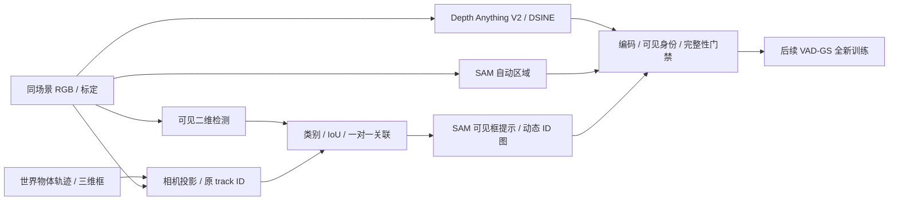

# V7.6 同场景先验：scene-0230 / 0255

任务：`VADGS-MATCHED-PRIORS-20260926`，seed 0，资源为单张 RTX 3090；利用 P0R1 的 CPU COLMAP 阶段准备输入。当前执行状态见 [RESEARCH_STATUS](../RESEARCH_STATUS.md)。本记录说明数据合同与核验，不是同场景重建结果。

## Architecture components

## 输入和方法边界

两场景取前61帧、6相机，各366个视图，已有 RGB、标定、世界物体轨迹和重新打包的 LiDAR `pointcloud.npz`。准备全部6路文件不等于将 Camera5 加入梯度训练；实际训练相机由后续配置确定。P0R1 仍使用原始官方样例先验，本适配不改变它的输入。

深度为 Depth Anything V2 ViT-L 原生输出逐图归一化到 uint8，VAD-GS 读取后取 `255-value`。两场景已有各366张。生成方式是同场景适配，不能冒称与官方打包样例逐像素一致。初始化先验包含候选时间 test 帧；不是完全未见数据协议。

DSINE 使用官方 commit `ef0c2afa32b4dd19cb8ca4567c652802cd92591c` 的 `DSINE_v02`、`exp001_cvpr2024` 配置与完整权重，按原始1600×900分辨率和真实相机内参推理。代码路径依据官方 [test_minimal.py](https://github.com/baegwangbin/DSINE/blob/ef0c2afa32b4dd19cb8ca4567c652802cd92591c/projects/dsine/test_minimal.py)，包括32倍数padding、内参平移、ImageNet归一化、5次细化与裁切。完整 state dict 严格加载，构造 encoder 时省去会被覆盖的独立 ImageNet 权重下载。没有改 VAD-GS 的法线读取约定。

## 法线编码核验

固定官方样例帧20、相机0–5，各重新推理一次，对比已有官方法线先验。下表是整个画面的平均方向夹角，不是对真实法线的准确率。

| 相机 | 原RGB编码 | 整体取反对照 | RGB/BGR交换对照 |
|---|---:|---:|---:|
| 0 | 1.933° | 178.067° | 52.697° |
| 1 | 1.368° | 178.632° | 98.377° |
| 2 | 1.890° | 178.110° | 53.903° |
| 3 | 1.619° | 178.381° | 61.934° |
| 4 | 2.044° | 177.956° | 70.741° |
| 5 | 4.778° | 175.222° | 41.689° |

固定六视图对照已检查：道路、建筑、车辆的方向颜色一致。支持编码和轴顺序正确，不证明法线是真值，也不证明后续重建会改善。输出为 RGB `floor((normal+1)*127.5)`；VAD-GS 用负RGB恢复相机法线，再按c2w旋转。未对已有官方先验覆盖写入。

见[数值证据](../autoresearch/worldsim_v76/matched-scene-priors/dsine_encoding_gate.json)与[全部六视图](../autoresearch/worldsim_v76/matched-scene-priors/dsine_encoding_comparison.png)。

两场景已各生成366张法线，推理耗时分别199.19秒和194.80秒；随后固定帧0/20/60×相机0/5抽查PNG shape、uint8格式和向量范数。完整文件分母见[输入核验](../autoresearch/worldsim_v76/matched-scene-priors/matched_priors_audit.json)。

## SAM 输入合同

复用本地 SAM ViT-H 权重，调用 [SAM 的自动区域和提示分割接口](https://github.com/facebookresearch/segment-anything)。代码来自已保留的 Grounded-Segment-Anything commit `99fbbe789cf99ff851886bca0935da33586db86b` 中的 SAM 包；不使用其 GroundingDINO 或 SAM-HQ 模型。自动区域使用32×32点网格、batch32、predicted IoU 0.88、stability 0.95、不加crop层。

动态对象判定复用 VAD-GS 在选定时间段内的位置标准差/首尾位移规则。三维框用真实 `obj_to_world` 和相机 `extrinsics` 投影，跨近裁面的框按边裁切。对每个投影框单独 SAM 提示，mask 裁到该投影包围框；冲突像素优先较近的对象中心。ID直接来自 `instances_info.json`，背景为255；uint8三通道中一通道写对象ID，其余保留255。背景自动区域采用2–254的灰度ID，未分配像素0，避免VAD-GS会跳过的0/1区域号。

这些是明确的适配选择：投影框提示及中心深度排序不能保证遮挡实例的像素真值，未发布的官方mask生成流程也无法逐项等同。固定帧20的六相机投影与SAM输出都已保存。

## 动态身份门禁未通过：V76-F02

12视图共17个动态对象提示，PNG的原ID、尺寸和数据类型全部合法，但出现清楚的可见身份错误：scene-0230 `020_3` 的行人ID6/21选中了遮挡他们的白车，scene-0255 `020_2` 的行人ID14/23选中了前景指示牌。四例均查看了原始RGB和未裁切mask的[局部图](../autoresearch/worldsim_v76/matched-scene-priors/sam_identity_gate.png)。

重新保存17个提示的[原始未裁切mask统计](../autoresearch/worldsim_v76/matched-scene-priors/sam_occlusion_audit.json)：上述四例框外像素比例分别8.84%、2.43%、9.12%、14.01%，只有最后一例mask面积大于框面积。因此“裁到框内”或“面积小于框”不能修复身份，不能把这些标签用于同场景训练。未逐个审核全部17个身份，4例只是确认反例数，不是总体误差率。

两场景各6张动态mask已移出训练入口并完整保留，加入 `DYNAMIC_IDENTITY_BLOCKED.json` 和生成入口guard。背景区域可独立准备，GPU阶段已完成scene-0230的366张和scene-0255的268张，03:01主训练启动时自动退出；剩余98张由两线程、低优先级CPU续做。两场景训练输入尚不合格，未启动训练。

按scaling law把它登记为本适配器的数据/身份工程失败 [V76-F02](../research_failures/entries/V76-F02.md)。唯一后续控制是“可见二维检测 + 类别和投影track关联，再提示SAM”；先用同一固定正例及遮挡反例验证，再决定是否扩展。它不改变当前以P0R1复现为主的问题，也不构成VAD-GS科学失败。

## 可见检测关联控制

已完成上述唯一控制：复用本地 [Torchvision Faster R-CNN ResNet50 FPN V2 COCO_V1](https://docs.pytorch.org/vision/stable/models/generated/torchvision.models.detection.fasterrcnn_resnet50_fpn_v2.html)，实际运行torchvision 0.16.2。score≥0.25、同类别且投影IoU≥0.3，阈值直接沿用V7.5的 `evaluate_localization.py`，在推理前写入[固定协议](../autoresearch/worldsim_v76/matched-scene-priors/visible_detection_protocol.json)。采用最大IoU的一对一关联，允许未匹配；没有网格搜索或事后改阈值。

在同一12视图/17个对象提示中，关联10个、未关联7个。预先指定的6个可见正例全部关联，4个确认遮挡错标全部未关联，其余3个未匹配提示不计入这10例门禁，也未被直接认定为不可见。协议是在看过原失败图后设定，属于开发控制，不是独立测试或完整召回评价。

随后以可见检测框重新提示同一SAM，输出到隔离的 `visible_detection_gate/sam_r1`，没有覆盖训练数据，也不再把mask裁到三维投影框。固定6正例的mask均非空，已逐图查看对应车辆/行人；4个遮挡反例不再给车/牌面赋行人ID。见[完整十例对照](../autoresearch/worldsim_v76/matched-scene-priors/visible_sam_fixed_controls.png)、[检测结果](../autoresearch/worldsim_v76/matched-scene-priors/visible_detection_result.json)和[SAM记录](../autoresearch/worldsim_v76/matched-scene-priors/visible_sam_result.json)。

检测整轮49.48秒、SAM整轮198.55秒，均在CPU两线程、nice10、CUDA不可见条件下运行；GPU专用于P0R1。局部门禁支持这项普通输入修复，但全场景动态标签、跨帧身份和远处目标召回仍未核验，保护标记保持。后续扩展应验证这些剩余条件，不能把局部控制通过写成同场景训练已就绪。

## 固定跨帧扩展：可见召回仍不合格

`VADGS-VISIBLE-SAM-CROSSFRAME-20260926` 在推理前固定两场景的帧0/40/60、全部6相机，共36视图；保持同一模型、score0.25、同类IoU0.3、一对一关联及SAM提示方式。CPU两线程完成666.08秒，全部输出仍在隔离sidecar。47个投影对象中28个关联、19个未关联；分母含遮挡目标，**28/47不是可见目标召回率**。

已查看全部36视图接触表及47对象局部图。明确反例是scene-0255 `000_5` 的公交车ID3：RGB中可见，但检测器将其判成truck（COCO8），score0.9273、与原公交车投影框IoU0.6771，因固定同类规则没有关联，也没有动态mask。同一ID在040_5和060_5得到bus检测并生成mask，说明固定帧20局部通过不足以保证跨帧输入一致。见[同一公交车三帧对照](../autoresearch/worldsim_v76/matched-scene-priors/crossframe-gate/bus_crossframe_boundary.png)和[审核记录](../autoresearch/worldsim_v76/matched-scene-priors/crossframe-gate/review.json)。未对其余远处或部分遮挡对象补写可见性真值，也不声称28个关联全部身份正确。

按预先写入[协议](../autoresearch/worldsim_v76/matched-scene-priors/crossframe-gate/protocol.json)的停止条件，本轮停止这项fallback扩展；不事后改类别兼容、阈值或换检测器继续救结果。原四例遮挡错标的局部修复仍成立，但完整动态先验没有准入，保护标记保持，同场景训练和HUGSIM同场景画质比较尚未完成。全部[逐视图结果与图像](../autoresearch/worldsim_v76/matched-scene-priors/crossframe-gate/)保留。这是适配输入的跨帧召回边界，不是VAD-GS方法否定；P0R1继续使用官方先验。

## 背景SAM完成与文件核验

`VADGS-BACKGROUND-COMPLETE-20260926`：scene-0255的CPU续做于2026-09-26 07:48结束，最终生成报告为 `complete`，原PID28434已退出。它保留原有268张，由两线程CPU补完98张，当前调用耗时16,236.68秒；scene-0230已有366张。两场景深度、DSINE法线、背景SAM均各366张，动态身份mask仍被保护标记阻止进入训练。

08:14对两场景的全部732张背景PNG逐一解码：文件名集合精确覆盖61帧×6相机，均为900×1600、uint8，区域ID只含0及2–254，每图至少一个非空区域，无不完整临时PNG。深度/法线文件名也各覆盖366个预期视图。本次核验保存每张背景图的大小、SHA-256、区域数及未分配比例；它验证完整性与编码，不替代语义/遮挡准确率评价。

完整[核验与文件清单](../autoresearch/worldsim_v76/matched-scene-priors/background-completion/audit.json)、[生成报告与CPU日志](../autoresearch/worldsim_v76/matched-scene-priors/background-completion/)已归档。两场景的 `DYNAMIC_IDENTITY_BLOCKED.json` 及被拒的动态mask原件均保留；本次没有新增推理、同场景训练或方法结果，也不重开V76-F02的已停止fallback。P0R1官方先验训练继续，08:14为14828/30000；后续训练与评价尚未完成，不能关机。

## 资产与复现

- 远端：`/root/autodl-tmp/data/v76_vadgs/scene_{0230,0255}`；法线报告在 `normal_img/generation_report.json`，SAM证据在 `sam_prior_evidence/`。
- 适配代码与小型核验证据：[matched-scene-priors](../autoresearch/worldsim_v76/matched-scene-priors/)。完整PNG和模型权重保留在AutoDL持久数据盘，不提交Git。
- 重型先验生成入口带 `--stop-on-training`，发现P0R1进入GPU阶段即保存进度并退出，避免与主训练持续争用。
- `failure_ledger_refs: [V76-F01]`；`failure_ledger_delta: V76-F02`。本轮没有新增科学否定、方法结果或人工verdict。
