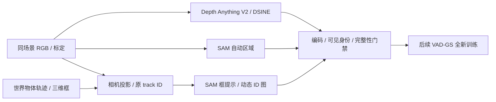

# V7.6 同场景先验：scene-0230 / 0255

任务：`VADGS-MATCHED-PRIORS-20260926`，seed 0，资源为单张 RTX 3090；利用 P0R1 的 CPU COLMAP 阶段准备输入。当前执行状态见 [RESEARCH_STATUS](../RESEARCH_STATUS.md)。本记录说明数据合同与核验，不是同场景重建结果。

## Architecture components

## 输入和方法边界

两场景取前61帧、6相机，各366个视图，已有 RGB、标定、世界物体轨迹和重新打包的 LiDAR `pointcloud.npz`。准备全部6路文件不等于将 Camera5 加入梯度训练；实际训练相机由后续配置确定。P0R1 仍使用原始官方样例先验，本适配不改变它的输入。

深度为 Depth Anything V2 ViT-L 原生输出逐图归一化到 uint8，VAD-GS 读取后取 `255-value`。两场景已有各366张。生成方式是同场景适配，不能冒称与官方打包样例逐像素一致。初始化先验包含候选时间 test 帧；不是完全未见数据协议。

DSINE 使用官方 commit `ef0c2afa32b4dd19cb8ca4567c652802cd92591c` 的 `DSINE_v02`、`exp001_cvpr2024` 配置与完整权重，按原始1600×900分辨率和真实相机内参推理。代码路径依据官方 [test_minimal.py](https://github.com/baegwangbin/DSINE/blob/ef0c2afa32b4dd19cb8ca4567c652802cd92591c/projects/dsine/test_minimal.py)，包括32倍数padding、内参平移、ImageNet归一化、5次细化与裁切。完整 state dict 严格加载，构造 encoder 时省去会被覆盖的独立 ImageNet 权重下载。没有改 VAD-GS 的法线读取约定。

## 法线编码核验

固定官方样例帧20、相机0–5，各重新推理一次，对比已有官方法线先验。下表是整个画面的平均方向夹角，不是对真实法线的准确率。

| 相机 | 原RGB编码 | 整体取反对照 | RGB/BGR交换对照 |
|---|---:|---:|---:|
| 0 | 1.933° | 178.067° | 52.697° |
| 1 | 1.368° | 178.632° | 98.377° |
| 2 | 1.890° | 178.110° | 53.903° |
| 3 | 1.619° | 178.381° | 61.934° |
| 4 | 2.044° | 177.956° | 70.741° |
| 5 | 4.778° | 175.222° | 41.689° |

固定六视图对照已检查：道路、建筑、车辆的方向颜色一致。支持编码和轴顺序正确，不证明法线是真值，也不证明后续重建会改善。输出为 RGB `floor((normal+1)*127.5)`；VAD-GS 用负RGB恢复相机法线，再按c2w旋转。未对已有官方先验覆盖写入。

见[数值证据](../autoresearch/worldsim_v76/matched-scene-priors/dsine_encoding_gate.json)与[全部六视图](../autoresearch/worldsim_v76/matched-scene-priors/dsine_encoding_comparison.png)。

两场景已各生成366张法线，推理耗时分别199.19秒和194.80秒；随后固定帧0/20/60×相机0/5抽查PNG shape、uint8格式和向量范数。完整文件分母见[输入核验](../autoresearch/worldsim_v76/matched-scene-priors/matched_priors_audit.json)。

## SAM 输入合同

复用本地 SAM ViT-H 权重，调用 [SAM 的自动区域和提示分割接口](https://github.com/facebookresearch/segment-anything)。代码来自已保留的 Grounded-Segment-Anything commit `99fbbe789cf99ff851886bca0935da33586db86b` 中的 SAM 包；不使用其 GroundingDINO 或 SAM-HQ 模型。自动区域使用32×32点网格、batch32、predicted IoU 0.88、stability 0.95、不加crop层。

动态对象判定复用 VAD-GS 在选定时间段内的位置标准差/首尾位移规则。三维框用真实 `obj_to_world` 和相机 `extrinsics` 投影，跨近裁面的框按边裁切。对每个投影框单独 SAM 提示，mask 裁到该投影包围框；冲突像素优先较近的对象中心。ID直接来自 `instances_info.json`，背景为255；uint8三通道中一通道写对象ID，其余保留255。背景自动区域采用2–254的灰度ID，未分配像素0，避免VAD-GS会跳过的0/1区域号。

这些是明确的适配选择：投影框提示及中心深度排序不能保证遮挡实例的像素真值，未发布的官方mask生成流程也无法逐项等同。固定帧20的六相机投影与SAM输出都已保存。

## 动态身份门禁未通过：V76-F02

12视图共17个动态对象提示，PNG的原ID、尺寸和数据类型全部合法，但出现清楚的可见身份错误：scene-0230 `020_3` 的行人ID6/21选中了遮挡他们的白车，scene-0255 `020_2` 的行人ID14/23选中了前景指示牌。四例均查看了原始RGB和未裁切mask的[局部图](../autoresearch/worldsim_v76/matched-scene-priors/sam_identity_gate.png)。

重新保存17个提示的[原始未裁切mask统计](../autoresearch/worldsim_v76/matched-scene-priors/sam_occlusion_audit.json)：上述四例框外像素比例分别8.84%、2.43%、9.12%、14.01%，只有最后一例mask面积大于框面积。因此“裁到框内”或“面积小于框”不能修复身份，不能把这些标签用于同场景训练。未逐个审核全部17个身份，4例只是确认反例数，不是总体误差率。

两场景各6张动态mask已移出训练入口并完整保留，加入 `DYNAMIC_IDENTITY_BLOCKED.json` 和生成入口guard。背景区域有各6张固定帧结果，仍可独立批量准备；当前后台只生成背景，不生成动态标签。两场景训练输入尚不合格，未启动训练。

按scaling law把它登记为本适配器的数据/身份工程失败 [V76-F02](../research_failures/entries/V76-F02.md)。唯一后续控制是“可见二维检测 + 类别和投影track关联，再提示SAM”；先用同一固定正例及遮挡反例验证，再决定是否扩展。它不改变当前以P0R1复现为主的问题，也不构成VAD-GS科学失败。

## 资产与复现

- 远端：`/root/autodl-tmp/data/v76_vadgs/scene_{0230,0255}`；法线报告在 `normal_img/generation_report.json`，SAM证据在 `sam_prior_evidence/`。
- 适配代码与小型核验证据：[matched-scene-priors](../autoresearch/worldsim_v76/matched-scene-priors/)。完整PNG和模型权重保留在AutoDL持久数据盘，不提交Git。
- 重型先验生成入口带 `--stop-on-training`，发现P0R1进入GPU阶段即保存进度并退出，避免与主训练持续争用。
- `failure_ledger_refs: [V76-F01]`；`failure_ledger_delta: V76-F02`。本轮没有新增科学否定、方法结果或人工verdict。
